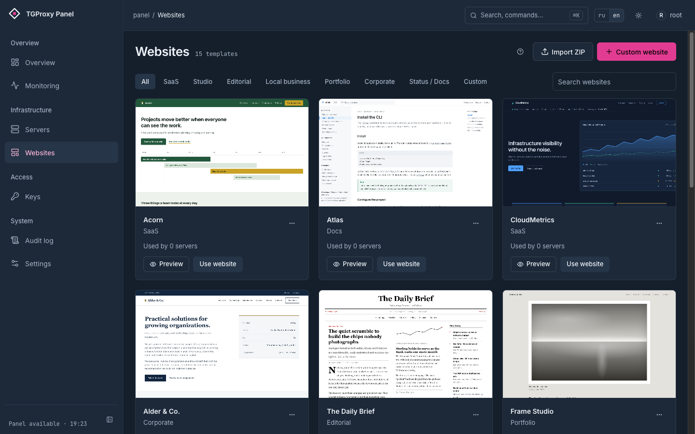

<picture>
  <source media="(prefers-color-scheme: dark)" srcset="docs/brand/logo-dark.png">
  
</picture>

# TGProxy panel

[](https://github.com/greenpandorik/tgproxy-panel/actions/workflows/ci.yml)
[](https://github.com/greenpandorik/tgproxy-panel/releases)
[](go.mod)
[](LICENSE)

A self-hosted control panel for a fleet of Telegram proxy nodes. It issues and revokes keys,
pushes configuration to nodes over gRPC, serves a cover website on each of them and watches
their health. One panel manages many nodes; a node runs [telemt](https://github.com/telemt/telemt)
or tproxy-server, and a small agent on the node takes instructions from the panel.

<p align="center">
  
  
</p>

## What it does differently

**A key gets two links, and one of them negotiates its own transport.** The Fake-TLS link
(`https://t.me/proxy?…`) is a single shape: a TLS handshake that looks like a real visit to your
domain. The WEB link (`https://t.me/webproxy?…`) is a protocol over ordinary HTTPS on port 443,
and inside it there are four ways to carry the traffic. telemt tries them per connection —
WebSocket lanes, WebSocket, HTTPS lanes, then plain HTTPS as the one that gets through almost
anywhere — and remembers which one worked in that client's network, so the next connection starts
there. A corporate proxy that eats WebSocket no longer means "the proxy is broken for this person".

**Every node serves a different-looking cover site.** Fifteen built-in sites ship with the panel,
and assigning one to a node re-randomizes its block order, CSS class names, asset filenames and
marked wording first. The result is deterministic per node, so re-assigning the same template
changes nothing and does not restart anything — but two nodes running the same template never
serve byte-identical pages, so a fleet cannot be fingerprinted by diffing its cover sites.

**Limits are enforced by the proxy, not by the panel.** On a telemt node a key's traffic quota,
up/down rate, maximum unique IPs and maximum connections are pushed into telemt and applied by
telemt itself, along with per-key traffic accounting. The panel does not sit in the data path.

**A number the panel does not have is never drawn as zero.** If a node did not report a counter,
the panel says "not available" and means it. A diagnostic check that could not run is left out of
both the passed and the total count instead of being scored as a pass. It is the difference
between "nothing is wrong" and "we have not heard", and the panel refuses to blur it.

**Changing keys does not drop anybody.** On a telemt node the agent applies the desired state over
telemt's loopback control API without restarting the process, so live sessions survive. (Changing
the Fake-TLS domain or port is the one exception, and the panel warns before you do it.)

**Nodes move themselves to a new version.** `tgwp-agent upgrade` asks the panel what this node
should be running, replaces only what differs after verifying the panel's sha256, restarts the
unit, waits for it to report healthy, and puts the previous binary back if it does not. Updating
telemt goes further: drain, swap, verify, and reopen admission — with the rollback path reporting
whether reopening actually succeeded.

Beyond that: shared and personal keys with batch creation, public subscription pages, a fleet
overview that leads with a verdict, Prometheus metrics and a Grafana dashboard, Telegram alerts,
an audit log, TOTP with recovery codes, nightly backups and master-key rotation.

## Quick start

A fresh Ubuntu 22.04+ or Debian 12+ host, root, ports 80 and 443 free, and a DNS A record for the
panel's domain already pointing at it. The installer brings Docker if it is missing, writes the
compose files and a generated `.env`, starts the stack and creates the first admin.

```bash
curl -fsSL https://raw.githubusercontent.com/greenpandorik/tgproxy-panel/main/install.sh | sudo bash
```

It prints the URL and the admin password once. Then add your first node in the UI — the panel
gives you a command to paste into a root shell on the node:

```bash
curl -fsSL https://panel.example.com/api/v1/install/<token>.sh | sudo bash
```

The node script checks DNS, ports and architecture before it installs anything, and registers with
the panel only once TLS is up and the proxy reports ready. Keeping a node current later is one
command on the node:

```bash
tgwp-agent upgrade
```

The [setup guide](docs/setup.en.md) walks the same path with screenshots, and the
[reference](docs/reference.md) covers installing by hand, local mode without a domain, and the
installer's options.

## Documentation

| | |
|---|---|
| [Setup guide](docs/setup.en.md) · [Русский](docs/setup.ru.md) | Install the panel and your first node, with screenshots |
| [Reference](docs/reference.md) | Node engines, architecture, every screen and every environment variable |
| [Runbook](docs/runbook.md) | Backups, restore, key rotation, and what to do when something breaks |
| [Monitoring](docs/monitoring.md) | The `/metrics` endpoint and the Grafana dashboard |
| [Contributing](CONTRIBUTING.md) | Local development, the test suites, and how changes are reviewed |
| [Security](SECURITY.md) | Reporting a vulnerability, and what the panel does to protect a deployment |

## Credits

[telemt](https://github.com/telemt/telemt) is the proxy that runs on telemt nodes: one process
serving the WEB transport, Fake-TLS, the cover site and a control API. The panel pins a release
and verifies its sha256 before installing it. telemt is distributed under its own license,
TELEMT PL 3; the license notice stays with the binary they ship.

[MTPROTO_FIX_By_MEKO](https://github.com/Mekotofeuka/MTPROTO_FIX_By_MEKO) is the SYN rate-limit fix
for the connection problems Telegram proxies started seeing in June 2026. telemt carries that fix
as `synlimit`, which the panel enables on every Fake-TLS listener. The sysctl tuning the installer
writes to `/etc/sysctl.d/90-tgwp.conf` is taken from that project.

[tproxy-server](https://github.com/telegramdesktop/tproxy-server) and MTProxy are what the tproxy
engine runs: Telegram's WEB proxy relay and the official MTProxy behind it.

## Star it

If you run this, [give it a star](https://github.com/greenpandorik/tgproxy-panel) — it is how
other people running Telegram proxies find the project.

## License

[AGPL-3.0](LICENSE).
