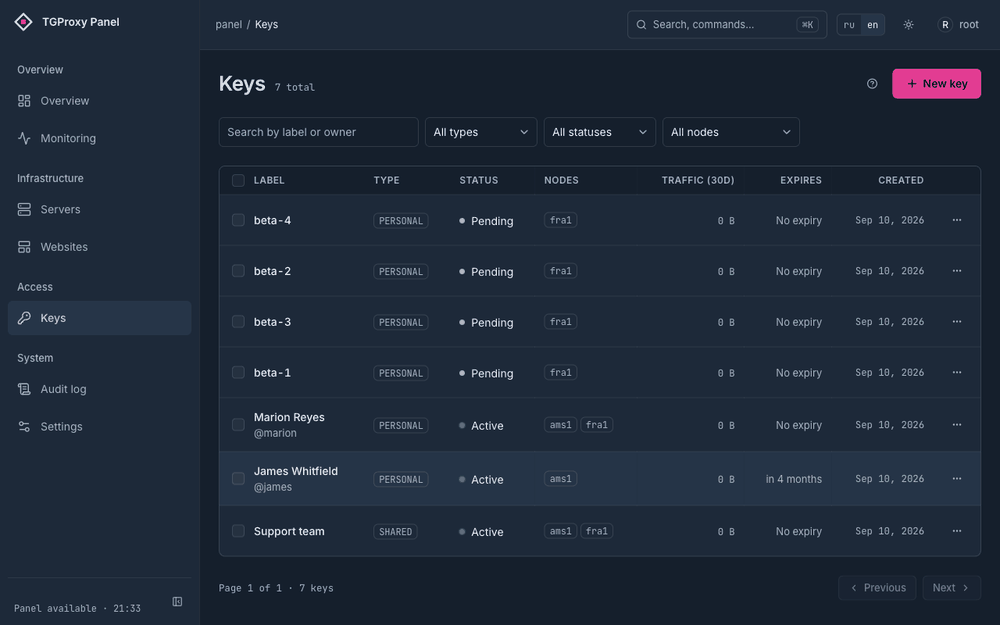

<picture>
  <source media="(prefers-color-scheme: dark)" srcset="docs/brand/logo-dark.png">
  
</picture>

# TGProxy panel

[](https://github.com/greenpandorik/tgproxy-panel/actions/workflows/ci.yml)
[](https://github.com/greenpandorik/tgproxy-panel/releases)
[](go.mod)
[](LICENSE)

[English](README.md) · **Русский**

Панель управления парком Telegram-прокси, которую вы ставите на свой сервер. Она выдаёт и
отзывает ключи, доставляет настройки на ноды по gRPC, разворачивает на каждой сайт-прикрытие и
следит за их состоянием. Одна панель управляет многими нодами; на ноде работает
[telemt](https://github.com/telemt/telemt) или tproxy-server, а небольшой агент принимает от
панели указания.

<p align="center">
  
</p>

<p align="center"><sub>Выпуск ключа: даём название, привязываем к двум серверам — и получаем обе ссылки с QR-кодами.</sub></p>

## Чем это отличается от других панелей

**У ключа две ссылки, и одна из них сама подбирает транспорт.** Fake-TLS-ссылка
(`https://t.me/proxy?…`) — это одна форма: рукопожатие TLS, неотличимое от настоящего визита на
ваш домен. WEB-ссылка (`https://t.me/webproxy?…`) — протокол поверх обычного HTTPS на порту 443,
и внутри него есть четыре способа переносить трафик. telemt перебирает их на каждое подключение —
WebSocket lanes, WebSocket, HTTPS lanes и напоследок обычный HTTPS, который проходит почти
везде, — и запоминает, что сработало в сети этого клиента, чтобы следующее подключение начать
сразу с него. Корпоративный прокси, режущий WebSocket, больше не означает «прокси у этого
человека не работает».

**Каждая нода отдаёт сайт-прикрытие, не похожий на соседские.** В комплекте пятнадцать готовых
сайтов, и при назначении на ноду у него заново перемешиваются порядок блоков, имена CSS-классов,
имена файлов и помеченные варианты формулировок. Результат детерминирован: тот же шаблон на той же
ноде даёт тот же вывод, поэтому повторное назначение ничего не меняет и ничего не перезапускает.
Но две ноды с одним шаблоном никогда не отдают побайтово одинаковые страницы — парк нельзя
опознать, сравнивая сайты-прикрытия между собой.

**Лимиты применяет прокси, а не панель.** На telemt-ноде квота трафика ключа, скорость вверх и
вниз, максимум уникальных IP и соединений передаются в telemt и применяются им самим, вместе с
поштучным учётом трафика. Панель не стоит на пути данных.

**Число, которого у панели нет, никогда не рисуется нулём.** Если нода не сообщила счётчик,
панель пишет «недоступно» и имеет в виду именно это. Проверка, которую не удалось выполнить, не
попадает ни в число пройденных, ни в общее. Это разница между «всё в порядке» и «мы не получили
ответа», и панель отказывается их смешивать.

**Изменение ключей никого не отключает.** На telemt-ноде агент применяет нужное состояние через
локальный control API telemt, не перезапуская процесс, поэтому живые сессии сохраняются.
Исключение одно — смена Fake-TLS домена или порта, и панель предупреждает об этом заранее.

**Ноды сами переходят на новую версию.** `tgwp-agent upgrade` спрашивает у панели, что нода должна
запускать, заменяет только отличающееся, сверив sha256, перезапускает юнит, дожидается признака
здоровья и возвращает прежний бинарник, если тот не поднялся. Обновление telemt идёт дальше:
дренаж, подмена, проверка и открытие приёма соединений — причём путь отката сообщает, удалось ли
открыть приём.

Кроме этого: общие и персональные ключи с пакетным созданием, публичные страницы подписки, обзор
парка, который начинается с вердикта, метрики Prometheus и панель Grafana, оповещения в Telegram,
журнал аудита, двухфакторная аутентификация с кодами восстановления, ночные резервные копии и
ротация мастер-ключа.

<p align="center">
  
  
</p>

## Быстрый старт

Нужен чистый Ubuntu 22.04+ или Debian 12+, root, свободные порты 80 и 443 и A-запись домена
панели, уже указывающая на этот сервер. Установщик поставит Docker, если его нет, запишет файлы
compose и сгенерированный `.env`, поднимет стек и создаст первого администратора.

```bash
curl -fsSL https://raw.githubusercontent.com/greenpandorik/tgproxy-panel/main/install.sh | sudo bash
```

Он один раз напечатает адрес и пароль администратора. Дальше добавьте первую ноду в интерфейсе —
панель выдаст команду, которую нужно вставить в root-консоль сервера:

```bash
curl -fsSL https://panel.example.com/api/v1/install/<token>.sh | sudo bash
```

Скрипт ноды проверяет DNS, порты и архитектуру **до того, как что-либо устанавливать**, и
регистрируется в панели только после того, как поднялся TLS и прокси сообщил о готовности.
Поддерживать ноду в актуальном состоянии потом — одна команда на самой ноде:

```bash
tgwp-agent upgrade
```

[Руководство по установке](docs/setup.ru.md) проходит тот же путь со скриншотами, а
[справочник](docs/reference.md) описывает установку вручную, локальный режим без домена и все
параметры установщика.

## Документация

| | |
|---|---|
| [Установка](docs/setup.ru.md) · [English](docs/setup.en.md) | Установка панели и первой ноды, со скриншотами |
| [Справочник](docs/reference.md) | Движки нод, архитектура, каждый экран и каждая переменная окружения |
| [Эксплуатация](docs/runbook.md) | Резервные копии, восстановление, ротация ключей и что делать при сбоях |
| [Мониторинг](docs/monitoring.md) | Эндпоинт `/metrics` и панель Grafana |
| [Разработка](CONTRIBUTING.md) | Локальная разработка, наборы тестов и как рассматриваются изменения |
| [Безопасность](SECURITY.md) | Как сообщить об уязвимости и что панель делает для защиты установки |

## Благодарности

[telemt](https://github.com/telemt/telemt) — прокси, который работает на telemt-нодах: один
процесс обслуживает WEB-транспорт, Fake-TLS, сайт-прикрытие и control API. Панель фиксирует
конкретный релиз и сверяет его sha256 перед установкой. telemt распространяется по собственной
лицензии TELEMT PL 3; уведомление о ней остаётся с поставляемым бинарником.

[MTPROTO_FIX_By_MEKO](https://github.com/Mekotofeuka/MTPROTO_FIX_By_MEKO) — исправление
SYN-флуда для проблем с подключением, которые Telegram-прокси начали ловить в июне 2026 года.
telemt несёт его как `synlimit`, и панель включает его на каждом Fake-TLS листенере. Настройки
sysctl, которые установщик пишет в `/etc/sysctl.d/90-tgwp.conf`, взяты оттуда же.

[tproxy-server](https://github.com/telegramdesktop/tproxy-server) и MTProxy — то, что работает на
нодах с движком tproxy: WEB-релей Telegram и официальный MTProxy за ним.

## Поставьте звезду

Если вы это используете — [поставьте звезду](https://github.com/greenpandorik/tgproxy-panel).
Именно так проект находят другие люди, поднимающие Telegram-прокси.

## Лицензия

[AGPL-3.0](LICENSE).
