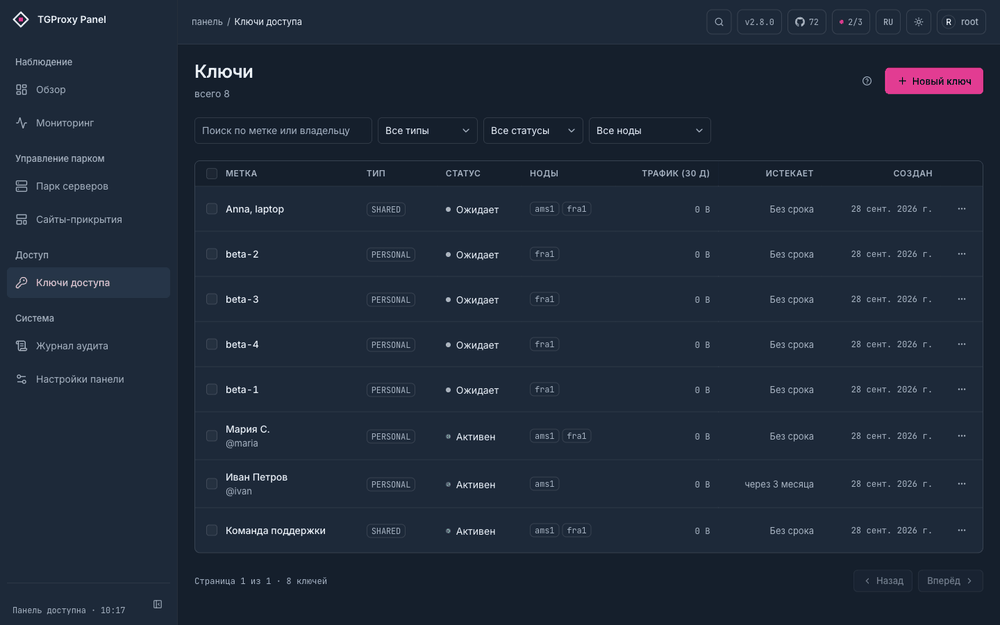
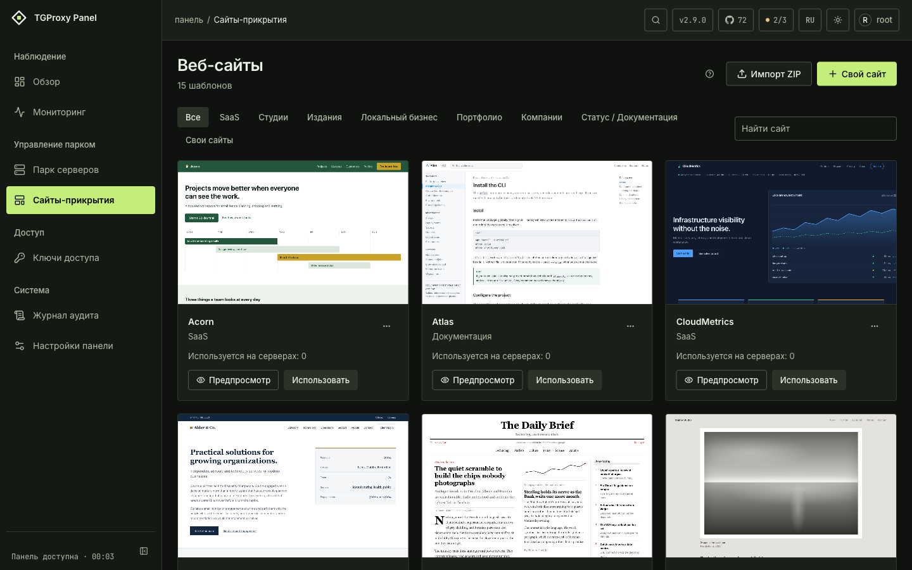

<picture>
  <source media="(prefers-color-scheme: dark)" srcset="docs/brand/logo-dark.png">
  
</picture>

# TGProxy Panel

[](https://github.com/greenpandorik/tgproxy-panel/actions/workflows/ci.yml)
[](https://github.com/greenpandorik/tgproxy-panel/releases)
[](go.mod)
[](LICENSE)

[English](README.md) · **Русский** · [Сайт проекта](https://greenpandorik.github.io/tgproxy-panel/)

TGProxy Panel помогает поднять свои прокси для Telegram и управлять ими из браузера. Панель
ставится на один сервер и настраивает прокси на остальных: выдаёт людям готовые ссылки и
QR-коды, прячет каждый прокси за обычным на вид сайтом и следит, чтобы всё работало.

Панель бесплатная, код открыт. Ставится одной командой, интерфейс на русском и английском.

<p align="center">
  
</p>

<p align="center"><sub>Выдача доступа: даём имя, выбираем серверы и получаем ссылки с QR-кодами.</sub></p>

## Что умеет

- Выдаёт доступ одной ссылкой. У каждого пользователя есть ссылка подписки: человек открывает
  её, выбирает своё устройство и по шагам подключает прокси. Сами ссылки на прокси бывают двух
  видов. Fake-TLS работает во всех приложениях Telegram. WEB-прокси идёт через обычный HTTPS, его
  труднее заблокировать, но пока его понимают только Telegram Desktop и новые версии Android.
  Для каждой ссылки есть QR-код. Страницы подписки можно открывать на своём домене, в том числе
  с отдельного сервера, и тогда домен панели люди не видят.
- Маскирует прокси под сайт. На домене каждого прокси-сервера открывается обычный сайт, например
  кофейня или блог. В комплекте 15 готовых сайтов, и на каждом сервере сайт немного
  перестраивается, чтобы серверы нельзя было узнать по одинаковым страницам.
- Ограничивает доступ. Каждому пользователю можно задать срок, а на серверах с telemt ещё и
  объём трафика, скорость и число уникальных IP-адресов. Доступ можно выключить на время, а
  истёкший срок продлить, и ссылка при этом останется прежней.
- Не обрывает соединения. Новые пользователи и изменения доступа применяются без перезапуска
  прокси, и подключённые люди этого не замечают.
- Следит за серверами. Главная страница сразу показывает, что сломалось и где. Панель
  проверяет DNS, порты и сертификаты, присылает оповещения в Telegram и отдаёт метрики для
  Prometheus и Grafana.
- Обновляется одной командой. Если новая версия прокси не запустится, сервер сам вернётся на
  прежнюю.
- Бережёт доступ. Вход с двухфакторной защитой, журнал действий всех администраторов,
  ежедневные резервные копии базы по расписанию.

<p align="center">
  
  
</p>

## Что понадобится

- Два VPS с Ubuntu 22.04+ или Debian 12+: один для панели, второй для прокси. Панели хватит
  1 CPU и 1 ГБ памяти. Прокси-серверу нужны порты 80 и 443, поэтому на одном VPS с панелью он
  не уживётся. Прокси-серверов потом можно добавить сколько угодно.
- Домен, например `example.com`, и записи в его DNS, которые ведут на ваши серверы.
- Доступ к серверам по SSH с правами root.

Если здесь есть незнакомые слова, начните с гида [«С нуля»](docs/start.ru.md). Он объясняет
всё по шагам: какой сервер арендовать, как купить домен, как подключиться к серверу и как
отправить другу первую ссылку.

## Быстрая установка

1. На сервере для панели выполните:

   ```bash
   curl -fsSL https://raw.githubusercontent.com/greenpandorik/tgproxy-panel/main/install.sh | sudo bash
   ```

   Скрипт спросит домен панели, e-mail для сертификата и данные администратора. В конце он
   напечатает адрес панели и пароль, если вы его не задали сами.

2. В панели откройте «Серверы → Добавить сервер» и укажите домен прокси-сервера. Панель
   выдаст команду: выполните её на прокси-сервере. Через пару минут сервер появится в списке.

3. Откройте «Пользователи → Новый пользователь», выберите серверы и отправьте человеку ссылку
   подписки или её QR-код.

Обновить панель: `sudo /opt/tgproxy-panel/install.sh --update`. Обновить прокси-сервер:
`tgwp-agent upgrade` на нём самом.

## Документация

| Документ | Для кого |
|---|---|
| [С нуля](docs/start.ru.md) | Первый раз арендуете сервер: всё по шагам, со словариком терминов |
| [Установка](docs/setup.ru.md) | Знаете Linux: подробная установка панели и серверов, все варианты |
| [Справочник](docs/reference.ru.md) | Как всё устроено: движки, экраны панели, переменные окружения |
| [Эксплуатация](docs/runbook.ru.md) | Обновления, резервные копии и что делать, если что-то сломалось |
| [Мониторинг](docs/monitoring.ru.md) | Метрики Prometheus и панель Grafana |
| [Разработка](CONTRIBUTING.ru.md) | Как собрать проект, запустить тесты и прислать изменения |
| [Безопасность](SECURITY.ru.md) | Как сообщить об уязвимости |

Вопросы и идеи пишите в [Обсуждения](https://github.com/greenpandorik/tgproxy-panel/discussions).

## Благодарности

[telemt](https://github.com/telemt/telemt) — прокси, который работает на серверах. Один его
процесс обслуживает WEB-прокси, Fake-TLS, сайт-прикрытие и API управления. Панель ставит
конкретный проверенный релиз и сверяет его контрольную сумму. telemt распространяется по
собственной лицензии TELEMT PL 3, её текст поставляется вместе с программой.

[MTPROTO_FIX_By_MEKO](https://github.com/Mekotofeuka/MTPROTO_FIX_By_MEKO) — исправление для
проблем с подключением, которые Telegram-прокси начали ловить в июне 2026 года из-за SYN-флуда.
В telemt оно называется `synlimit`, и панель включает его на каждом сервере. Сетевые настройки,
которые установщик записывает в `/etc/sysctl.d/90-tgwp.conf`, взяты оттуда же.

[tproxy-server](https://github.com/telegramdesktop/tproxy-server) и официальный MTProxy
работают на серверах со старым движком tproxy.

[Remnawave](https://github.com/remnawave/panel) — у этой панели мы позаимствовали внешний вид
интерфейса: плавающее меню с разделами, карточки с метриками и тёмную палитру с бирюзовым
акцентом. Код интерфейса при этом свой.

## Поставьте звезду

Если панель вам пригодилась, [поставьте звезду](https://github.com/greenpandorik/tgproxy-panel):
так проект находят другие люди, которые поднимают прокси для Telegram.

## Лицензия

[AGPL-3.0](LICENSE).
