# Setup and running the panel

Русская версия: [setup.ru.md](setup.ru.md)

TGProxy Panel: a control panel for Telegram proxies (MTProto, WEB and Fake-TLS) - one Go binary with an embedded web UI, PostgreSQL and Caddy for TLS. The panel runs on its own server and manages nodes that run the official `tproxy-server` + MTProxy. All screenshots below use demo data.

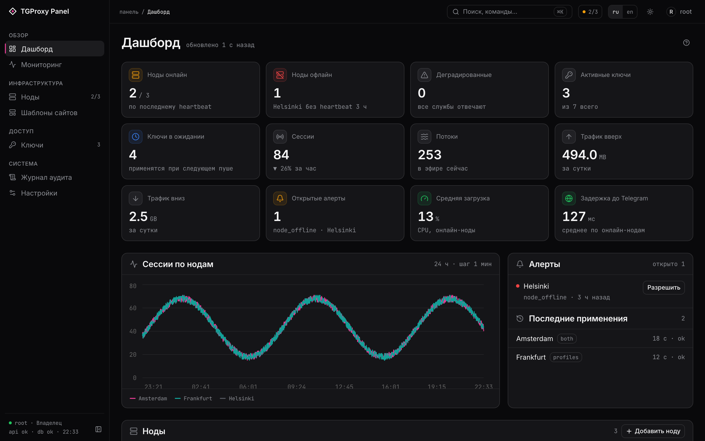

## 1. Requirements

| Component | Requirement |
|---|---|
| Panel server | Linux with Docker and Docker Compose v2; 1 CPU / 1 GB is enough; a domain with an A record pointing at it; ports 80 and 443 open |
| For the `install.sh` installer | A fresh Ubuntu 22.04+ or Debian 12+ host, root, ports 80 and 443 free. The script installs Docker itself |
| Each node | A separate VPS: Ubuntu 22.04+ or Debian 12+, x86_64, public IPv4, its own domain (A record), root or sudo, ports 80 and 443 open |
| Development without Docker | Go 1.26+, Node 22+, PostgreSQL 16 |

Nodes and the panel must live on different hosts: the relay on a node owns ports 80/443.

## 2. Option A: a server with a domain (recommended)

The panel sits behind Caddy, which obtains a Let's Encrypt certificate on its own.

### One command

You need a fresh Ubuntu 22.04+ or Debian 12+ host with root. The domain's A record must already point at it, and ports 80 and 443 must be free. The script installs Docker when it is missing, downloads the compose files of the latest release into `/opt/tgproxy-panel`, generates `.env` with fresh secrets, starts the stack, waits for it to become healthy and creates the first administrator (role `owner`).

```bash
curl -fsSL https://raw.githubusercontent.com/greenpandorik/tgproxy-panel/main/install.sh | sudo bash
```

It asks for the domain, the Let's Encrypt e-mail, and the admin username and password (an empty password means: generate one). Without questions:

```bash
curl -fsSL https://raw.githubusercontent.com/greenpandorik/tgproxy-panel/main/install.sh | sudo bash -s -- \
  --domain panel.example.com --email admin@example.com --admin-user root --admin-password 'a-strong-password' --yes
```

At the end the script prints the panel URL and, if you did not pass a password, the generated one. It is shown once. `/opt/tgproxy-panel` holds `docker-compose.yml`, `Caddyfile`, `.env` (mode 0600) and a copy of the script. Keep `.env` somewhere off the server: `MASTER_KEY` encrypts every secret in the database.

```bash
sudo /opt/tgproxy-panel/install.sh --update              # move to the latest release (or --version 1.2.0)
sudo /opt/tgproxy-panel/install.sh --uninstall           # stop; asks whether to remove the data volumes
sudo /opt/tgproxy-panel/install.sh --uninstall --purge   # remove containers, volumes and the directory
cd /opt/tgproxy-panel && docker compose logs -f panel    # logs
```

Before changing anything the script checks that the domain resolves to this host's public IP, that ports 80 and 443 are free and that the install directory is usable; a failed check offers re-run / continue / quit on a terminal and stops the script otherwise (`--skip-preflight` skips the checks). The script does not touch the firewall: open ports 80 and 443 yourself. `install.sh --help` lists every flag; each has a `TGWP_<NAME>` environment variable. The published image is built for `linux/amd64` and `linux/arm64`.

### By hand with docker compose

```bash
git clone <your-repository> tgproxy-web && cd tgproxy-web/deploy
cp ../.env.example .env
```

Generate the three secrets and put them into `deploy/.env`:

```bash
printf 'MASTER_KEY=%s\n'     "$(openssl rand -base64 32)"
printf 'SESSION_SECRET=%s\n' "$(openssl rand -base64 32)"
printf 'METRICS_TOKEN=%s\n'  "$(openssl rand -hex 32)"
```

Then set:

```
PANEL_PUBLIC_URL=https://panel.example.com
PANEL_DOMAIN=panel.example.com
ACME_EMAIL=admin@example.com
```

In the compose deployment `DATABASE_URL` is set by `docker-compose.yml` itself (the `postgres` service); the line in `.env` can stay as is.

Start:

```bash
docker compose up -d --build postgres panel caddy
docker compose logs -f panel        # wait for "panel listening"
```

Create the first administrator (role `owner`):

```bash
docker compose exec panel /app/panel admin create root 'a-strong-password'
```

Open `https://panel.example.com` and log in.

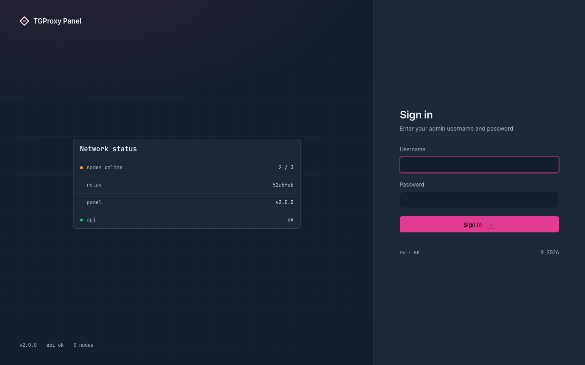

Things to know:

- `MASTER_KEY` encrypts key secrets and tokens in the database. Losing it means losing every secret; keep a copy off the server.
- `METRICS_TOKEN` is mandatory: the panel refuses to start without it because `/metrics` is served on the public domain.
- Data lives in the `pgdata`, `paneldata` and `caddydata` volumes. Never run `down -v` in production.

## 3. Option B: locally without a domain

For trying it on your own machine the panel is exposed directly on `:8080`, without Caddy or TLS.

With the installer: `curl -fsSL https://raw.githubusercontent.com/greenpandorik/tgproxy-panel/main/install.sh | sudo bash -s -- --local --yes` (Linux, root). By hand from a checkout:

```bash
cd deploy
cp ../.env.example .env
# fill MASTER_KEY, SESSION_SECRET, METRICS_TOKEN as above; PANEL_PUBLIC_URL=http://localhost:8080
docker compose -f docker-compose.yml -f docker-compose.override.example.yml up -d --build postgres panel
docker compose exec panel /app/panel admin create root 'change-me-now-1'
```

The panel is at `http://localhost:8080`. Real nodes cannot join such a panel (the agent needs a public address to reach), but the UI, keys and templates are fully usable.

To see the UI with a demo node running the real relay in a container:

```bash
make e2e     # builds images, starts panel + fakenode, runs the end-to-end smoke and tears the stack down
```

## 4. Option C: development without Docker

```bash
brew install postgresql@16 && brew services start postgresql@16   # macOS
createuser -s tgwp && psql -d postgres -c "ALTER USER tgwp PASSWORD 'tgwp'"
createdb -O tgwp tgwp && createdb -O tgwp tgwp_test

cp .env.example .env         # fill MASTER_KEY, SESSION_SECRET; NODE_DRIVER=mock lets you leave METRICS_TOKEN empty
make tools                   # sqlc, gofumpt, golangci-lint, protoc plugins
make web                     # builds the SPA into web/dist (embedded into the binary)
go run ./cmd/panel admin create root 'change-me-now-1'
make run                     # panel on :8080
```

For the frontend with hot reload: `cd web && npm run dev` (the dev server proxies `/api` to `:8080`).

Checks to run before changes:

```bash
make test                    # go test -p 1 ./... (tests share one database, hence -p 1)
make lint
cd web && npm run typecheck && npm run lint && npm run test -- --run && npm run i18n:check
```

## 5. First login and two-factor authentication

Change your password right after the first login: Settings → Security. Changing the password ends all other sessions.

To enable 2FA set `FEATURE_TOTP=true` in `.env` and restart the panel. The same tab then shows a QR code for an authenticator app.

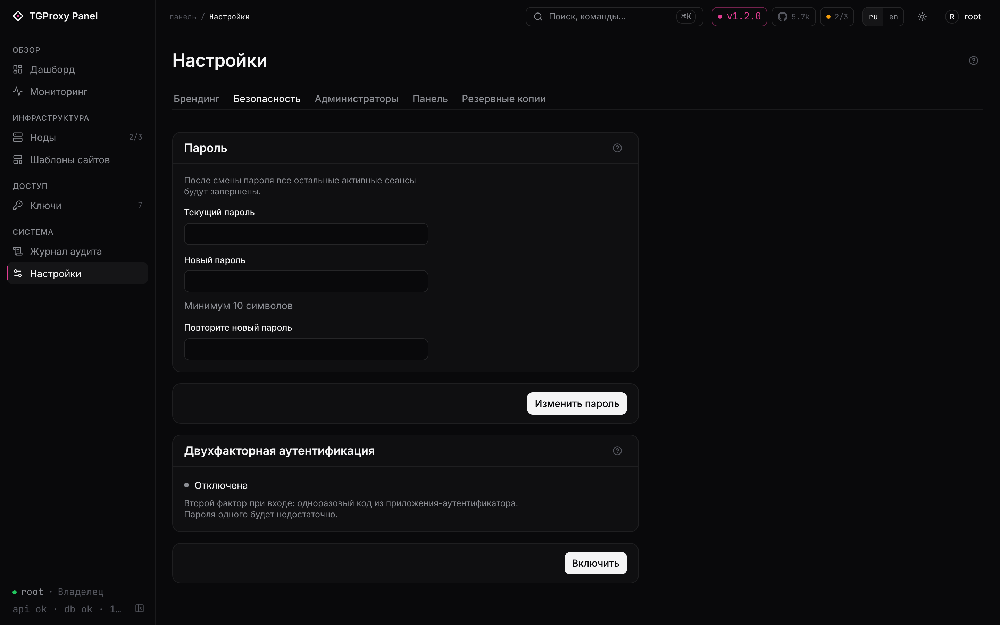

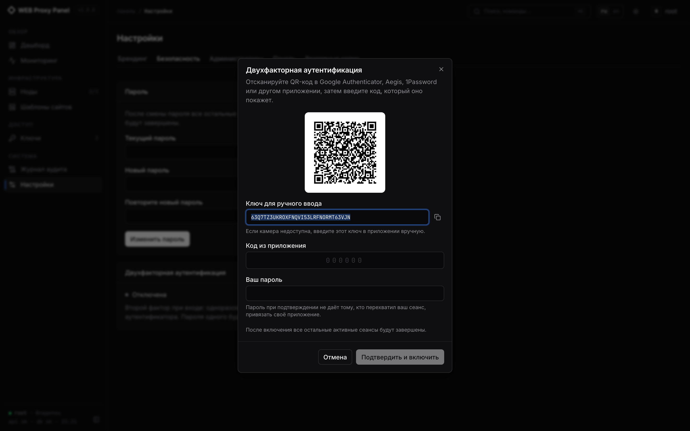

After confirming the code the panel shows eight recovery codes once. Save them. If the authenticator is lost, an owner resets 2FA from the server:

```bash
docker compose exec panel /app/panel admin totp-reset <username>
```

## 6. Adding a node

Prepare the VPS: an A record for the node's domain pointing at its IP, ports 80 and 443 open, nothing else listening on them.

**The A record must already resolve to the node before you run the install command.** The script checks that before it installs anything. Its first step, "Pre-flight checks", prints one line per check: `arch` (x86_64), `systemd`, `panel` (the panel answers `/healthz` from this host), `public_ip` (this server's public IPv4: `TGWP_PUBLIC_IP` if set, else `public_ip` set on the node in the panel, else detected from two candidates - the outbound interface's address and the address `api.ipify.org` sees; the one the A record already points at wins, otherwise the interface address when it is public. When the two differ, both are printed: on a NAT host the provider's egress address is the one nothing listens on), `dns` (the node's A record resolves to that address), on a telemt node `tls_domain` (resolves; a warning only) and `ports` (80, 443 and the Fake-TLS port are free; Caddy or telemt left by a previous run of this same script are fine). A failed `arch`, `systemd`, `panel` or `public_ip` check stops the script. A failed `dns` or `ports` check shows a menu read from the terminal:

```
  What now?  [r] re-run the checks   [c] continue anyway   [q] quit
```

Fix the record in another window and press `r`; `q` (or Ctrl-C) exits with nothing installed. Where there is no terminal to ask on (a cloud console that pipes the script), the script exits the same way; to go ahead regardless run `curl … | sudo TGWP_SKIP_PREFLIGHT=1 bash`. `TGWP_DRY_RUN=1` stops right after the checks.

After the packages the installer starts Caddy and waits up to 120 seconds for `https://<node domain>/` to answer with a valid certificate (a telemt node then waits up to 60 seconds for telemt to report ready on its control API), and only then registers the node with the panel. Registration is the one step that consumes the single-use install token, so if the script fails anywhere before the "Registration" step — the certificate wait is the usual place — fix the cause and run the same command again; the packages already installed are reused. The failure message ends with the last 30 lines of `journalctl -u caddy` (or `-u telemt`) and says what to check. (telemt learns the TLS fingerprint of its `tls_domain` from a real handshake on 443, and it refuses to activate a new configuration until it has one, which is why Caddy must hold a certificate before telemt starts.)

In the panel: Nodes → Add node. Enter a name, the node's domain and an e-mail for the Let's Encrypt certificate.

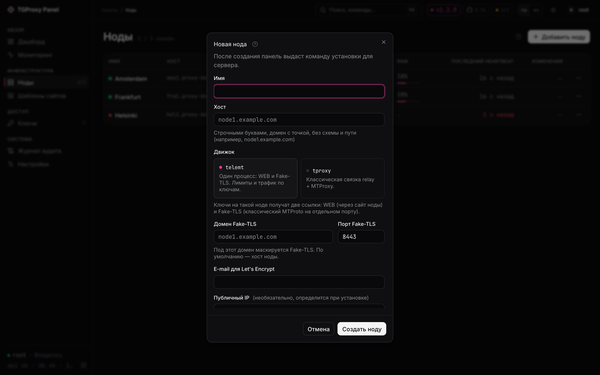

The panel returns a one-time install command. The token is valid for 24 hours.

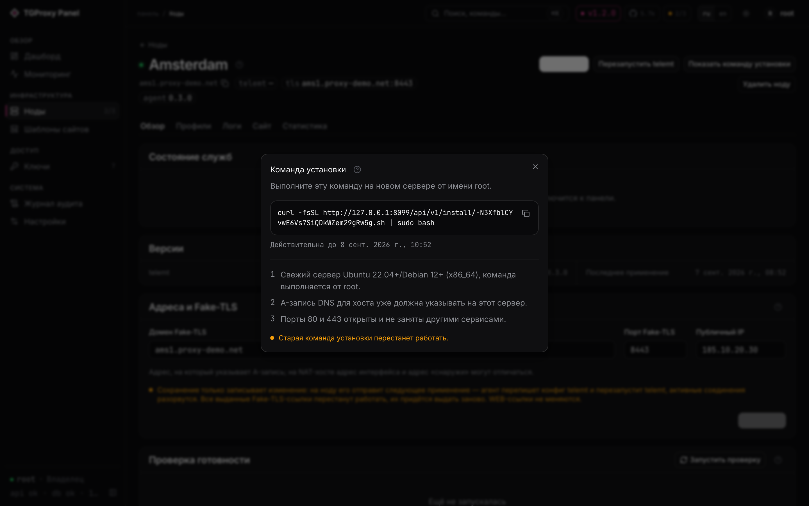

Run it on the VPS as root:

```bash
curl -fsSL https://panel.example.com/api/v1/install/<token>.sh | sudo bash
```

Depending on the node's engine the script installs telemt (default) or `tproxy-server` (pinned commit) with the official MTProxy, plus Caddy and the agent; it obtains a certificate and registers the node. Within a minute the node shows up online.

Alongside the dependencies the script (for either engine) writes `/etc/sysctl.d/90-tgwp.conf` — network tuning for a proxy node, adopted from MTPROTO_FIX_By_MEKO: BBR with the `fq` qdisc, larger accept/SYN queues (`somaxconn`, `tcp_max_syn_backlog`, `netdev_max_backlog` = 65535), TCP Fast Open and short keepalives (45/15 s × 3 probes) so dead clients drop off in about a minute. If the kernel rejects a key (container, old kernel) the script says so and carries on. The file is safe to delete — nothing but these values depends on it.

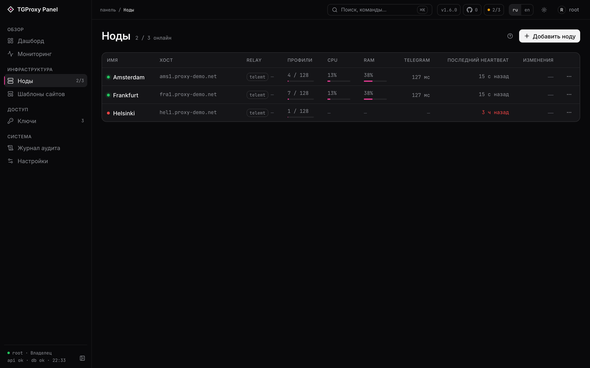

The node page shows service health, resources, the readiness check (DNS, ports, certificate, site response; on a telemt node also the Fake-TLS mask), profiles, logs and relay statistics. The separate "Post-quantum key exchange" row is informational: it shows whether Caddy on the node negotiates the hybrid X25519MLKEM768 with modern clients and does not affect the overall check result.

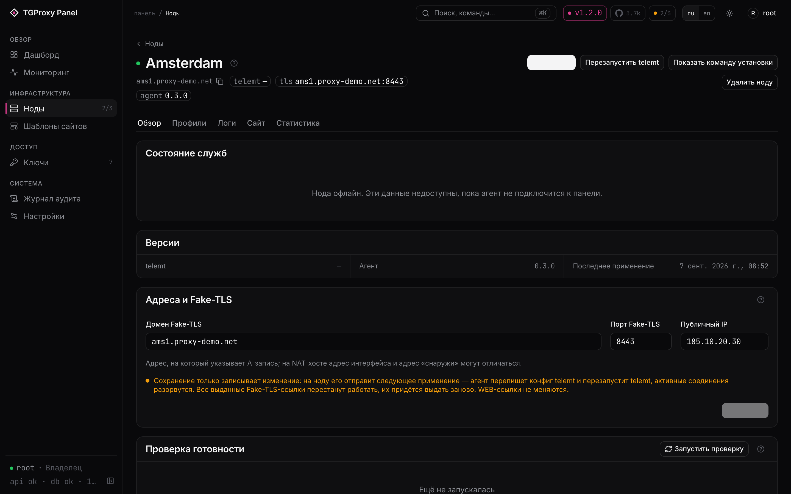

Server load is visible in three places: the CPU and RAM columns in the nodes list and on the dashboard (from the last heartbeat, a dash for an offline node), the node's Overview tab (current CPU, memory, disk, uptime) and its Stats tab with a CPU/RAM/disk chart over 1 hour, 6 hours, a day or a week. The same chart sits in the node card on the Monitoring page.

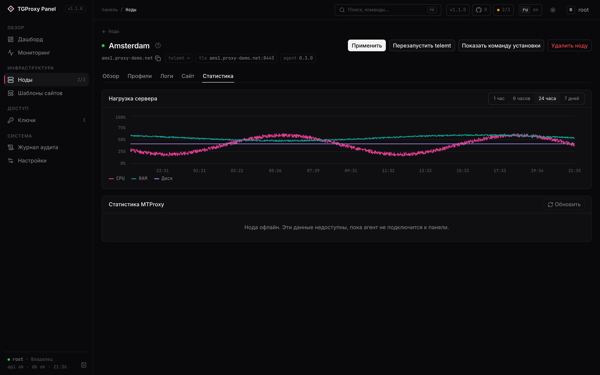

Profile and site changes are not pushed immediately: a worker applies them in batches every `APPLY_INTERVAL` seconds (45 by default) or when you press Apply. Every apply restarts the relay; clients re-establish their connections automatically.

## 7. Node engine: telemt or tproxy

The engine is chosen when the node is created and never changes afterwards — moving to the other engine means reinstalling the node.

**`telemt` (the default).** A single pinned telemt process plus Caddy:

- Caddy, from the Caddy project's signed repository, terminates TLS on 443 and reverse-proxies to telemt's loopback listener (`X-Forwarded-For`). The cover site is served by telemt itself (its decoy), not by Caddy, so a request without a valid secret is handled by the same process as a proxied one.
- The telemt binary at `TELEMT_VERSION` from the project's releases, its sha256 checked against `TELEMT_SHA256_X86_64` before it is installed to `/usr/local/bin/telemt`.
- A `telemt` system account; the unit runs unprivileged.
- `tgwp-agent init-node --engine telemt` writes `/etc/telemt/telemt.toml`, the control-API token in `/etc/telemt/api.token` (0600), the unit `/etc/systemd/system/telemt.service` and the cover site in `/var/lib/telemt/public`.
- An nftables table `tgwp_telemt` that closes the internal ports to the outside.

**`tproxy`.** The older stack: `tproxy-server` at a pinned commit, the official MTProxy, Caddy and the agent, installed by the upstream `deploy/install.sh`.

Ports on a telemt node: **80 and 443 public** (Caddy, ACME, the WEB transport), **`classic_port` public** (Fake-TLS, 8443 by default), and **9090 (metrics), 9091 (control API), 18080 (WEB listener) loopback only**. A tproxy node exposes only 80 and 443.

The node must also be able to reach **its own public address on 443**: an unknown SNI on the Fake-TLS port is masked to `tls_domain:443`, which resolves to the node's own IP. Where NAT hairpin or an egress policy blocks a host from connecting to its own public address, masking fails silently — a probe gets a connection error instead of the cover site, which is exactly the fingerprint the design avoids. `curl -sSI https://<node domain>/` **from the node** must return the cover site's response.

The node page's "Addresses and Fake-TLS" card also lets you correct `public_ip` after install (the installer on a NAT host can register the egress address instead of the interface one): the next apply rewrites telemt's WEB vhost address and restarts telemt, links are unaffected. Changing `tls_domain` or `classic_port` there is the panel action that restarts telemt *and* invalidates links: the next apply rewrites the node's config and restarts the process, dropping live connections, and **every Fake-TLS link already issued for that node stops working** — the domain and port are baked into the link's secret, so reissue the links afterwards. WEB links are unaffected.

What this changes in the panel:

- **Two links per key.** On a telemt node a key offers both a WEB link (`https://t.me/webproxy?server=…`) and a Fake-TLS one (`https://t.me/proxy?server=…&port=<classic_port>&secret=ee…`). A tproxy node offers the WEB link only.
- **Key limits** (traffic quota, up/down rate, max unique IPs, max connections) work on telemt only — telemt enforces them itself. On tproxy nodes the fields are shown as unavailable.
- **Applying without a restart.** Profile changes on a telemt node go over the control API and live sessions are not cut. On a tproxy node every apply restarts the relay.
- **The telemt version is pinned.** `TELEMT_VERSION` and `TELEMT_SHA256_X86_64` in `.env` are what the install script downloads and verifies. Change them only as a pair. Nodes already installed are moved to a new pin with `tgwp-agent upgrade` on the node itself — see below.

A local demo bench with the real telemt binary (no VPS and no Telegram client needed):

```bash
make e2e-telemt
```

It brings up postgres + the panel, builds `deploy/Dockerfile.fakenode-telemt` (telemt from the release, checksum verified), creates a telemt node and a key with limits, and asserts that telemt on the "node" really received the user over the control API. `make e2e` does the same for the tproxy engine.

### Upgrading a node

A node upgrades itself. When the panel's pinned telemt moves (a panel update, or you changed `TELEMT_VERSION`/`TELEMT_SHA256_X86_64` in `.env`), log into the node over ssh as root and run:

```bash
tgwp-agent upgrade --check   # what would change; changes nothing
tgwp-agent upgrade           # prints the plan and asks
tgwp-agent upgrade --yes     # unattended; required when there is no terminal
```

The command reads the token the node already has in `/etc/tgwp-agent/agent.env` and asks the panel what it should be running, so you do **not** need to generate an install command in the panel and you do not re-run the whole installation. It upgrades only what differs — the telemt binary, the agent binary, or both (`--telemt` / `--agent` narrow it) — verifies every download against the panel's sha256 before it replaces anything, keeps the previous binary, restarts the unit and waits for it to come back healthy; if it does not, the previous binary is put back and restarted. Restarting telemt drops the live sessions on that node, so upgrade one node at a time.

`sudo /opt/tgproxy-panel/install.sh --update` on the panel host now also moves the telemt pins in `.env` to whatever the new panel release ships, so the usual order is: update the panel, then run `tgwp-agent upgrade` on each node.

## 8. Issuing keys

Keys → New key. A SHARED key is one secret for a group of people; a PERSONAL key belongs to one person and is revoked individually. The Batch tab creates several personal keys at once from a name template.

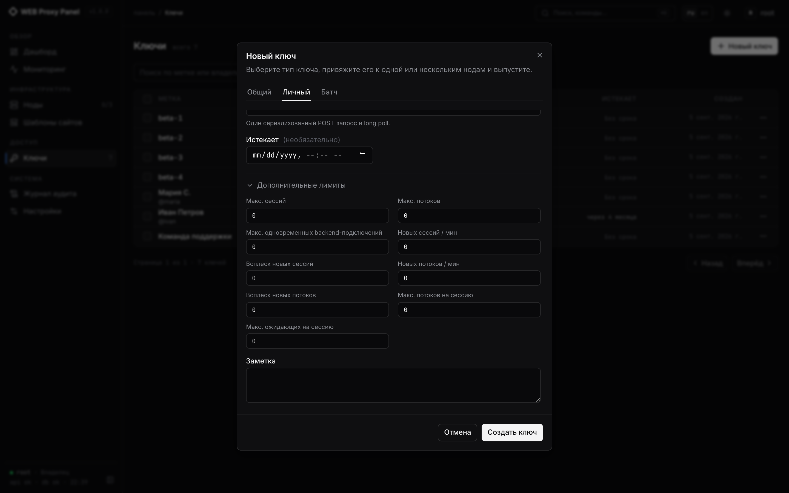

A node holds up to 128 profiles. A key can be bound to several nodes; the user then gets one link per location.

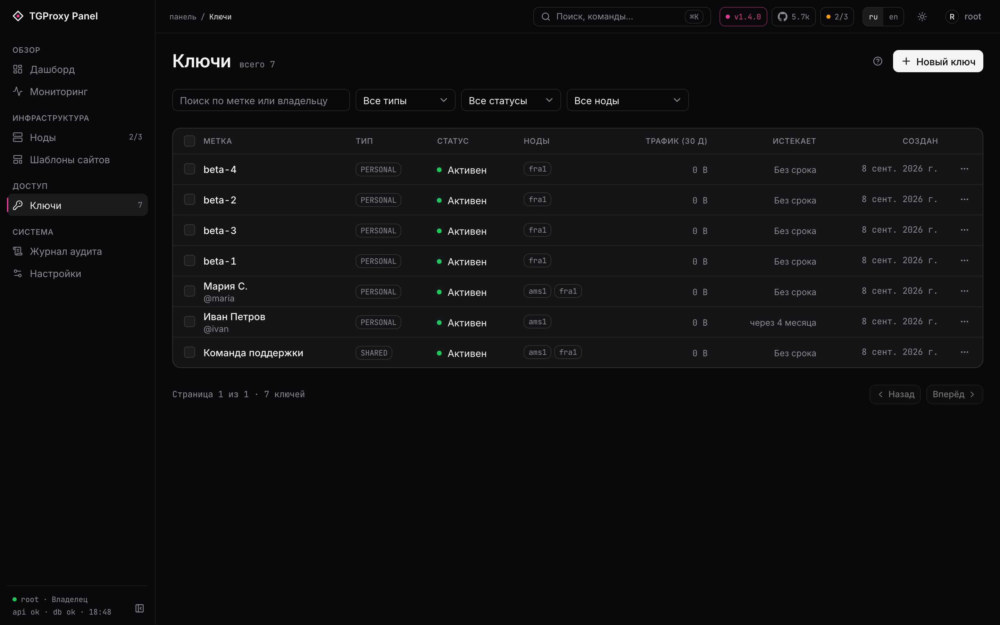

Link and QR:

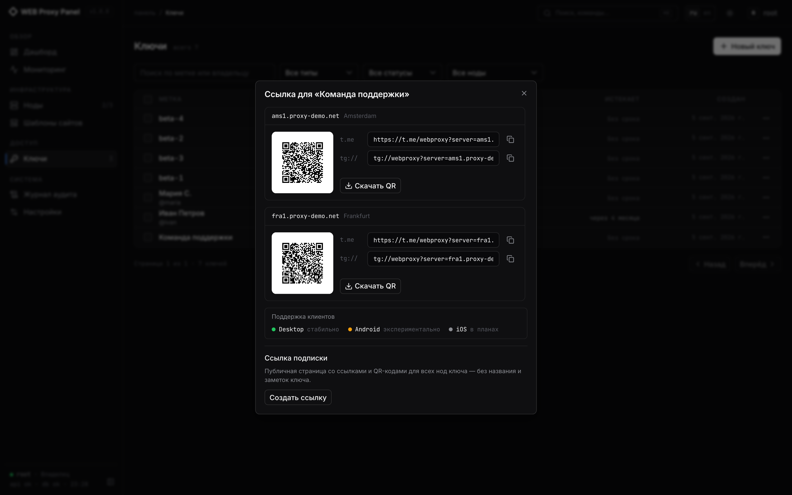

Link format: `https://t.me/webproxy?server=<node-domain>&secret=<secret>`. Client support today: Telegram Desktop stable, Android experimental, iOS planned. A key becomes active after the next apply on the node.

"Create link" in the same dialog produces a public subscription page: a single link where the user sees all their locations and QR codes. The key's label and notes never appear there.

## 9. Node cover site

The node's domain must serve an ordinary website so the traffic looks like a visit to a site. The panel installs a template during setup and lets you change it: Site templates → pick a preset or write your own → Assign to node.

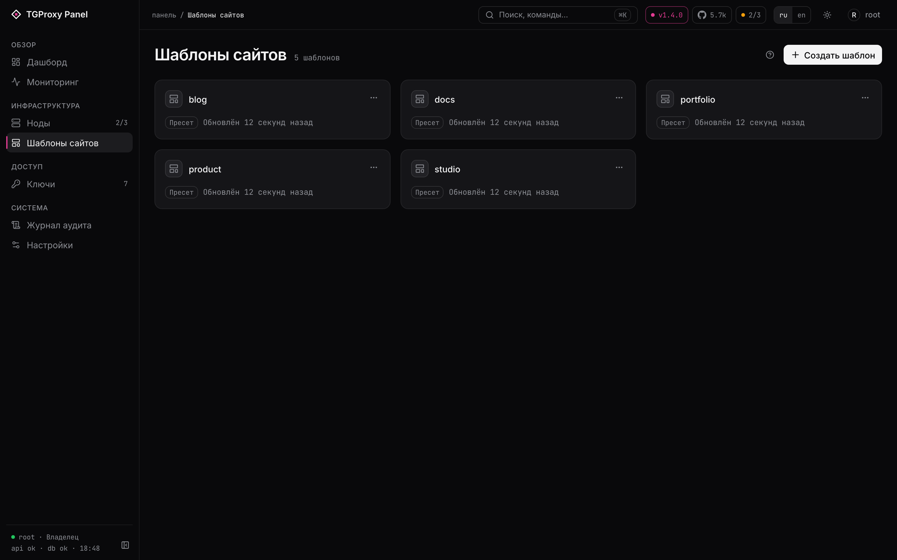

The editor validates the relay's restrictions (no external resources, inline handlers or forms) and moves styles and scripts into files. On assignment every node gets a uniquified copy: block order, class and file names differ so nodes do not share a signature.

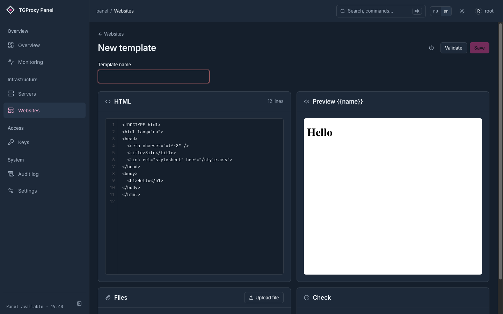

## 10. Monitoring, alerts and audit

Monitoring shows sessions, streams and traffic per node over 1 hour, 6 hours, a day or a week. The panel's own metrics are served on `/metrics` with `Authorization: Bearer <METRICS_TOKEN>`; a ready Grafana dashboard is in `deploy/grafana/tgwp-panel.json`, details in [monitoring.md](monitoring.md).

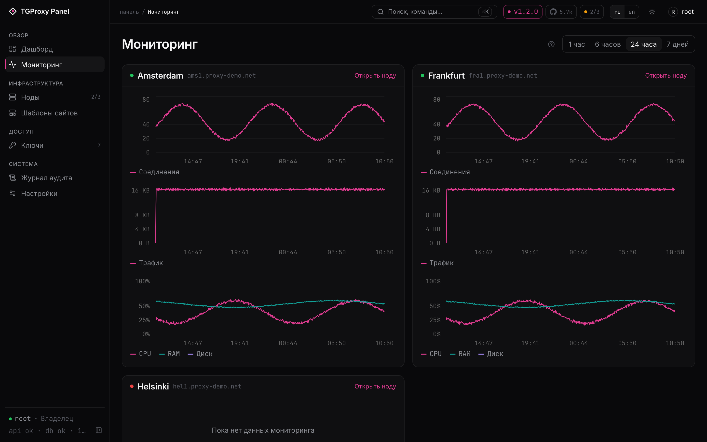

Telegram alerts: Settings → Panel → enter the bot token and chat id, press "Send test". Messages are sent when a node goes offline, comes back, or an apply fails.

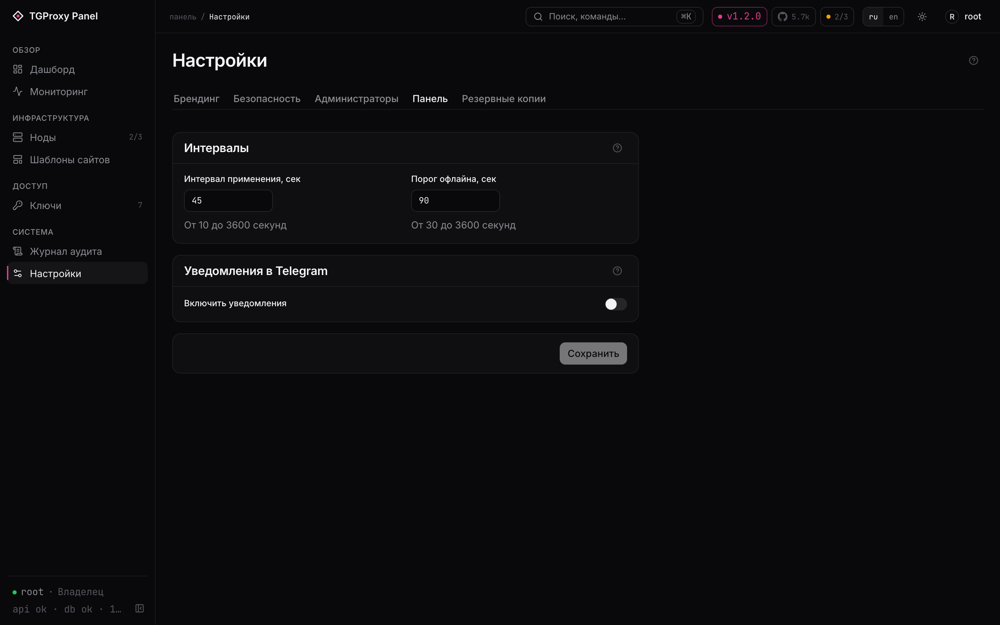

The audit log keeps every administrator action with filters by action, user and date.

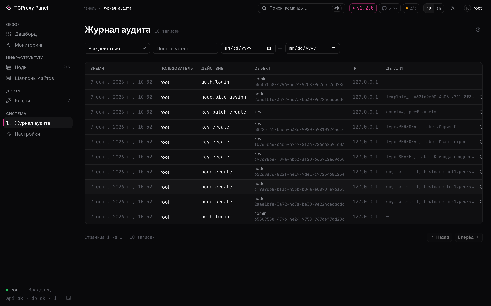

Search and commands are available with `⌘K` / `Ctrl+K`.

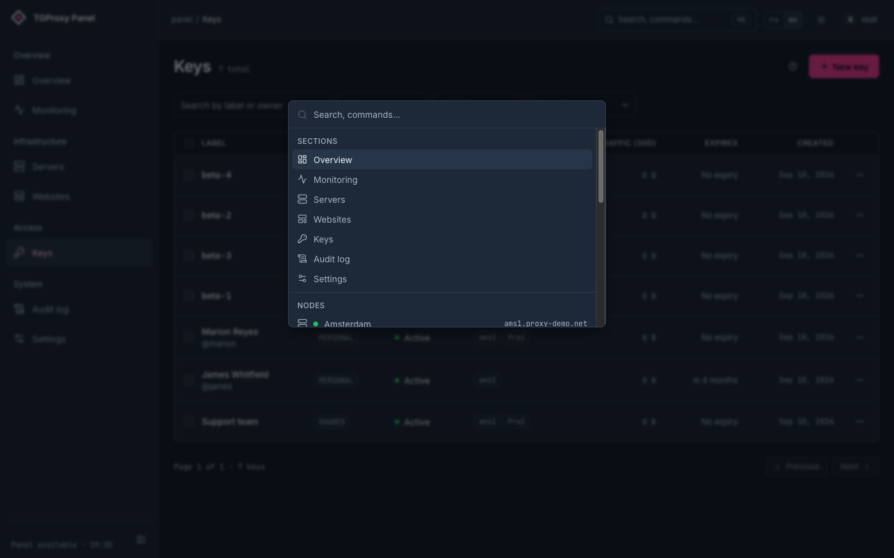

The right side of the top bar carries three chips: the panel version, the project on GitHub with its star count, and nodes online. Once an hour the panel reads the latest release of `GITHUB_REPO` (default `greenpandorik/tgproxy-panel`); when a newer version exists the version chip is highlighted and links to the release page. Nothing about your installation is sent; `UPDATE_CHECK=false` in `.env` turns the GitHub calls off. On narrow screens the same information sits in the user menu.


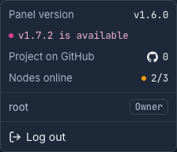

The `?` in the header of every page and dialog opens a help panel on the right: what each field means, an example value, what happens when it is left empty, and common mistakes. The `?` key opens the help for the current page. Forms remember what you typed: if a dialog closes by accident, the next time it opens the panel offers to continue the draft or start over. A draft lives for 24 hours in the browser; passwords and tokens are never stored in it.

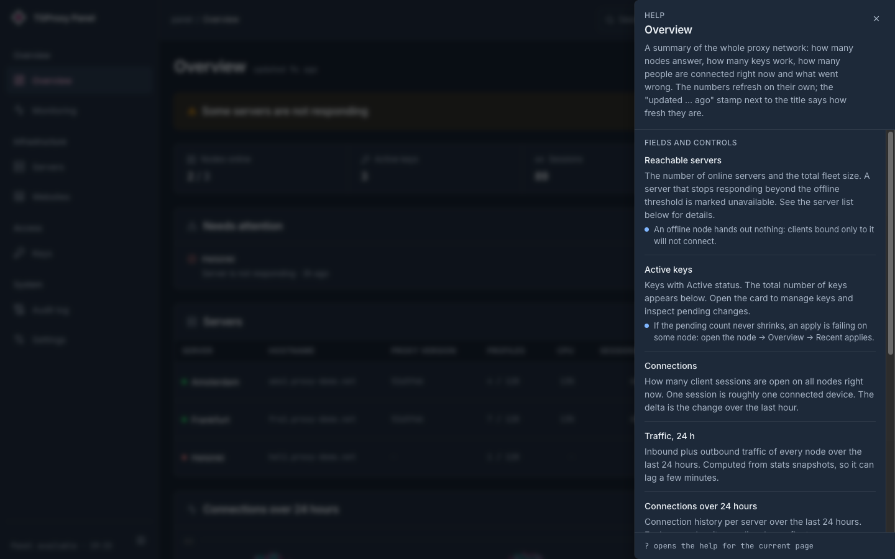

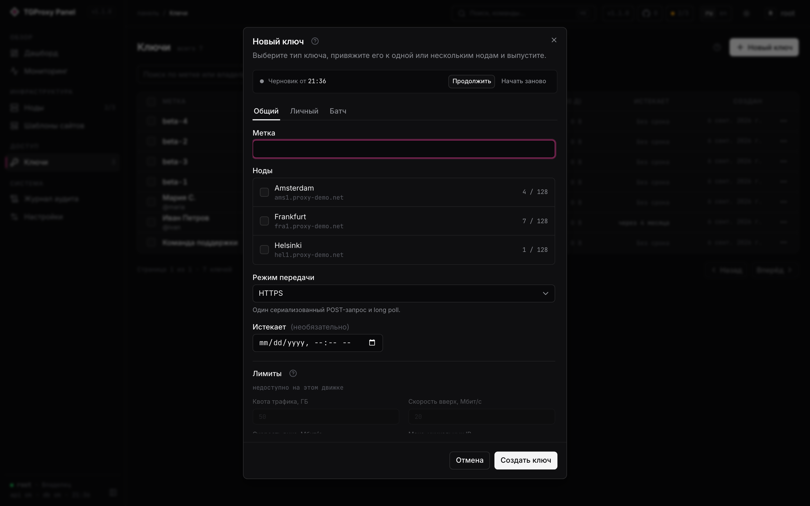

On the node page, Overview tab, the "Telegram data centres" panel shows how this node sees Telegram's network: per data centre, the latency telemt measures itself with its health checks (a moving average, not a one-off probe at start), the IPv4/IPv6 preference, the health of the direct route and a connection counter. Latency is green under 150 ms, amber under 400, red above. The Statistics tab plots the same latencies over time, the nodes list has a "Telegram" column with the overall latency, and the dashboard tile "Telegram latency" averages it over the online nodes. Nodes on the older tproxy engine have no such data.

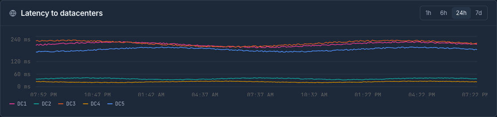

## 11. Branding

Settings → Branding: name, logo, favicon, colours, default theme, login and footer texts, custom CSS. Changes apply immediately without a rebuild. Several profiles can be kept and switched.

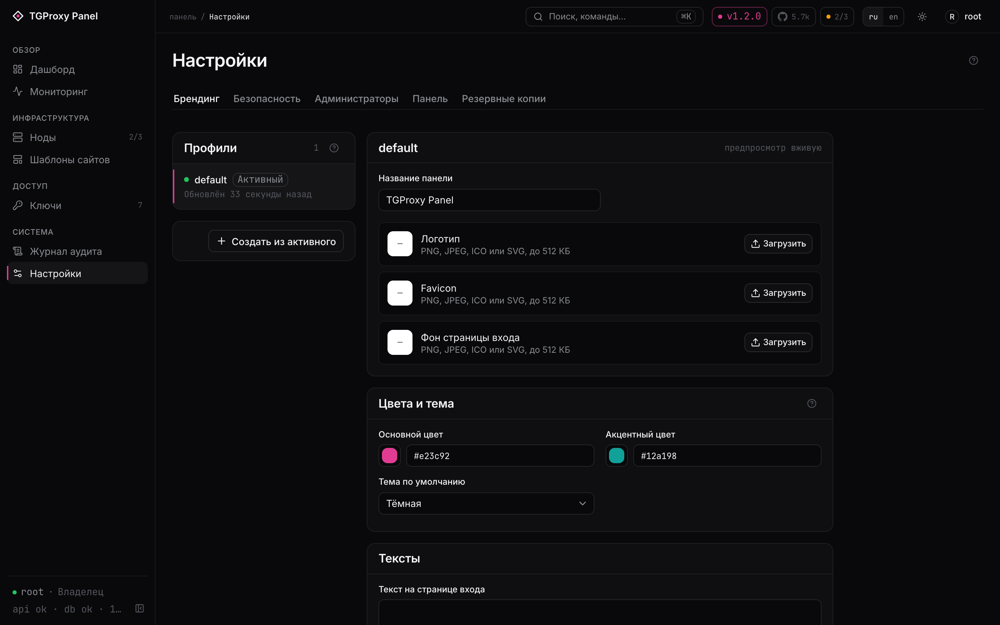

## 12. Backups, key rotation, upgrades

Backups: Settings → Backups → "Create backup", or a schedule (UTC hour, how many copies to keep). Files live in the panel volume under `/data/backups/`.

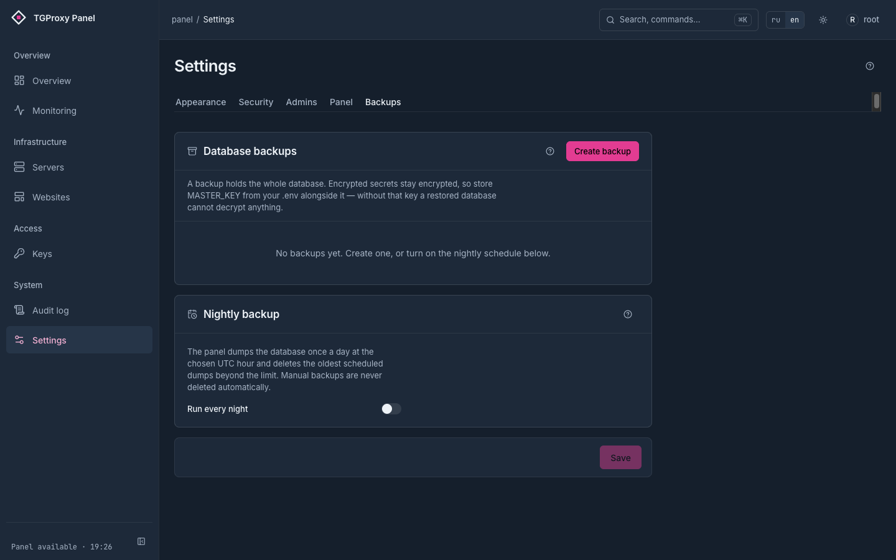

Restore from a backup (the panel must be stopped):

```bash
docker compose stop panel
docker compose run --rm panel db restore /data/backups/<file>.dump --yes
docker compose start panel
```

Rotating `MASTER_KEY`:

```bash
docker compose stop panel
# add MASTER_KEY_NEW=<new base64 key> to .env
docker compose run --rm panel keys rotate --dry-run
docker compose run --rm panel keys rotate
# then in .env: MASTER_KEY=<new>, MASTER_KEY_VERSION=2, MASTER_KEY_V1=<old>; remove MASTER_KEY_NEW
docker compose start panel
```

Upgrading a panel set up by the installer:

```bash
sudo /opt/tgproxy-panel/install.sh --update      # latest release; --version 1.2.0 for a specific one
```

Upgrading a panel built from a checkout:

```bash
git pull
cd deploy && docker compose up -d --build panel
```

Upgrading nodes: the panel serves the agent binary itself; `tproxy-server` is pinned to the commit in `TPROXY_COMMIT`. Changing the commit requires reinstalling the node with a fresh install command.

## 13. Environment variables

| Variable | Purpose |
|---|---|
| `DATABASE_URL` | PostgreSQL connection string |
| `MASTER_KEY`, `MASTER_KEY_VERSION` | Encryption key for secrets in the database and its version |
| `SESSION_SECRET` | Signs session cookies |
| `PANEL_PUBLIC_URL` | Public panel address, embedded in node install commands |
| `PANEL_HTTP_ADDR` | Listen address inside the container, usually `:8080` |
| `NODE_DRIVER` | `gateway` for real nodes, `mock` for demos and tests |
| `METRICS_TOKEN` | Token for `/metrics`, required with `gateway` |
| `TPROXY_COMMIT` | `tproxy-server` commit used when installing nodes |
| `FEATURE_TOTP` | Enables 2FA |
| `APPLY_INTERVAL`, `OFFLINE_AFTER` | Apply batch interval and offline threshold, seconds |
| `PANEL_DOMAIN`, `ACME_EMAIL` | Caddy only, compose deployment |

## 14. Troubleshooting

- The panel does not start: `docker compose logs panel`. Usually an empty `METRICS_TOKEN` or a wrong `DATABASE_URL`.
- A node never comes online: on the VPS run `systemctl status tgwp-agent tproxy-server mtproxy caddy` and `journalctl -u tgwp-agent -n 100`. The agent must be able to reach `PANEL_PUBLIC_URL`.
- A key stays "pending": the node is offline or the apply failed. Check the node's Overview tab, "Recent applies", which contains the agent log.
- Detailed procedures: [runbook.md](runbook.md).

Not yet verified on real hardware: the node install script and the agent's path through Caddy have only been exercised on the containerised demo node. Do the first production install on a test VPS and verify a connection from Telegram Desktop.
