# Setup and running the panel

**English** · [Русский](setup.ru.md)

This is the full installation guide for people who are comfortable in a Linux terminal. If this
is your first server, start with the [From scratch](start.en.md) guide: it goes step by step, and
unfamiliar words are explained in its [glossary](start.en.md#glossary).

The panel is a single Go program with a built-in web interface. Next to it run a PostgreSQL
database and Caddy, which gets the HTTPS certificate. All of this runs in Docker on its own
server. The proxies themselves run on other servers. Each has telemt (the default) or the older
`tproxy-server` and MTProxy pair, plus an agent, `tgwp-agent`, through which the panel controls
them.

For a normal install, sections 1, 2, 5, 6 and 8 are enough. The rest is for fine tuning and for
when something goes wrong. The screenshots use demo data.

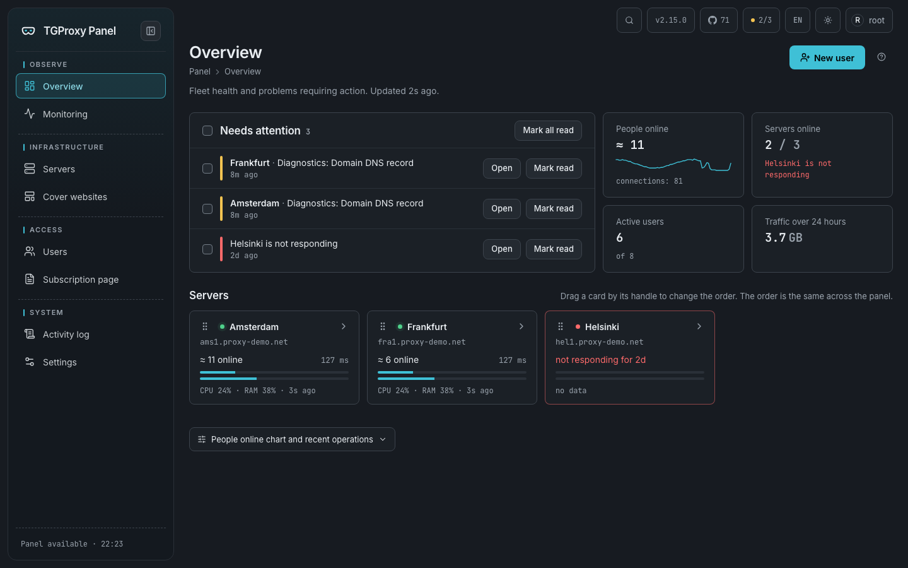

## 1. Requirements

- A server for the panel. 1 CPU and 1 GB of memory is enough. A fresh Ubuntu 22.04+ or Debian
  12+ is easiest, because the installer sets up Docker with Compose v2 on its own. The CPU can be
  x86_64 or ARM64; the panel image is built for both. You need a domain with an A record pointing
  at this server, and ports 80 and 443 free.
- As many proxy servers as you like. Each is a separate VPS: Ubuntu 22.04+ or Debian 12+, an
  x86_64 CPU (telemt ships for x86_64 only), a public IPv4, its own domain with an A record, and
  root or sudo.
- For development without Docker: Go 1.26+, Node 22+, PostgreSQL 16.

The panel and a proxy cannot share one server, because a proxy server takes ports 80 and 443 for
itself.

The installers do not open firewall ports. If your provider has a network firewall ("Firewall",
"Security groups") or `ufw` is on, allow inbound TCP:

- on the panel server: 22, 80 and 443;
- on a proxy server: 22, 80, 443 and the Fake-TLS port, 8443 by default.

A proxy server needs outbound internet access: to the panel, to `github.com` (telemt is
downloaded from there), to the Caddy repository at `dl.cloudsmith.io` and to the Telegram
datacenters.

## 2. Option A: a server with a domain (recommended)

This is how you install the panel for real use. It is served over HTTPS on its own domain, and
Caddy gets and renews the Let's Encrypt certificate by itself.

### One command

Before you run it, the panel domain's A record must already point at this server, and ports 80
and 443 must be free. On the server, run:

```bash
curl -fsSL https://raw.githubusercontent.com/greenpandorik/tgproxy-panel/main/install.sh | sudo bash
```

The installer asks a few questions:

| Question | What to answer |
|---|---|
| `Panel domain` | The panel domain, for example `panel.example.com`. An empty answer installs the panel in local mode without a domain (section 3) |
| `E-mail for Let's Encrypt` | Where certificate problem notices go. You can skip it, but then you get no warnings |
| `Admin username` | The first administrator's login, `admin` by default |
| `Admin password` | At least 10 characters. It is hidden as you type, and the installer asks for it twice. Press Enter to have a 20-character password generated |

Then the installer works through these steps:

1. It checks that the domain points at this server's public IP, that ports 80 and 443 are free
   and that the install directory is usable.
2. It installs Docker from get.docker.com if Docker is missing, after asking you.
3. It shows the plan and asks `Proceed?`.
4. It downloads the latest release's compose files into `/opt/tgproxy-panel` and writes `.env`
   with fresh secrets: `MASTER_KEY`, `SESSION_SECRET`, `METRICS_TOKEN` and the PostgreSQL
   password.
5. It starts the containers and waits up to 120 seconds for the panel to answer.
6. It creates the first administrator with the `owner` role.

If a check in step 1 fails, the installer says why and offers
`[r] re-run  [c] continue anyway  [q] quit`. Fix the DNS record or free the port in another window
and press `r`. If a CDN proxy sits in front of the domain, turn it off: Let's Encrypt has to reach
the server directly. Without a terminal, and with `--yes`, the installer stops on a failed check.
`--skip-preflight` skips the checks entirely.

To skip the questions:

```bash
curl -fsSL https://raw.githubusercontent.com/greenpandorik/tgproxy-panel/main/install.sh | sudo bash -s -- \
  --domain panel.example.com --email admin@example.com --admin-user root --admin-password 'a-strong-password' --yes
```

With `--yes` the installer never prompts, and a missing required value makes it exit with code 2.
`install.sh --help` lists every flag, and each flag has a `TGWP_<NAME>` environment variable, such
as `TGWP_DOMAIN` or `TGWP_YES=1`.

At the end the installer prints the panel URL and, if you did not set a password, the generated
one. It is shown only once, so save it right away.

`/opt/tgproxy-panel` keeps `docker-compose.yml`, `docker-compose.local.yml`, `Caddyfile`,
`.env.example`, `.env` (mode 0600) and a copy of `install.sh` for updates. Keep a copy of `.env`
off the server: its `MASTER_KEY` encrypts every secret in the database, and without it they cannot
be recovered even from a backup. For example, from your own computer, if you log in as root:

```bash
scp root@<panel IP>:/opt/tgproxy-panel/.env ./tgproxy-panel.env
```

Day-to-day commands:

```bash
sudo /opt/tgproxy-panel/install.sh --update              # move to the latest release (or --version 1.2.0)
sudo /opt/tgproxy-panel/install.sh --uninstall           # stop; asks whether to remove the data volumes
sudo /opt/tgproxy-panel/install.sh --uninstall --purge   # remove containers, volumes and the directory
cd /opt/tgproxy-panel && docker compose logs -f panel    # logs
```

Running the installer again on a server that already has `/opt/tgproxy-panel/.env` works like
`--update`: it updates the panel and keeps `.env` and the data.

### By hand with docker compose

This path builds the panel image from source.

```bash
git clone https://github.com/greenpandorik/tgproxy-panel.git && cd tgproxy-panel/deploy
cp ../.env.example .env
```

Generate the secrets:

```bash
printf 'MASTER_KEY=%s\n'     "$(openssl rand -base64 32)"
printf 'SESSION_SECRET=%s\n' "$(openssl rand -base64 32)"
printf 'METRICS_TOKEN=%s\n'  "$(openssl rand -hex 32)"
```

Put the values into the matching lines of `deploy/.env`, then set:

```
PANEL_PUBLIC_URL=https://panel.example.com
PANEL_DOMAIN=panel.example.com
ACME_EMAIL=admin@example.com
```

In the compose deployment `docker-compose.yml` sets `DATABASE_URL` itself (the `postgres`
service), so the line in `.env` can stay as it is. `TELEMT_VERSION` and `TELEMT_SHA256_X86_64` are
already filled in `.env.example`. Leave them: the panel will not start without the sha256.

Start:

```bash
docker compose up -d --build postgres panel caddy
docker compose logs -f panel        # wait for "panel listening"
```

Create the first administrator. Without a third argument the account gets the `owner` role;
`admin` and `viewer` are the other choices. Use at least 10 characters, which is what the panel
requires when a password is changed in the interface.

```bash
docker compose exec panel /app/panel admin create root 'a-strong-password'
```

Open `https://panel.example.com` and log in.

Things to know:

- `MASTER_KEY` encrypts key secrets and tokens in the database. Lose it and every secret is gone,
  so keep a copy off the server.
- `METRICS_TOKEN` is mandatory. The panel will not start without it, because `/metrics` is served
  on the public domain.
- Data lives in the `pgdata`, `paneldata` and `caddydata` volumes. Never run
  `docker compose down -v` on a live panel: `-v` deletes the volumes.

## 3. Option B: locally without a domain

To look around the interface, you can run the panel without a domain or HTTPS. It is then served
directly on port 8080 and Caddy is not needed.

With the installer (Linux, root):

```bash
curl -fsSL https://raw.githubusercontent.com/greenpandorik/tgproxy-panel/main/install.sh | sudo bash -s -- --local --yes
```

An empty answer to `Panel domain` gives the same mode. The installer then only checks that port
8080 is free, and it writes `http://<server IP>:8080` into `PANEL_PUBLIC_URL`. When you recreate
the containers in `/opt/tgproxy-panel` later, pass both compose files:
`docker compose -f docker-compose.yml -f docker-compose.local.yml up -d`. Without the second file
the panel container loses port 8080.

By hand from a checkout:

```bash
cd deploy
cp ../.env.example .env
# fill MASTER_KEY, SESSION_SECRET, METRICS_TOKEN as above; PANEL_PUBLIC_URL=http://localhost:8080
docker compose -f docker-compose.yml -f docker-compose.override.example.yml up -d --build postgres panel
docker compose exec panel /app/panel admin create root 'change-me-now-1'
```

The panel is at `http://localhost:8080`. You can explore the interface, the cover sites and the
settings, and you can add a server record too. You cannot install it on a real VPS, since a
server on the internet cannot reach `localhost`. On a VPS installed with `--local`, the panel and
its servers would talk without encryption, so use option A for real servers.

## 4. Option C: development without Docker

```bash
brew install postgresql@16 && brew services start postgresql@16   # macOS
createuser -s tgwp && psql -d postgres -c "ALTER USER tgwp PASSWORD 'tgwp'"
createdb -O tgwp tgwp && createdb -O tgwp tgwp_test

cp .env.example .env         # fill MASTER_KEY, SESSION_SECRET; NODE_DRIVER=mock lets you leave METRICS_TOKEN empty
set -a; . ./.env; set +a     # the panel reads its settings from the environment only
make tools                   # sqlc, gofumpt, golangci-lint, protoc plugins
make web                     # builds the SPA into web/dist (embedded into the binary)
go run ./cmd/panel admin create root 'change-me-now-1'
make run                     # panel on :8080
```

Neither the panel nor `make` reads `.env` by itself. Run `set -a; . ./.env; set +a` in every new
terminal, or the panel stops with `DATABASE_URL is required`.

For the frontend with hot reload, run `cd web && npm run dev`. The Vite dev server proxies `/api`,
`/healthz` and `/metrics` to `:8080`.

Checks to run before you change anything:

```bash
make test                    # go test -p 1 ./... (tests share one database, hence -p 1)
make lint
cd web && npm run typecheck && npm run lint && npm run test -- --run && npm run i18n:check
```

Tests that use the database need `TEST_DATABASE_URL`, which is in `.env.example`. When it is not
in the environment, those tests are skipped.

The end-to-end checks start the panel and a test server in Docker, create a server and a key,
check that the key reached the proxy, and tear the stack down with its volumes. They need Docker,
`curl` and `jq`, and a passing run ends with the line `SMOKE OK`.

```bash
make e2e          # tproxy engine, real tproxy-server in a container
make e2e-telemt   # telemt engine, real telemt release binary (needs egress to Telegram DCs)
```

`make e2e-telemt` builds `deploy/Dockerfile.fakenode-telemt` from the telemt release with the
checksum verified, creates a key with limits, and checks that telemt received it over the control
API without a restart.

## 5. First login and two-factor authentication

Open the panel URL and log in as the administrator the installer created.

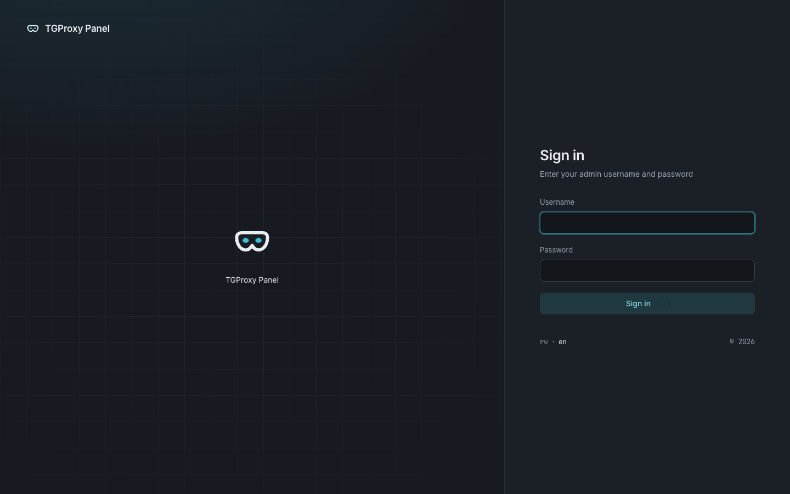

If the installer generated your password, change it: Settings → Password and 2FA tab. The user
menu in the top right corner leads there too. A new password needs at least 10 characters.
Changing it signs out all your other sessions.

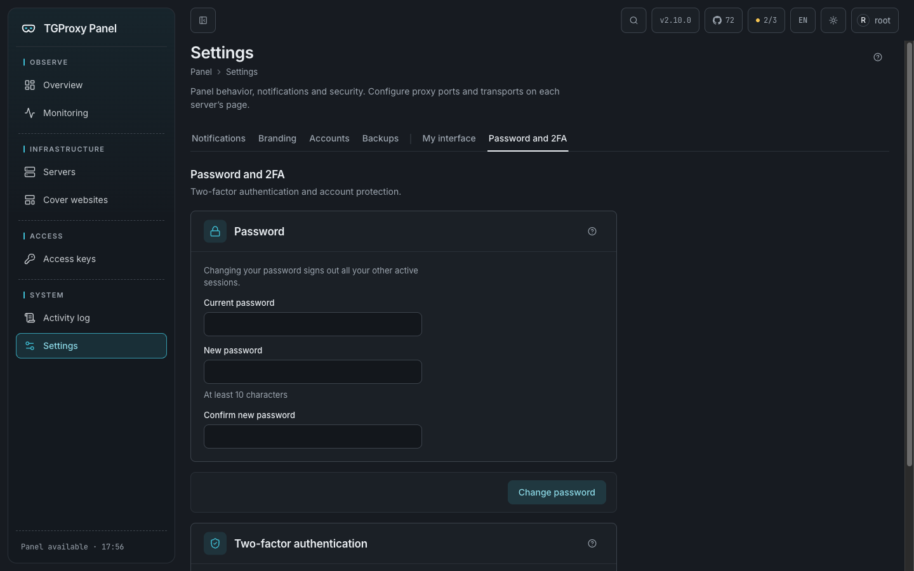

Two-factor login is available by default: the tab has a "Two-factor authentication" block. If
the panel's `.env` has `FEATURE_TOTP=false`, the block is hidden; remove that line or set it to
`true` and recreate the panel container in the install directory with
`cd /opt/tgproxy-panel && docker compose up -d panel` (`docker compose restart` keeps the old
variables).

To turn it on, press "Turn on" on the Password and 2FA tab, scan the QR code with Google Authenticator,
Aegis, 1Password or another app, enter the code and press "Confirm and turn on".

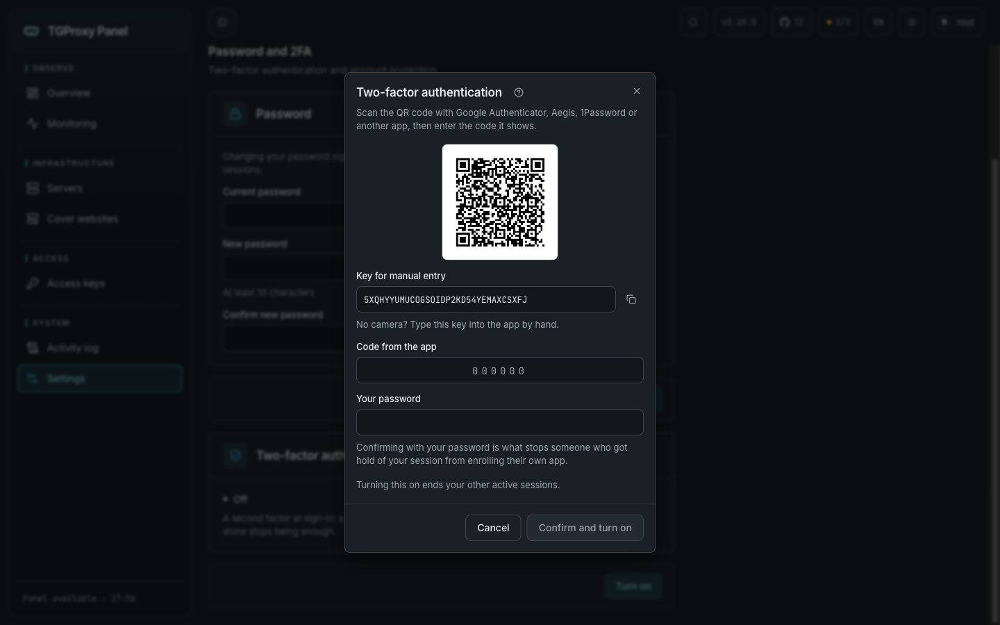

The panel then shows eight recovery codes, and they cannot be shown again. Each code works once
and gets you in if the phone with the app is lost. Save them, for example with "Download .txt".
If someone has lost both the app and the codes, turn 2FA off for that user from the panel server,
in the install directory:

```bash
docker compose exec panel /app/panel admin totp-reset <username>
```

This turns off the second factor and deletes the recovery codes for that one user. They can log
in with the password and enrol again.

The owner adds more administrators on the Settings → Accounts tab. The roles are: the owner can do
everything; an admin manages servers, keys, sites and branding, but not panel settings or
accounts; a viewer can only look.

## 6. Adding a server

### Prepare the server

Before you run the install, check three things:

- The proxy server's domain has an A record pointing at its IP. The installer checks this before
  it installs anything, and without a correct record Caddy cannot get a certificate.
- Ports 80 and 443 are open in the provider's firewall, plus the Fake-TLS port (8443 by default)
  on a telemt server.
- Nothing else is listening on those ports.

### Add the server in the panel

Open Servers and press "Add server". A three-step wizard opens.

On the "Server" step, fill in:

- "Name": what the server is called in the panel, for example "Amsterdam";
- "Hostname": the server's domain in lowercase, without `https://`, for example
  `proxy1.example.com`;
- "Let's Encrypt e-mail": where certificate problem notices go;
- "Public IP": optional, the installer detects it. Fill it in if the server is behind NAT and its
  interface address differs from the one the A record points at.

"Check DNS" shows where the domain points right now. Press "Continue".

On the "Proxy" step, pick the "Engine". Keep telemt for new servers; section 7 explains the
difference. Under "Advanced: masking and ports" are the "Fake-TLS domain" (the hostname by
default) and the "Fake-TLS port" (8443 by default, anything from 1024 to 65535 except 80 and 443).
If in doubt, leave them alone. Press "Create server".

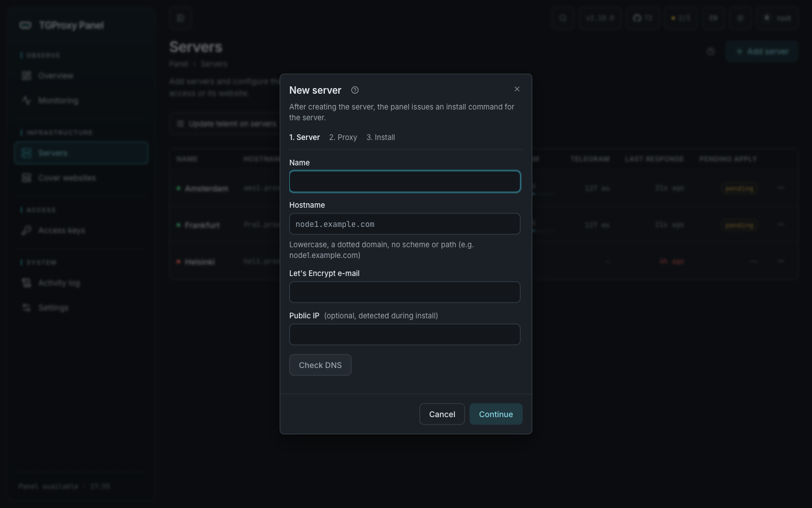

On the "Install" step the panel shows a one-time command. It is valid for 24 hours, and the expiry
time is printed under it. Copy it with the button next to it.

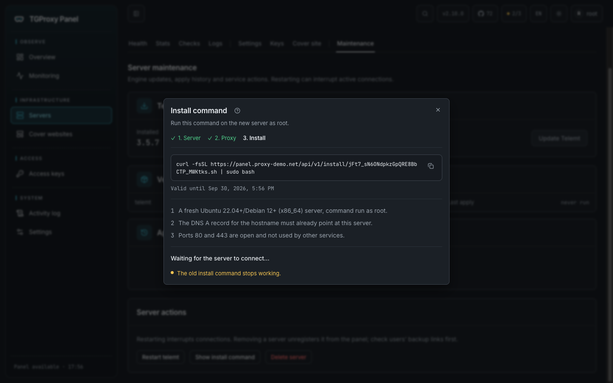

### Run the install

Keep the panel window open. Connect to the proxy server over SSH and run the command as root:

```bash
curl -fsSL https://panel.example.com/api/v1/install/<token>.sh | sudo bash
```

Depending on the engine, the script installs telemt, or `tproxy-server` (at a pinned commit) with
the official MTProxy, plus Caddy and the agent. It gets a certificate and registers the server
with the panel. The panel window then changes from "Waiting for the server to connect…" to "Agent
connected" and shows the "Full server check" and an "Open server" button. This usually takes a
couple of minutes.

### What the installer checks

The script starts with "Pre-flight checks" and prints one line per check:

- `arch`: an x86_64 CPU; `systemd`: it is running; `panel`: the panel answers `/healthz` from this
  server.
- `public_ip`: this server's public IPv4. It is `TGWP_PUBLIC_IP` if set, otherwise the "Public IP"
  set in the panel. With neither, the script finds two candidates: the outbound interface's address
  and the address `api.ipify.org` sees. The one the A record already points at wins; failing that,
  the interface address is used when it is public. When the two differ, both are printed. On a NAT
  host the provider's outside address is often outbound only, and nothing inbound arrives on it.
- `dns`: the server's A record points at that address.
- `tls_domain`, on telemt only and only when the Fake-TLS domain differs from the hostname: that
  domain resolves. A failure here is only a warning.
- `ports`: 80, 443 and the Fake-TLS port are free. Caddy or telemt left behind by an earlier run of
  this same script are fine.

A failed `arch`, `systemd`, `panel` or `public_ip` check stops the script. A failed `dns` or `ports`
check shows a menu:

```
  What now?  [r] re-run the checks   [c] continue anyway   [q] quit
```

Fix the record in another window and press `r`. `q` or Ctrl-C exits with nothing installed. Where
there is no terminal (a cloud console that just pipes the script), the script exits the same way.
To go ahead regardless, run `curl … | sudo TGWP_SKIP_PREFLIGHT=1 bash`. `TGWP_DRY_RUN=1` stops
right after the checks, and `TGWP_PUBLIC_IP=<address>` sets the public address by hand.

### If the install stopped

After the packages, the script starts Caddy and waits up to 120 seconds for
`https://<server domain>/` to answer with a valid certificate. A telemt server then waits up to
60 seconds for telemt to report ready on its control API. Caddy has to hold a certificate before
telemt starts: telemt learns the TLS fingerprint of its Fake-TLS domain from a real handshake on
443 and will not accept a new configuration without it.

Registration with the panel is the last step, and it is the only one that uses up the single-use
token. So if the script fails before the "Registration" step (the certificate wait is the usual
place), fix the cause and run the same command again; packages already installed are reused. The
failure message ends with the last 30 lines of `journalctl -u caddy` or `journalctl -u telemt` and
says what to check.

If registration returns 404, the token was already used or has expired. Get a new command: the
server page's Maintenance tab → "Show install command", or "Install command" in the server's row
menu in the list. The old command stops working.

### Network tuning

For either engine, the script also writes `/etc/sysctl.d/90-tgwp.conf`, network tuning for a proxy
server taken from MTPROTO_FIX_By_MEKO: BBR with the `fq` qdisc, larger accept and SYN queues
(`somaxconn`, `tcp_max_syn_backlog`, `netdev_max_backlog` = 65535), TCP Fast Open, and short
keepalives (45/15 s × 3 probes) so dead clients drop off in about a minute. If the kernel rejects a
key (in a container, or on an old kernel), the script says so and carries on. You can delete the
file safely; nothing but these values depends on it.

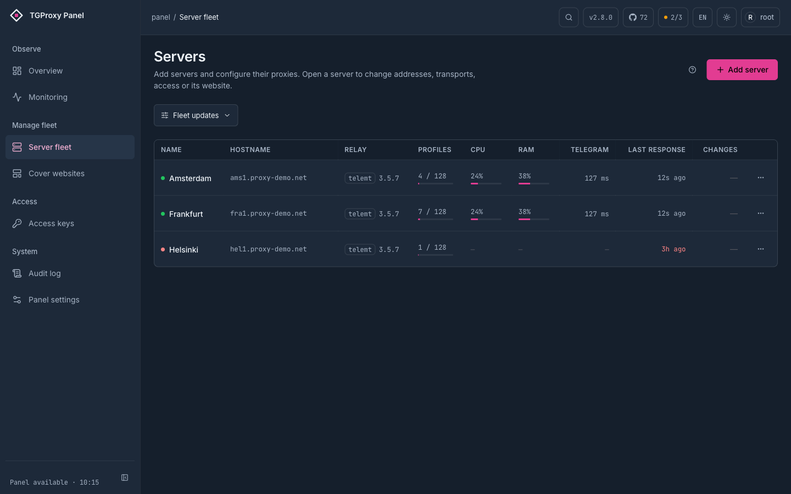

### The server page

A server's page is split into tabs:

- Health: services, CPU, memory, disk, uptime and the connection to the Telegram datacenters.
- Stats: charts of load, latency to Telegram and proxy activity. On a telemt server the WEB
  transport counters are here too.
- Checks: the "Full server check" through the agent (telemt only), the "Check from the panel" from
  outside, and "External network checks".
- Logs: the server's service logs.
- Settings, on telemt only: the Fake-TLS address, port and domains, the WEB transport and the route
  to Telegram.
- Keys: the keys installed on this server.
- Cover site: the website on the server's domain (section 9).
- Maintenance: telemt updates, apply history, restart, the install command and deleting the
  server.

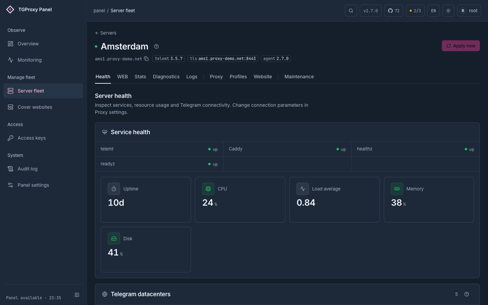

The "Check from the panel" looks at the server from outside, from the panel's address: the DNS
record, ports 80 and 443, the TLS certificate, the site response, and on a telemt server the
Fake-TLS mask as well. The "Post-quantum key exchange" row is informational. It shows whether Caddy
on the server negotiates the hybrid X25519MLKEM768 with modern clients, and it does not affect the
overall result. The "Full server check" keeps its history, and "Export report" downloads it. Checks
that could not run are counted separately and never as passes.

Server load shows up in several places. The servers list has CPU and RAM columns and the Overview
has a CPU column; both come from the agent's last report and show a dash for an offline server.
The Health tab shows current CPU, memory, disk and uptime. The Stats tab has a CPU, RAM and disk
chart over 1 hour, 6 hours, 24 hours or 7 days. The same chart is in the server's card under
Monitoring → Servers.

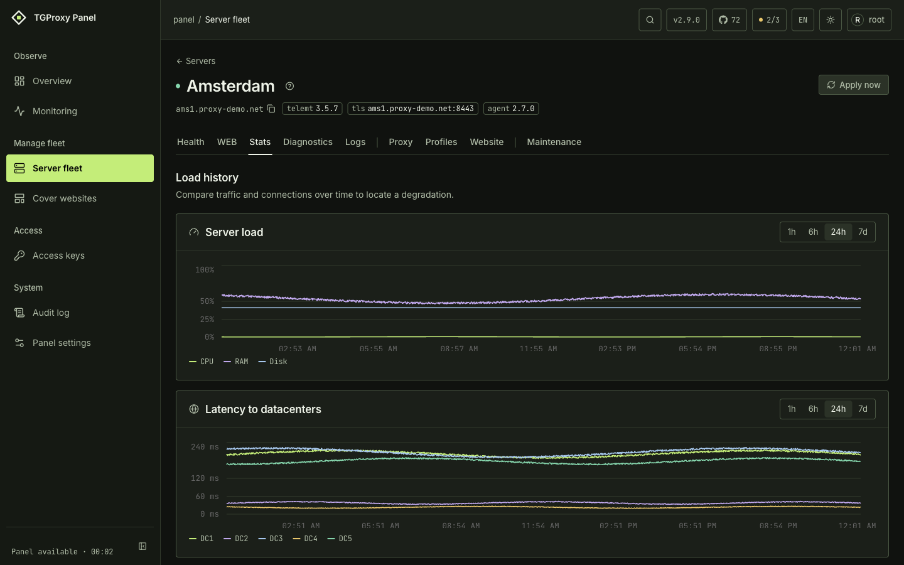

### When changes reach the server

New and revoked keys and site changes go to the server in batches, every 45 seconds by default.
Change the interval under Settings → Notifications, in "How often to apply changes, sec" (10 to
3600), or with `APPLY_INTERVAL`. "Apply now" on the server page sends the changes at once. A telemt
server applies them without a restart, and connected people notice nothing. On a tproxy server
every apply restarts the relay, and clients reconnect on their own.

## 7. Server engine: telemt or tproxy

The engine is chosen when the server is created and cannot be changed later. To move a server to
the other engine, delete it from the panel, add it again with the other engine and reinstall it.

### telemt

The default engine: a single telemt process at a pinned version, plus Caddy.

- Caddy, from the Caddy project's signed repository, terminates TLS on 443 and passes requests to
  telemt's loopback listener (`X-Forwarded-For`). telemt serves the cover site itself; Caddy
  serves nothing from disk. A request without a valid secret is therefore handled by the same
  process as a proxied one.
- The telemt binary at `TELEMT_VERSION` comes from the project's releases. Its sha256 is checked
  against `TELEMT_SHA256_X86_64` before it is installed to `/usr/local/bin/telemt`.
- telemt runs under a `telemt` system account, without root.
- `tgwp-agent init-node --engine telemt` writes `/etc/telemt/telemt.toml`, the control-API token in
  `/etc/telemt/api.token` (0600), the unit `/etc/systemd/system/telemt.service` and the cover site
  in `/var/lib/telemt/public`.
- An nftables table `tgwp_telemt` closes the internal ports to the outside.

### tproxy

The older stack: `tproxy-server` at a pinned commit, the official MTProxy, Caddy and the agent,
installed by the upstream `deploy/install.sh`.

### Ports

| Port | What listens | Reachable from |
|---|---|---|
| 80, 443 | Caddy: certificate, cover site, WEB proxy | the internet |
| `classic_port`, 8443 by default | Fake-TLS | the internet, telemt only |
| 9090, 9091, 18080 | telemt metrics, control API and WEB listener | loopback only |

A tproxy server exposes only 80 and 443.

When the Fake-TLS domain is the server's own hostname (the default), the server must be able to
reach its own public address on 443. telemt forwards a connection to the Fake-TLS port that names
an unknown site to that domain, which is the server itself. Where NAT hairpinning or an egress
policy stops a host from connecting to its own public address, masking fails without a word: a
probe gets a connection error instead of the cover site, which is exactly the fingerprint the
design is meant to avoid. Check from the server itself: `curl -sSI https://<server domain>/` must
return the cover site's response.

### What this changes in the panel

- On a telemt server a key has two links: WEB (`https://t.me/webproxy?server=…`) and Fake-TLS
  (`https://t.me/proxy?server=…&port=<classic_port>&secret=ee…`). A tproxy server offers the WEB
  link only.
- Key limits (traffic quota, upload and download speed, unique IPs, connections) work on telemt
  only, and telemt enforces them itself.
- On telemt, key changes go over the control API and live sessions stay up. On tproxy every apply
  restarts the relay.
- The telemt version is pinned. The install script downloads and verifies what `TELEMT_VERSION`
  and `TELEMT_SHA256_X86_64` in the panel's `.env` name. Change them only as a pair.

### Addresses and Fake-TLS

On a telemt server, the Settings tab starts with the "Addresses and Fake-TLS" card.

You can correct the "Public IP" after install: behind NAT the installer may have registered the
provider's outside address instead of the interface one. The next apply rewrites the address in
telemt's config and restarts telemt. Links do not change, since they carry the server's domain.

**Changing the "Fake-TLS domain" or "Fake-TLS port" breaks every Fake-TLS link already issued for
that server**, because the domain and port are baked into the link's secret. The next apply
rewrites the config, restarts telemt and drops live connections. Reissue the links afterwards. WEB
links are unaffected.

"Backup masking domains" give every key one more Fake-TLS link per domain, and the main link stays
as it was. If a provider starts blocking the main domain by SNI, people switch to a link with
another domain, with no need to reinstall the server. Use only real sites that answer HTTPS on 443
and are reachable from the server: telemt takes the TLS fingerprint of each domain at startup, and
if one is unreachable the apply rolls back. Saving restarts telemt, but links already handed out
keep working. This needs agent 2.9.2 or later and takes up to eight domains.

The "Sponsor channel tag" turns on a sponsored channel for people connected through this server.
The @MTProxybot bot issues the tag when you register the server with it, and the buttons next to
the field copy the address and secret it asks for.

### Upgrading a server

When the panel's pinned telemt moves (a panel update, or you changed `TELEMT_VERSION` and
`TELEMT_SHA256_X86_64` in `.env`), log into the server over SSH and run as root:

```bash
tgwp-agent upgrade --check   # what would change; changes nothing
tgwp-agent upgrade           # prints the plan and asks
tgwp-agent upgrade --yes     # unattended; required when there is no terminal
```

The command reads the server's token from `/etc/tgwp-agent/agent.env` and asks the panel what the
server should be running. You do not need a new install command or a full reinstall. It upgrades
only what differs: the telemt binary, the agent binary, or both (`--telemt` and `--agent` narrow
it). It verifies every download against the panel's sha256 before replacing anything, keeps the
previous binary, restarts the service and waits for it to report ready. If it does not, the
previous binary goes back. Restarting telemt drops the server's live sessions, so upgrade one
server at a time.

You can also update telemt from the panel: on the server page, open the Maintenance tab, find the
"Telemt updates" card and press "Update Telemt". For several servers there is "Update telemt on
servers" on the Servers page: tick the servers in the order you want, and the panel updates them
one by one, checks each server afterwards and watches it for a minute. An error stops the queue.
This works only for telemt servers that are connected right now, and it updates only telemt; the
agent is upgraded with `tgwp-agent upgrade`.

On the panel host, `sudo /opt/tgproxy-panel/install.sh --update` also moves the telemt pins in
`.env` to whatever the new panel release ships. The usual order is: update the panel, then the
servers.

## 8. Issuing keys

A key gives one person or a group access to the proxy. Open Access keys and press "New key". There
are three tabs at the top:

- "Personal": a key for one person, which you can revoke without touching anyone else. Fill in
  "Key name", "Issued to" (a name or e-mail) and tick the "Servers".
- "Shared": one key for a group of people. Revoking it cuts off everyone who uses it.
- "Several keys": a series of shared keys. Set a "Prefix" and a "Count" (1 to 100), and the keys
  are named `prefix-1`, `prefix-2` and so on. Afterwards "Download all links (.txt)" saves every
  link in one file.

Optional fields: "Expires at", "Limits" and "Note". The traffic, speed, unique IP and connection
limits appear once a telemt server is among the selected ones. The "What you get" block at the
bottom sums up the key you are about to create. Press "Create key".

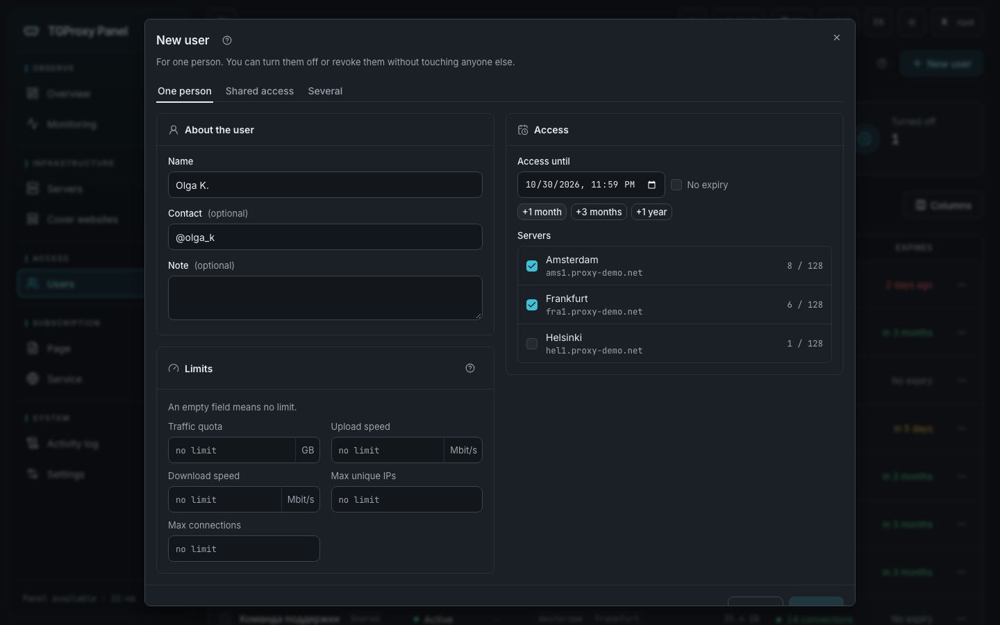

A key can be bound to several servers, and then it has links for each of them. One server holds up
to 128 keys by default; the Keys column in the servers list shows how full it is.

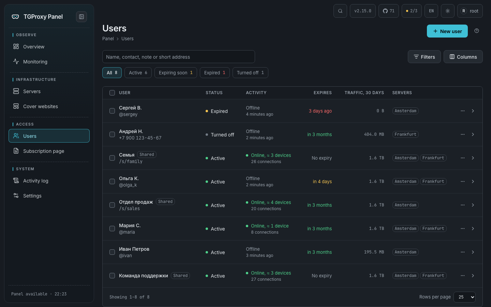

Right after creation the panel shows the links and QR codes. Each link can be copied as a `t.me`
or a `tg://` link, and each QR code downloaded as an image. If the server has backup domains, a
"Masking domain" choice appears. Links for individual servers are under "Per-node links".

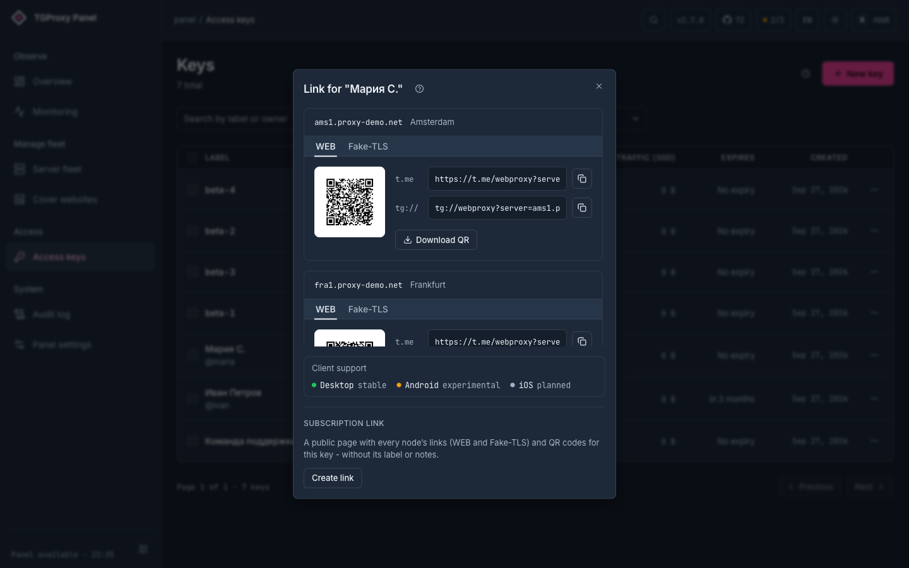

A new key starts as "Pending" and works after the next apply on the server, usually in under a
minute. Its status then changes to "Active".

Which link to send:

- Fake-TLS works in every Telegram app. If in doubt, send this one.
- The WEB proxy goes through the server's site over plain HTTPS and is harder to block. For now it
  works only in Telegram Desktop and recent versions of Telegram for Android.

"Create link" in the same dialog makes a subscription page: one public link where the person sees
the links and QR codes for every server of their key. The key's name and notes never appear there.
The subscription link and its QR are shown only once, so save them right away. "Rotate link"
issues a new one (the old one stops working), and "Revoke link" closes the page.

In the keys list, each key has a menu: "Show link", "Rotate" and "Revoke". After "Rotate" the old
links stop working and the new ones have to be sent out again. Tick several keys and buttons for
"Extend", "Revoke" and "Delete" appear above the list. A revoke takes effect with the next apply.
Keys whose expiry has passed are marked "Revoked" too.

## 9. Server cover site

Every proxy server's domain serves an ordinary website. A stranger who opens the server's address
sees a coffee shop or a blog, and the proxy stays out of sight.

Cover websites holds 15 ready-made sites, with category filters and search. "Preview" opens any of
them. To put a site on a server, press "Use website" and pick the server. You can do the same from
the server page: Cover site tab → "Change website". The site reaches the server with the next
apply, and the status changes from "Pending apply" to "Deployed".

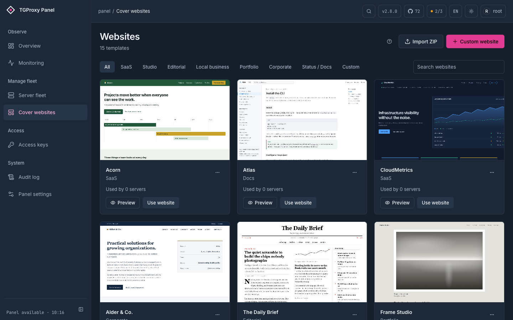

There are three ways to make a site of your own:

- "Customize website" in a ready-made site's menu creates an editable copy with your own text.
  Servers keep their current sites until you assign the copy.
- "Custom website" opens the editor for a new template.
- "Import ZIP" uploads a static site: HTML, CSS, JavaScript and local assets, with an `index.html`,
  at most 2 MB unpacked.

The editor enforces the cover site's restrictions: no external resources, inline handlers or
forms. It moves inline styles and scripts into files. On assignment every server gets its own copy
with its own block order and its own class and file names, so servers cannot be linked by
identical pages.

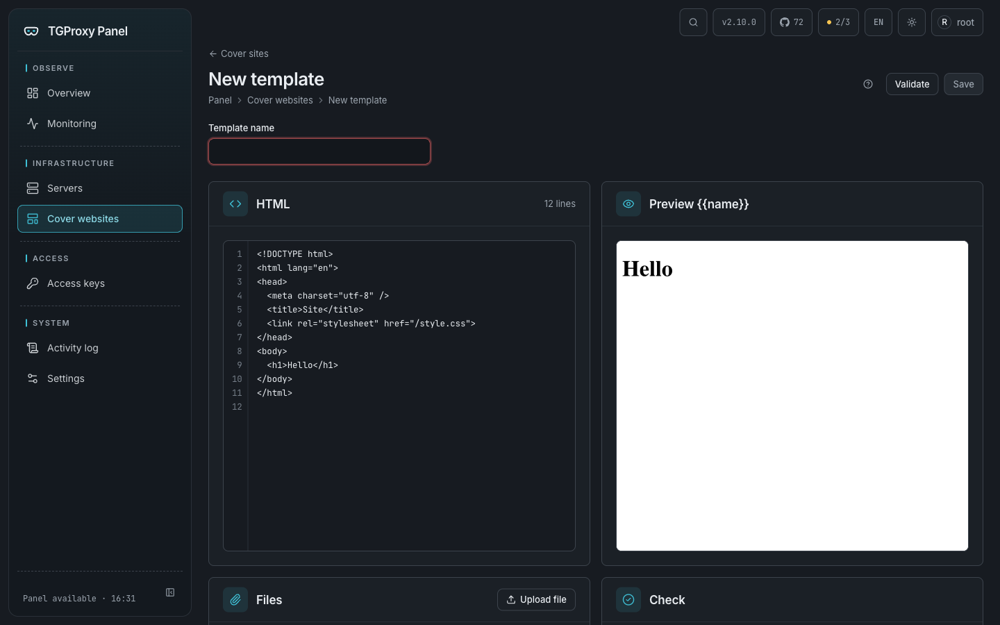

A telemt server can serve the response of an application already running next to it instead of a
template. On the Cover site tab, press "HTTP website", enter the "Origin URL" and press "Test and
apply". Only an `http://` address on a loopback or private IP is accepted. The button is available
once the server has confirmed it supports this. Before switching, the agent checks the address on
the server itself, and on failure the current site stays.

The editor's preview does not show what was actually deployed. After assigning a site, open
`https://<server domain>/` in a browser and check that the whole page loads, images and styles
included.

## 10. Monitoring, alerts and audit

The Overview shows an overall verdict on the servers, a "Needs attention" list and every server at
a glance.

Monitoring has four views: "All servers", "Servers" (connections, traffic and load per server),
"WEB transport" and "Metrics export". The range is picked at the top: 1h, 6h, 24h or 7d. The
panel's own metrics are served on `/metrics` with `Authorization: Bearer <METRICS_TOKEN>`. A ready
Grafana dashboard is in `deploy/grafana/tgwp-panel.json`, and setting up Prometheus and Grafana is
covered in [monitoring.md](monitoring.md).

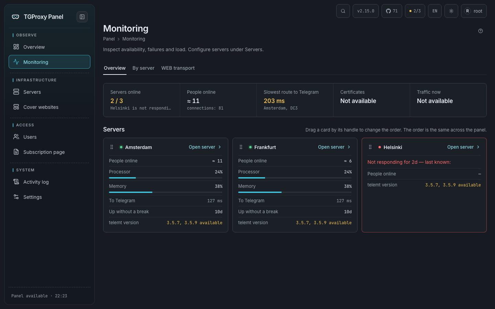

### Telegram alerts

Open Settings → Notifications (the "Notifications and polling" section). Turn on the "Enable
alerts" switch, paste the "Bot token" and "Chat ID", press "Send test message" and then "Save". The panel sends a message when a
server goes offline and comes back, when an apply fails, and when something is wrong on a server,
for example the disk is running out or the proxy is not ready to accept connections. When such a
problem clears, a second message follows. The same tab sets how many seconds without a response
mark a server as down.

Alerts can also go to your own HTTPS endpoint through `ALERT_WEBHOOK_URL` (section 13).

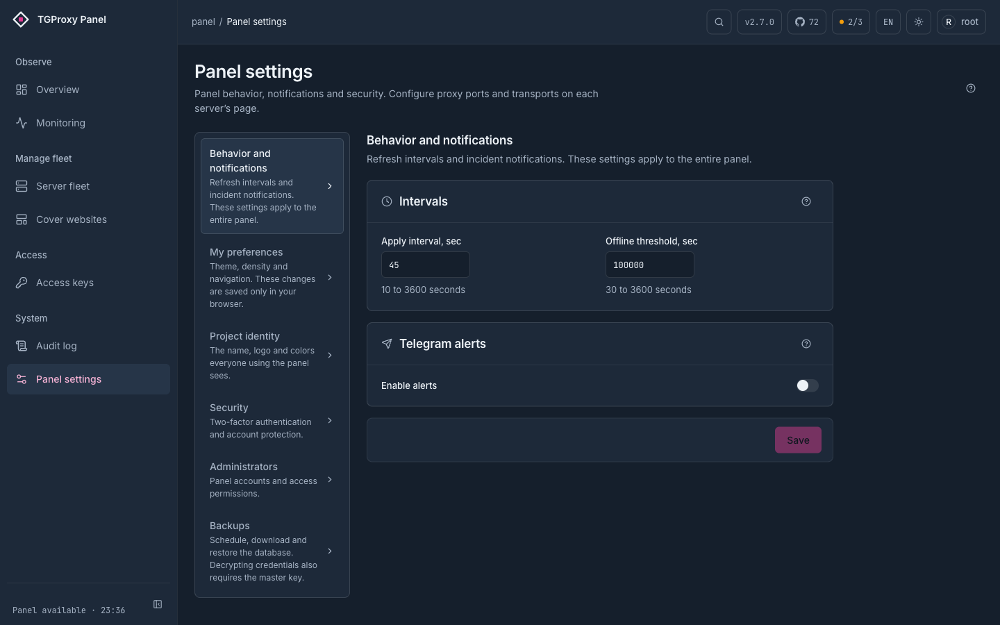

### Activity log

The Activity log records every administrator action and can be filtered by action, user and date.

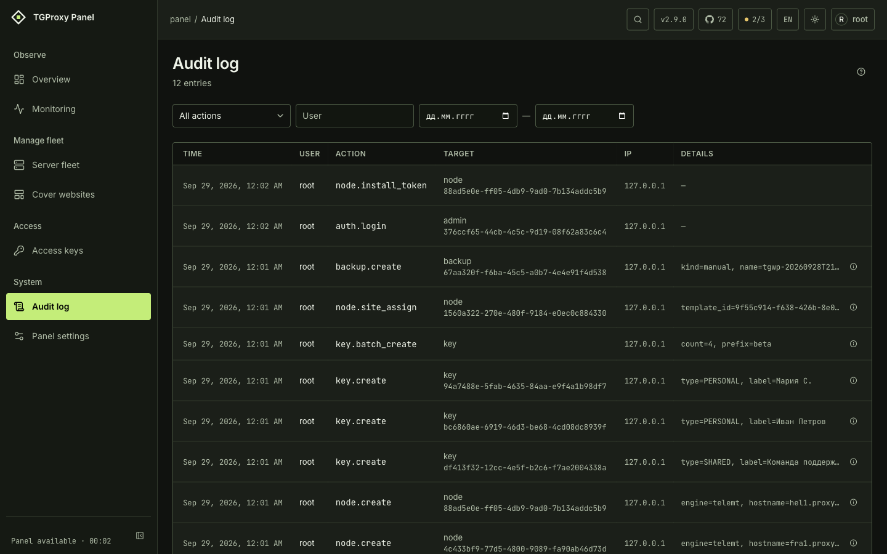

### Top bar, search and help

The button in the top left corner collapses the sidebar. Search and commands open with `⌘K` or
`Ctrl+K`: from there you can jump to a section, server or key, create a key, apply changes on
every server, or switch the theme or language.

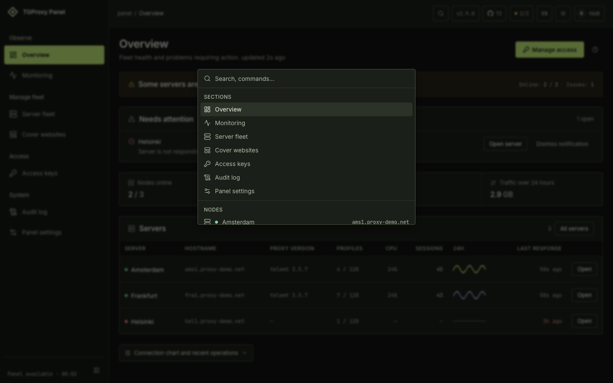

The right side of the top bar has three chips: the panel version, the project on GitHub with its
star count, and the number of servers online. On narrow screens the same information moves into
the user menu. Once an hour the panel reads the latest release of `GITHUB_REPO` (default
`greenpandorik/tgproxy-panel`). When a newer version exists, the version chip is highlighted and
links to the release page. Nothing about your installation is sent, and `UPDATE_CHECK=false` in
`.env` turns the GitHub calls off.

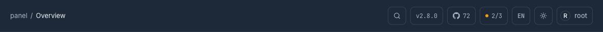

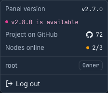

The `?` in the header of a page or dialog opens a help panel on the right: what each field means,
an example value, what happens if it is left empty, and common mistakes. The `?` key opens help for
the current page. Forms remember what you typed. If a dialog closes by accident, the next time it
opens the panel offers to continue the draft or start over. A draft lives for 24 hours in the
browser, and passwords and tokens are never stored in it.

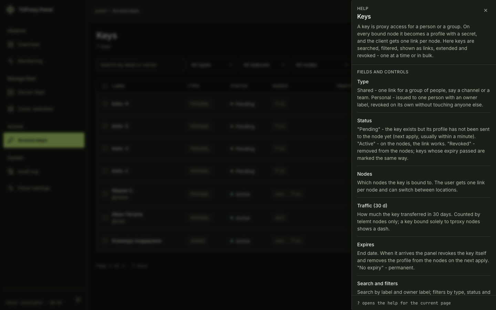

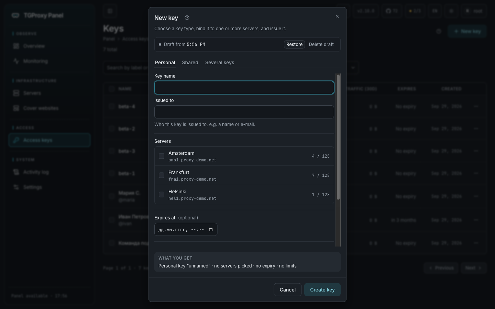

### Telegram datacenters

On the Health tab, the "Telegram datacenters" block shows how the server sees Telegram's network.
For each datacenter it gives the latency telemt measures with its own regular checks and averages,
the IPv4 or IPv6 preference, the state of the direct route, and a connection counter. Latency is
green under 150 ms, amber under 400 ms and red above. The Stats tab plots the same latencies over
time, the servers list has a "Telegram" column with the overall latency, and the Overview tile
"Latency to Telegram" averages it over the online servers. Servers on tproxy have no such data.

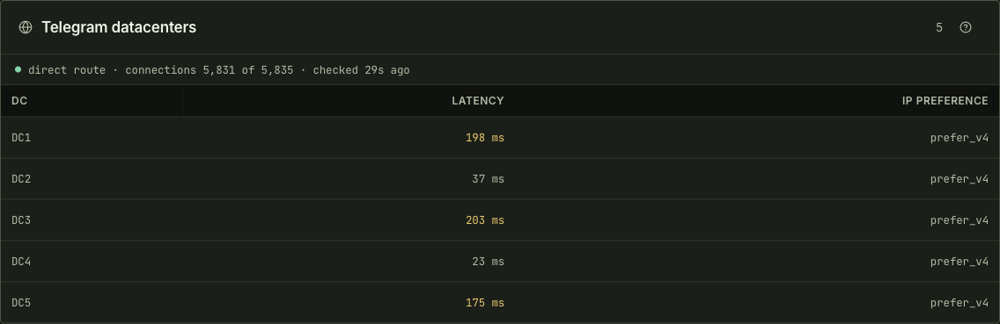

### External network checks

The panel checks servers from its own address. To see how a server looks from other networks, for
example from different providers, connect external checks: set `PROBE_TOKEN` and
`PROBE_LOCATIONS` on the panel host and run `tgwp-probe` in each of those networks. The results
appear on the Checks tab under "External network checks".

## 11. Branding

Settings → Branding (the "Project identity" section): panel name, logo, favicon, login background,
primary and accent colours, default theme, login page text, support link, footer text and custom
CSS. Changes apply to every user at once, without a rebuild. You can keep several branding
variants and switch the active one with "Activate".

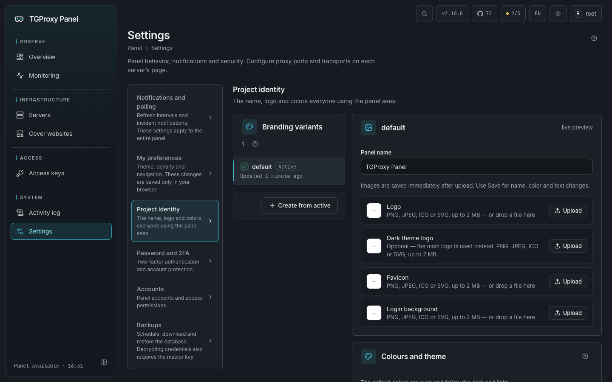

The My interface tab changes the theme, density and sidebar for you alone. These preferences are
stored in your browser.

## 12. Backups, key rotation, upgrades

### Backups

The Settings → Backups tab is visible to the owner only. "Create backup" dumps the database right
away. In the "Nightly backup" block, turn on "Run every night", pick the time (an hour in UTC) and how
many dumps to keep, from 1 to 60, then press "Save". Older scheduled dumps beyond that are deleted; manual ones are
kept. The files live in the panel volume under `/data/backups/` and can be downloaded from the
table.

A backup holds the whole database, with the secrets still encrypted. Keep `MASTER_KEY` from `.env`
next to your backups: without it a restored database cannot decrypt anything. Encrypting backups,
uploading them off the host and verifying restores are switched on with the `BACKUP_*` variables
(section 13).

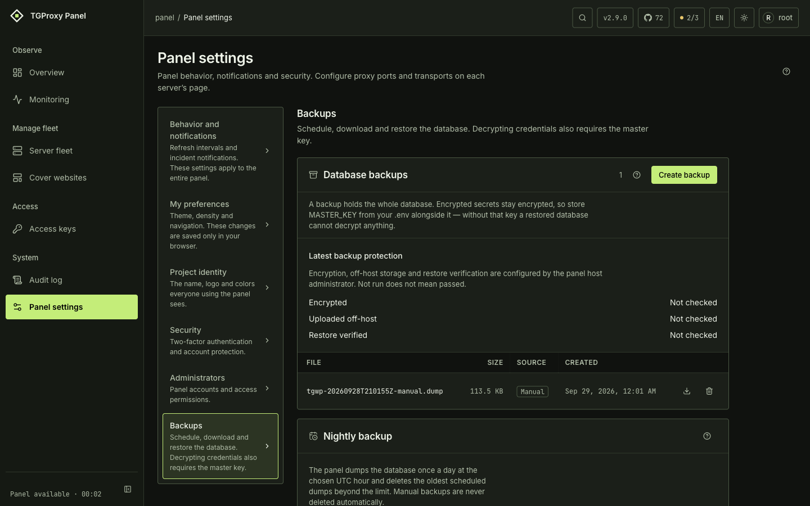

Restoring from a backup. Run the commands in the install directory. A restore works only while the
panel is stopped, and it replaces the current database entirely.

```bash
docker compose stop panel
docker compose run --rm panel db restore /data/backups/<file>.dump --yes
docker compose start panel
```

### Rotating the master key

Generate the new key with `openssl rand -base64 32`. Then:

```bash
docker compose stop panel
# add MASTER_KEY_NEW=<new base64 key> to .env
docker compose run --rm panel keys rotate --dry-run
docker compose run --rm panel keys rotate
# then in .env: MASTER_KEY=<new>, MASTER_KEY_VERSION=2, MASTER_KEY_V1=<old>; remove MASTER_KEY_NEW
docker compose up -d panel
```

`--dry-run` only counts the rows that would be re-encrypted. The panel is started with `up -d` so
that the container picks up the new `.env`. Keep the old key in `MASTER_KEY_V1` for as long as old
backups need it. The details are in [the runbook](runbook.md).

### Upgrading the panel

A panel set up by the installer:

```bash
sudo /opt/tgproxy-panel/install.sh --update      # latest release; --version 1.2.0 for a specific one
```

The installer pulls the new image and restarts the containers. The data is kept, and in `.env` only
the panel version and the telemt pins change. The panel runs database migrations by itself on
start.

A panel built from a checkout:

```bash
git pull
cd deploy && docker compose up -d --build panel
```

### Upgrading servers

`tgwp-agent upgrade` upgrades the agent and telemt on a server, and telemt can also be updated from
the panel (section 7). `tproxy-server` is pinned to the commit in `TPROXY_COMMIT`. Changing that
commit means reinstalling the server with a fresh install command.

## 13. Environment variables

The variables live in `.env`: `/opt/tgproxy-panel/.env` after the installer, or `deploy/.env` for a
by-hand install. After editing it, recreate the panel container with `docker compose up -d panel`;
a plain `restart` does not see the new values.

| Variable | Purpose |
|---|---|
| `DATABASE_URL` | PostgreSQL connection string. In compose, `docker-compose.yml` sets it itself |
| `MASTER_KEY`, `MASTER_KEY_VERSION` | Encryption key for secrets in the database and its version |
| `MASTER_KEY_V<n>`, `MASTER_KEY_NEW` | Earlier keys after a rotation, and the new key while `keys rotate` runs |
| `SESSION_SECRET` | Signs session cookies |
| `PANEL_PUBLIC_URL` | Public panel address without a trailing `/`, embedded in server install commands |
| `PANEL_HTTP_ADDR` | Listen address inside the container, usually `:8080` |
| `DATA_DIR` | The panel's data directory; `/data` (the `paneldata` volume) in Docker |
| `NODE_DRIVER` | `gateway` for real servers, `mock` for demos and tests |
| `METRICS_TOKEN` | Token for `/metrics`, required with `gateway` |
| `TELEMT_VERSION`, `TELEMT_SHA256_X86_64` | telemt version for servers and the sha256 of its archive. Change them as a pair; the sha256 is required with `gateway` |
| `TPROXY_COMMIT` | `tproxy-server` commit used when installing servers |
| `FEATURE_TOTP` | `true` by default; `false` hides two-factor login |
| `APPLY_INTERVAL`, `OFFLINE_AFTER` | Apply interval and offline threshold in seconds, 45 and 90 by default. Values saved under Settings → Notifications take precedence |
| `UPDATE_CHECK`, `GITHUB_REPO`, `GITHUB_TOKEN` | The GitHub update check: on/off switch, repository and an optional token |
| `LOG_LEVEL` | `debug`, `info`, `warn` or `error` |
| `PANEL_DOMAIN`, `ACME_EMAIL` | Caddy only, compose deployment |
| `POSTGRES_PASSWORD` | Password of the bundled PostgreSQL in compose; the installer generates it |
| `PANEL_VERSION`, `PANEL_IMAGE` | Which panel image to run; written by the installer |
| `PROBE_TOKEN`, `PROBE_LOCATIONS` | External network checks: a token of at least 32 characters and comma-separated location names |
| `ALERT_WEBHOOK_URL`, `ALERT_WEBHOOK_SECRET` | Signed alerts to your own HTTPS endpoint; the secret needs at least 32 characters |
| `BACKUP_AGE_RECIPIENT`, `BACKUP_UPLOAD_URL`, `BACKUP_UPLOAD_TOKEN`, `BACKUP_VERIFY` | Backup encryption to an age public key, upload over HTTPS and restore verification |

Every variable is described in full in [the reference](reference.md).

## 14. Troubleshooting

Before you hand out keys, test a connection yourself, ideally from Telegram Desktop, where both
links work.

- The panel does not start. Run `docker compose logs panel` in the install directory. The error
  line contains `config:` and the variable's name. The usual causes are an empty `METRICS_TOKEN`
  or `TELEMT_SHA256_X86_64`, a wrong `DATABASE_URL`, or a `MASTER_KEY` that does not decode to 32
  bytes.
- The panel installer stopped at its checks. The domain does not point at this server, a CDN
  proxy is in front of it, or port 80 or 443 is taken. Fix it and press `r`.
- A server install stopped while waiting for the certificate. The A record must point at this
  server, and ports 80 and 443 must be reachable from the internet. Caddy's log:
  `journalctl -u caddy -n 30`. Then run the same command again.
- telemt did not report ready. It needs outbound access to the Telegram datacenters and to the
  Fake-TLS domain on 443. Its log: `journalctl -u telemt -n 30`.
- Registration returned 404. The token was already used or 24 hours have passed. Get a new
  command: Maintenance tab → "Show install command".
- A server never comes online. On the server, run `systemctl status tgwp-agent` and
  `journalctl -u tgwp-agent -n 100 --no-pager`. The agent must be able to reach
  `PANEL_PUBLIC_URL`. The proxy services: `systemctl status telemt caddy` on telemt,
  `systemctl status tproxy-server mtproxy caddy` on tproxy. If the agent will not start, reinstall
  it with the command from the Maintenance tab.
- A key stays "Pending". The server is offline or the apply failed. Open the server's Maintenance
  tab and look at "Apply history": the operation details include the agent log.
- The WEB link works but Fake-TLS does not. Look at Checks → "Check from the panel", the "Fake-TLS
  mask" row. Usually port 8443 is closed in the provider's firewall, or the server cannot connect
  to itself on 443 (section 7).
- Fake-TLS links stopped working after the Fake-TLS domain or port changed. That is expected;
  reissue the links.

Detailed recovery procedures are in [the runbook](runbook.md).
