# Установка и запуск панели

[English](setup.en.md) · **Русский**

Это полная инструкция по установке для тех, кто уверенно работает в терминале Linux. Если вы
ставите сервер впервые, начните с гида [«С нуля»](start.ru.md): там всё по шагам, а незнакомые
слова объяснены в [словарике](start.ru.md#словарик).

Панель состоит из одной программы на Go со встроенным веб-интерфейсом. Рядом с ней работают
база PostgreSQL и Caddy, который получает сертификат для HTTPS. Всё это запускается в Docker на
отдельном сервере. Сами прокси работают на других серверах: на каждом стоит telemt (так по
умолчанию) или старая связка `tproxy-server` и MTProxy, а ещё агент `tgwp-agent`, через
который панель ими управляет.

Для обычной установки хватит разделов 1, 2, 5, 6 и 8. Остальные понадобятся, когда захочется
тонкой настройки или что-то пойдёт не так. Скриншоты сняты на демо-данных.

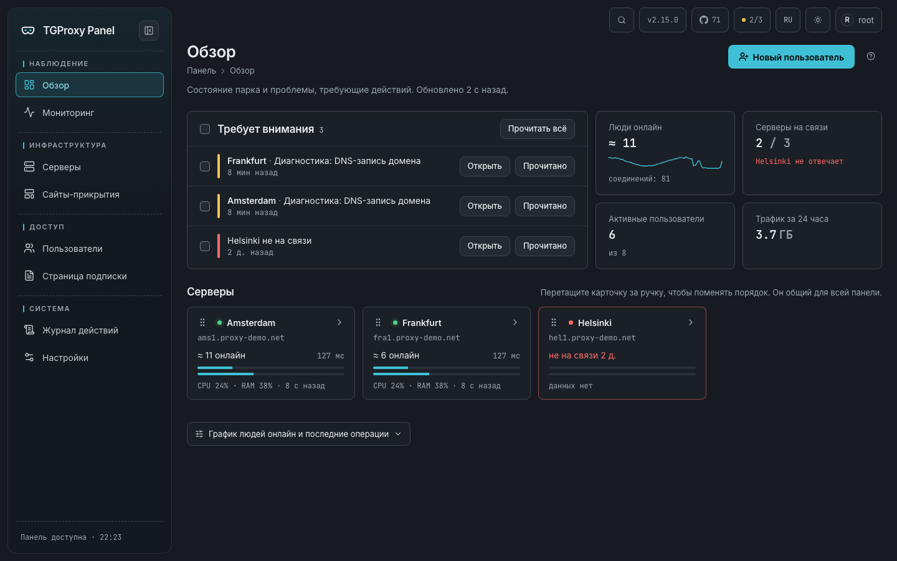

## 1. Что понадобится

- Сервер для панели. Хватит 1 CPU и 1 ГБ памяти. Проще всего взять чистую Ubuntu 22.04+ или
  Debian 12+: установщик сам поставит Docker с Compose v2. Процессор x86_64 или ARM64, образ
  панели собран для обоих. Нужен домен с A-записью на этот сервер и свободные порты 80 и 443.
- Серверы для прокси, сколько нужно. Каждый из них отдельный VPS: Ubuntu 22.04+ или Debian 12+,
  процессор x86_64 (telemt выпускается только под него), публичный IPv4, свой домен с A-записью,
  доступ root или sudo.
- Для разработки без Docker: Go 1.26+, Node 22+, PostgreSQL 16.

Панель и прокси не уживутся на одном сервере, потому что прокси-сервер занимает порты 80 и 443
целиком.

Установщики не открывают порты в файрволе. Если у хостинга есть сетевой фильтр («Firewall»,
«Группы безопасности») или на сервере включён `ufw`, разрешите входящий TCP:

- на сервере панели: 22, 80 и 443;
- на прокси-сервере: 22, 80, 443 и порт Fake-TLS, по умолчанию 8443.

Прокси-серверу нужен выход в интернет: к панели, к `github.com` (оттуда скачивается telemt),
к репозиторию Caddy `dl.cloudsmith.io` и к датацентрам Telegram.

## 2. Вариант A: сервер с доменом (рекомендуется)

Так панель ставят для настоящей работы. Она открывается по HTTPS на своём домене, а сертификат
Let's Encrypt Caddy получает и продлевает сам.

### Одной командой

До запуска A-запись домена панели уже должна указывать на этот сервер, а порты 80 и 443 должны
быть свободны. Выполните на сервере:

```bash
curl -fsSL https://raw.githubusercontent.com/greenpandorik/tgproxy-panel/main/install.sh | sudo bash
```

Установщик задаст вопросы на английском:

| Вопрос | Что ответить |
|---|---|
| `Panel domain` | Домен панели, например `panel.example.com`. Пустой ответ ставит панель в локальном режиме без домена (раздел 3) |
| `E-mail for Let's Encrypt` | Адрес для писем о проблемах с сертификатом. Можно пропустить, но тогда предупреждений не будет |
| `Admin username` | Логин первого администратора, по умолчанию `admin` |
| `Admin password` | Пароль от 10 символов. При вводе он не виден, установщик попросит повторить. Если нажать Enter, он придумает пароль из 20 символов сам |

Дальше установщик работает по порядку:

1. Проверяет, что домен указывает на публичный IP этого сервера, порты 80 и 443 свободны, а
   каталог установки подходит.
2. Ставит Docker с get.docker.com, если его нет. Перед этим спросит разрешения.
3. Показывает план и спрашивает `Proceed?`.
4. Скачивает compose-файлы последнего релиза в `/opt/tgproxy-panel` и пишет `.env` с новыми
   секретами: `MASTER_KEY`, `SESSION_SECRET`, `METRICS_TOKEN` и пароль PostgreSQL.
5. Запускает контейнеры и до 120 секунд ждёт, пока панель ответит.
6. Создаёт первого администратора с ролью `owner` (владелец).

Если проверка из первого шага не прошла, установщик объяснит причину и предложит
`[r] re-run  [c] continue anyway  [q] quit`. Поправьте DNS или освободите порт в другом окне и
нажмите `r`. Если перед доменом включён прокси CDN, выключите его: Let's Encrypt должен
достучаться до сервера напрямую. Без терминала, а также с `--yes`, установщик на проваленной
проверке останавливается. Флаг `--skip-preflight` пропускает проверки совсем.

То же самое без вопросов:

```bash
curl -fsSL https://raw.githubusercontent.com/greenpandorik/tgproxy-panel/main/install.sh | sudo bash -s -- \
  --domain panel.example.com --email admin@example.com --admin-user root --admin-password 'надёжный-пароль' --yes
```

С `--yes` установщик ничего не спрашивает. Если не хватает обязательного значения, он выходит
с кодом 2. Все флаги перечислены в `install.sh --help`, и у каждого есть переменная окружения
`TGWP_<ИМЯ>`, например `TGWP_DOMAIN` или `TGWP_YES=1`.

В конце установщик печатает адрес панели и, если вы не задали пароль, сгенерированный пароль.
Он показывается один раз, сохраните его сразу.

В `/opt/tgproxy-panel` остаются `docker-compose.yml`, `docker-compose.local.yml`, `Caddyfile`,
`.env.example`, `.env` (права 0600) и копия `install.sh` для обновлений. Сохраните копию `.env`
вне сервера: `MASTER_KEY` из него шифрует все секреты в базе, и без него их не восстановить даже
из резервной копии. Например, с вашего компьютера, если заходите на сервер как root:

```bash
scp root@<IP панели>:/opt/tgproxy-panel/.env ./tgproxy-panel.env
```

Команды для обслуживания:

```bash
sudo /opt/tgproxy-panel/install.sh --update              # обновить до последнего релиза (или --version 1.2.0)
sudo /opt/tgproxy-panel/install.sh --uninstall           # остановить; спросит, удалять ли тома с данными
sudo /opt/tgproxy-panel/install.sh --uninstall --purge   # удалить контейнеры, тома и каталог
cd /opt/tgproxy-panel && docker compose logs -f panel    # логи
```

Если запустить установщик ещё раз на сервере, где уже есть `/opt/tgproxy-panel/.env`, он
сработает как `--update`: обновит панель, а `.env` и данные оставит.

### Вручную через docker compose

Этот путь собирает образ панели из исходников.

```bash
git clone https://github.com/greenpandorik/tgproxy-panel.git && cd tgproxy-panel/deploy
cp ../.env.example .env
```

Сгенерируйте секреты:

```bash
# три секрета
printf 'MASTER_KEY=%s\n'     "$(openssl rand -base64 32)"
printf 'SESSION_SECRET=%s\n' "$(openssl rand -base64 32)"
printf 'METRICS_TOKEN=%s\n'  "$(openssl rand -hex 32)"
```

Впишите полученные значения в соответствующие строки `deploy/.env`, затем задайте:

```
PANEL_PUBLIC_URL=https://panel.example.com
PANEL_DOMAIN=panel.example.com
ACME_EMAIL=admin@example.com
```

`DATABASE_URL` в compose-варианте задаёт сам `docker-compose.yml` (сервис `postgres`), так что
строку в `.env` можно оставить как есть. Строки `TELEMT_VERSION` и `TELEMT_SHA256_X86_64` уже
заполнены в `.env.example`, не стирайте их: без sha256 панель не запустится.

Запуск:

```bash
docker compose up -d --build postgres panel caddy
docker compose logs -f panel        # ждём строку "panel listening"
```

Создайте первого администратора. Без третьего аргумента он получает роль `owner`, возможны ещё
`admin` и `viewer`. Пароль берите от 10 символов: столько панель требует, когда пароль меняют в
интерфейсе.

```bash
docker compose exec panel /app/panel admin create root 'надёжный-пароль'
```

Откройте `https://panel.example.com` и войдите.

Что важно знать:

- `MASTER_KEY` шифрует секреты ключей и токены в базе. Потеряете его, и все секреты пропадут,
  поэтому храните копию вне сервера.
- `METRICS_TOKEN` обязателен. Без него панель не стартует, потому что `/metrics` доступен на
  публичном домене.
- Данные лежат в томах `pgdata`, `paneldata` и `caddydata`. Никогда не запускайте на рабочей
  панели `docker compose down -v`: флаг `-v` удаляет тома.

## 3. Вариант B: локально без домена

Чтобы просто посмотреть интерфейс, панель можно запустить без домена и HTTPS. Она откроется
напрямую на порту 8080, Caddy при этом не нужен.

Установщиком (Linux, root):

```bash
curl -fsSL https://raw.githubusercontent.com/greenpandorik/tgproxy-panel/main/install.sh | sudo bash -s -- --local --yes
```

Тот же режим включается, если на вопрос `Panel domain` ответить пустой строкой. Установщик
проверит только, что свободен порт 8080, и запишет в `PANEL_PUBLIC_URL` адрес
`http://<IP сервера>:8080`. Если потом пересоздаёте контейнеры в `/opt/tgproxy-panel`, указывайте
оба compose-файла: `docker compose -f docker-compose.yml -f docker-compose.local.yml up -d`.
Без второго файла контейнер панели потеряет порт 8080.

Вручную из исходников:

```bash
cd deploy
cp ../.env.example .env
# заполните MASTER_KEY, SESSION_SECRET, METRICS_TOKEN как выше; PANEL_PUBLIC_URL=http://localhost:8080
docker compose -f docker-compose.yml -f docker-compose.override.example.yml up -d --build postgres panel
docker compose exec panel /app/panel admin create root 'change-me-now-1'
```

Панель будет на `http://localhost:8080`. Интерфейс, сайты-прикрытия и настройки можно
посмотреть целиком, сервер в панели тоже можно завести. Поставить его на настоящий VPS не
выйдет: до `localhost` сервер из интернета не достучится. На VPS с `--local` связь панели и
серверов шла бы без шифрования, поэтому для настоящих серверов ставьте вариант A.

## 4. Вариант C: разработка без Docker

```bash
brew install postgresql@16 && brew services start postgresql@16   # macOS
createuser -s tgwp && psql -d postgres -c "ALTER USER tgwp PASSWORD 'tgwp'"
createdb -O tgwp tgwp && createdb -O tgwp tgwp_test

cp .env.example .env         # заполните MASTER_KEY, SESSION_SECRET; NODE_DRIVER=mock позволяет не задавать METRICS_TOKEN
set -a; . ./.env; set +a     # панель берёт настройки только из переменных окружения
make tools                   # sqlc, gofumpt, golangci-lint, protoc-плагины
make web                     # сборка SPA в web/dist (встраивается в бинарь)
go run ./cmd/panel admin create root 'change-me-now-1'
make run                     # панель на :8080
```

Панель сама `.env` не читает, и `make` тоже. Поэтому строка `set -a; . ./.env; set +a` нужна в
каждом новом окне терминала, иначе панель остановится с ошибкой `DATABASE_URL is required`.

Для фронтенда с горячей перезагрузкой запустите `cd web && npm run dev`. Dev-сервер Vite
проксирует `/api`, `/healthz` и `/metrics` на `:8080`.

Проверки перед изменениями:

```bash
make test                    # go test -p 1 ./... (тесты делят одну базу, поэтому -p 1)
make lint
cd web && npm run typecheck && npm run lint && npm run test -- --run && npm run i18n:check
```

Тестам с базой нужна переменная `TEST_DATABASE_URL`, она есть в `.env.example`. Если её нет в
окружении, такие тесты пропускаются.

Сквозные проверки поднимают панель и тестовый сервер в Docker, создают сервер и ключ, проверяют,
что ключ дошёл до прокси, и сами разбирают стенд вместе с томами. Нужны Docker, `curl` и `jq`,
при успехе последняя строка будет `SMOKE OK`.

```bash
make e2e          # движок tproxy: настоящий tproxy-server в контейнере
make e2e-telemt   # движок telemt: настоящий релиз telemt, нужен выход к датацентрам Telegram
```

`make e2e-telemt` собирает образ `deploy/Dockerfile.fakenode-telemt` из релиза telemt со сверкой
контрольной суммы, создаёт ключ с лимитами и проверяет, что telemt получил его через control API
без перезапуска.

## 5. Первый вход и двухфакторная защита

Откройте адрес панели и войдите под администратором, которого создал установщик.

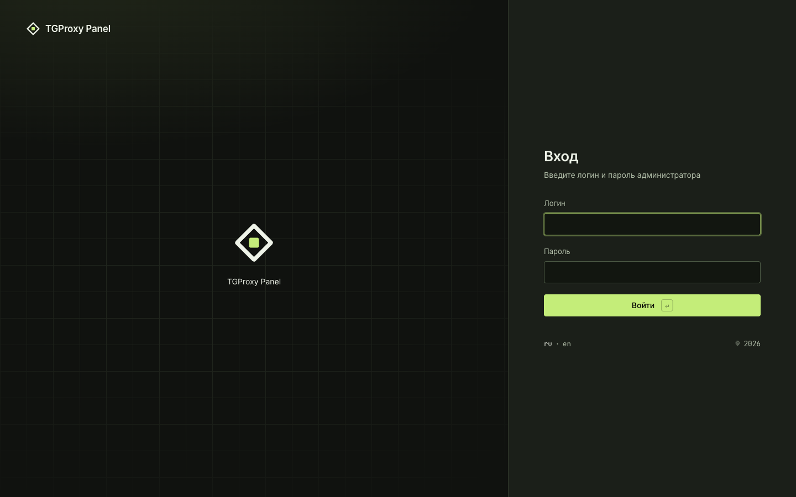

Смените пароль, если его придумал установщик: «Настройки» → вкладка «Пароль и 2FA». Туда же
ведёт меню пользователя в правом верхнем углу. Новый пароль должен быть не короче 10 символов.
После смены пароля все ваши остальные сеансы завершатся.

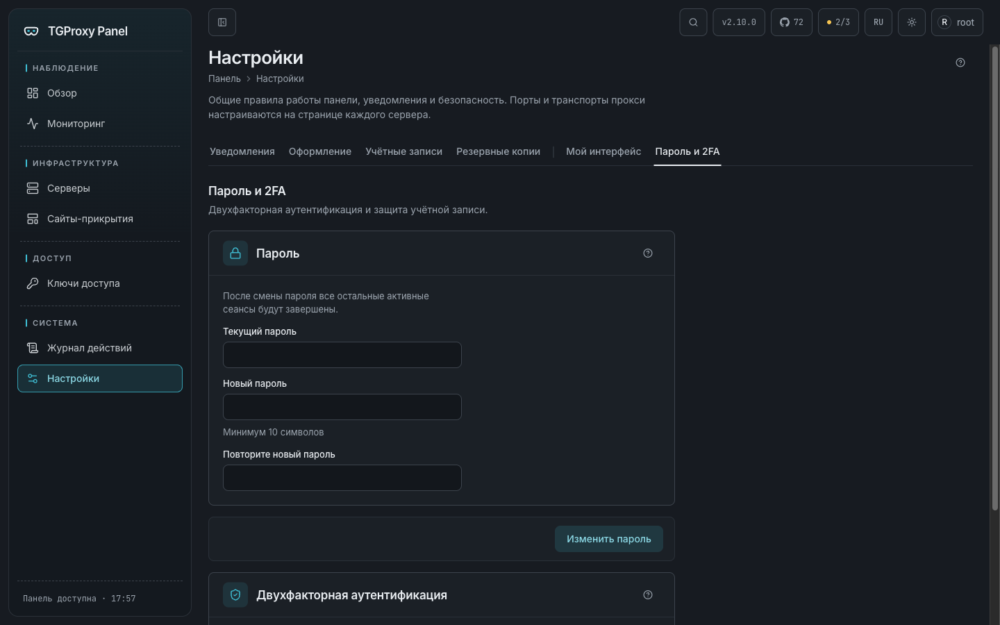

Двухфакторный вход доступен по умолчанию: на вкладке есть блок «Двухфакторная аутентификация».
Если в `.env` панели стоит `FEATURE_TOTP=false`, блок скрыт. Уберите эту строку или поставьте
`true` и пересоздайте контейнер панели в каталоге установки:
`cd /opt/tgproxy-panel && docker compose up -d panel` (`docker compose restart` оставит старые
переменные).

Чтобы включить вход с кодом, на вкладке «Пароль и 2FA» нажмите «Включить», отсканируйте QR-код в Google Authenticator,
Aegis, 1Password или другом приложении, введите код и нажмите «Подтвердить и включить».

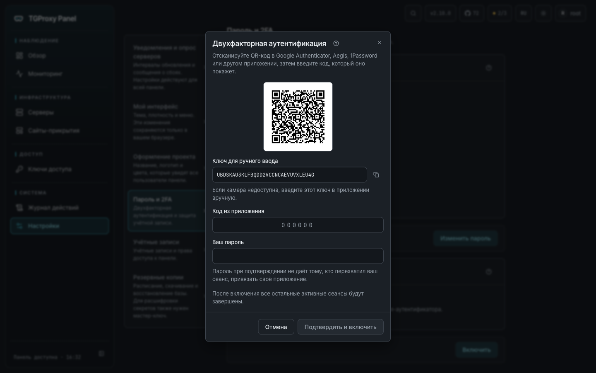

После этого панель покажет восемь резервных кодов, второй раз их не увидеть. Каждый код
срабатывает однократно и нужен на случай, если телефон с приложением потеряется. Сохраните их,
например кнопкой «Скачать .txt». Если доступа нет ни к приложению, ни к кодам, отключите 2FA этому пользователю с
сервера панели, из каталога установки:

```bash
docker compose exec panel /app/panel admin totp-reset <логин>
```

Команда выключит второй фактор и удалит резервные коды только у этого пользователя. Войти он
сможет по паролю и подключить 2FA заново.

Других администраторов добавляет владелец на вкладке «Настройки» → «Учётные записи». Роли такие:
владелец может всё; администратор управляет серверами, ключами, сайтами и оформлением, но не
настройками панели и учётными записями; наблюдатель только смотрит.

## 6. Подключение сервера

### Подготовьте сервер

Прежде чем запускать установку, проверьте три вещи:

- A-запись домена прокси-сервера указывает на его IP. Установщик проверяет это до того, как
  что-либо ставить, а без правильной записи Caddy не получит сертификат.
- Порты 80 и 443 открыты в сетевом фильтре хостинга, а для сервера с telemt ещё порт Fake-TLS,
  по умолчанию 8443.
- Эти порты не заняты другими программами.

### Заведите сервер в панели

Откройте «Серверы» и нажмите «Добавить сервер». Мастер из трёх шагов.

На шаге «Сервер» заполните:

- «Имя»: как сервер будет называться в панели, например «Амстердам»;
- «Хост»: домен сервера строчными буквами, без `https://`, например `proxy1.example.com`;
- «E-mail для Let's Encrypt»: на него придут письма о проблемах с сертификатом;
- «Публичный IP»: необязательно, установщик определит его сам. Заполните, если сервер за NAT
  и адрес на интерфейсе отличается от того, на который указывает A-запись.

Кнопка «Проверить DNS» покажет, куда сейчас указывает домен. Нажмите «Продолжить».

На шаге «Прокси» выберите «Движок». Для новых серверов оставьте telemt, чем движки отличаются,
описано в разделе 7. В блоке «Расширенные: маскировка и порты» есть «Домен Fake-TLS» (по
умолчанию совпадает с хостом) и «Порт Fake-TLS» (по умолчанию 8443, можно от 1024 до 65535,
кроме 80 и 443). Если не уверены, ничего не меняйте. Нажмите «Создать сервер».

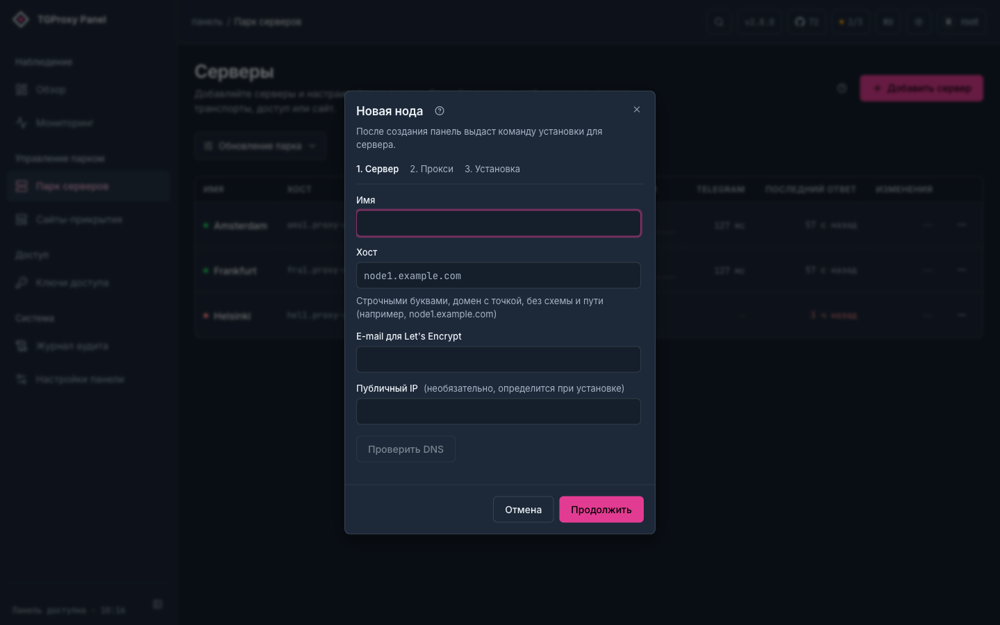

На шаге «Установка» панель покажет одноразовую команду. Она действует 24 часа, срок написан под
ней. Скопируйте её кнопкой рядом.

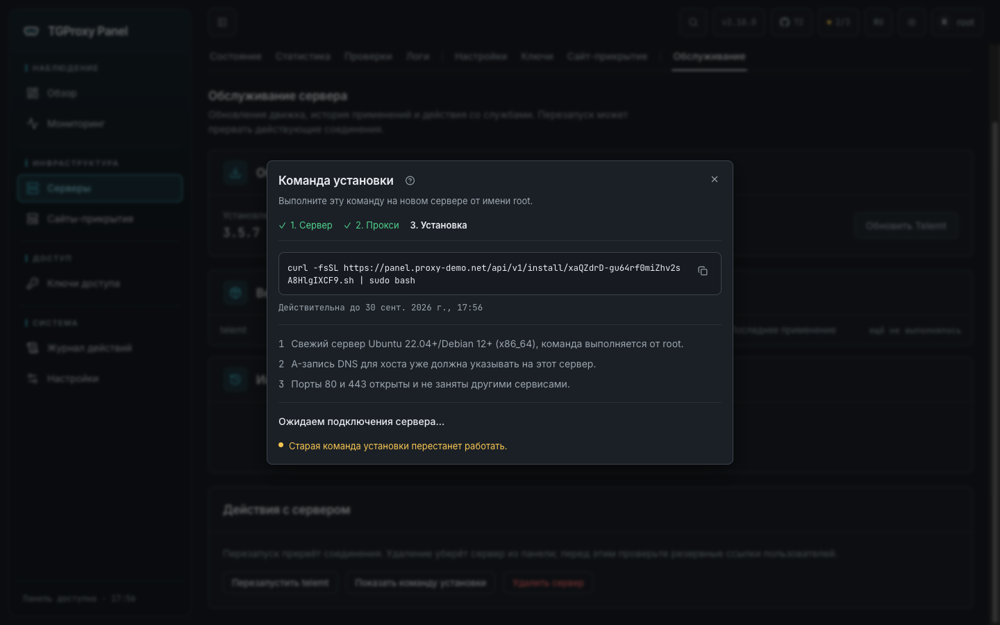

### Запустите установку

Не закрывайте окно панели. Подключитесь к прокси-серверу по SSH и выполните команду от root:

```bash
curl -fsSL https://panel.example.com/api/v1/install/<token>.sh | sudo bash
```

В зависимости от движка скрипт ставит telemt или `tproxy-server` (закреплённый коммит) с
официальным MTProxy, а также Caddy и агента. Он получает сертификат и регистрирует сервер в
панели. Окно в панели сменит «Ожидаем подключения сервера…» на «Агент подключён», покажет
«Полную проверку сервера» и кнопку «Открыть сервер». Обычно это занимает пару минут.

### Что проверяет установщик

Первым делом скрипт проходит «Pre-flight checks» и печатает по строке на проверку:

- `arch`: процессор x86_64; `systemd`: он работает; `panel`: панель отвечает на `/healthz` с
  этого сервера.
- `public_ip`: публичный IPv4 этого сервера. Если задан `TGWP_PUBLIC_IP`, берётся он, иначе
  «Публичный IP» из панели. Если нет ни того, ни другого, скрипт находит два адреса: на
  исходящем интерфейсе и тот, что видит `api.ipify.org`. Выигрывает адрес, на который уже
  указывает A-запись, а если ни один не совпал, берётся адрес интерфейса, когда он публичный.
  Если адреса различаются, печатаются оба. На сервере за NAT внешний адрес провайдера часто
  только исходящий, и входящие подключения на него не приходят.
- `dns`: A-запись сервера указывает на этот адрес.
- `tls_domain`, только на telemt и только если «Домен Fake-TLS» отличается от хоста: этот домен
  резолвится. При провале выводится только предупреждение.
- `ports`: свободны 80, 443 и порт Fake-TLS. Caddy или telemt, оставшиеся от прошлого запуска
  этого же скрипта, не мешают.

Провал `arch`, `systemd`, `panel` или `public_ip` останавливает скрипт. Провал `dns` или `ports`
показывает меню:

```
  What now?  [r] re-run the checks   [c] continue anyway   [q] quit
```

Поправьте запись в другом окне и нажмите `r`. `q` или Ctrl-C выходит, ничего не установив. Если
терминала нет (например, облачная консоль просто прогоняет скрипт), скрипт тоже выходит. Чтобы
продолжить несмотря на провал, запустите `curl … | sudo TGWP_SKIP_PREFLIGHT=1 bash`.
`TGWP_DRY_RUN=1` останавливает скрипт сразу после проверок, а `TGWP_PUBLIC_IP=<адрес>` задаёт
публичный адрес вручную.

### Если установка прервалась

После пакетов скрипт запускает Caddy и до 120 секунд ждёт, пока `https://<домен сервера>/`
ответит с настоящим сертификатом. Сервер с telemt затем до 60 секунд ждёт, пока telemt сообщит о
готовности через свой control API. Caddy должен получить сертификат раньше, чем запустится
telemt: telemt снимает TLS-отпечаток своего домена Fake-TLS настоящим подключением на 443 и без
него не примет новую конфигурацию.

Регистрация в панели идёт последним шагом, и только она тратит одноразовый токен. Поэтому если
скрипт упал раньше шага «Registration» (обычно на ожидании сертификата), устраните причину и
запустите ту же команду ещё раз: уже поставленные пакеты переиспользуются. Сообщение об ошибке
заканчивается последними 30 строками `journalctl -u caddy` или `journalctl -u telemt` и
подсказывает, что проверить.

Если регистрация вернула 404, токен уже потрачен или истёк. Выпустите новую команду: на странице
сервера вкладка «Обслуживание» → «Показать команду установки», или «Команда установки» в меню
строки сервера в списке. Старая команда после этого перестаёт работать.

### Сетевые настройки

Для обоих движков скрипт записывает `/etc/sysctl.d/90-tgwp.conf` с сетевыми настройками для
прокси-сервера из MTPROTO_FIX_By_MEKO: BBR с планировщиком `fq`, увеличенные очереди accept и SYN
(`somaxconn`, `tcp_max_syn_backlog`, `netdev_max_backlog` = 65535), TCP Fast Open и короткие
keepalive (45/15 с × 3 пробы), чтобы мёртвые клиенты отваливались примерно за минуту. Если ядро
не принимает какой-то ключ (в контейнере или на старом ядре), скрипт пишет об этом и продолжает.
Файл можно спокойно удалить, от него зависят только эти значения.

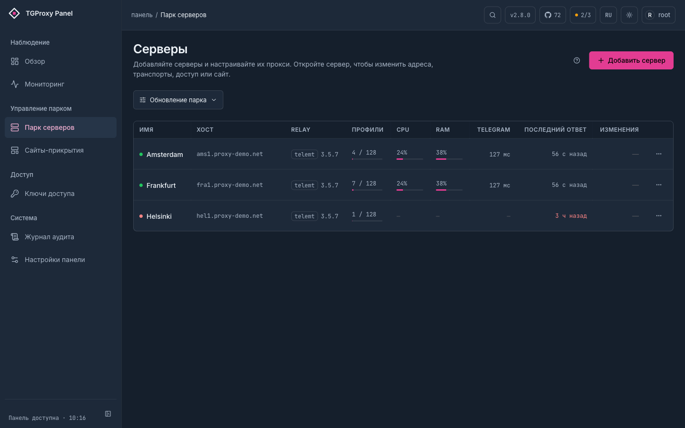

### Страница сервера

Страница сервера разбита на вкладки:

- «Состояние»: службы, CPU, память, диск, аптайм и связь с датацентрами Telegram.
- «Статистика»: графики нагрузки, задержки до Telegram и работы прокси. На сервере с telemt
  здесь же счётчики WEB-транспорта.
- «Проверки»: «Полная проверка сервера» через агента (только telemt), «Проверка с панели»
  снаружи и «Проверки из внешних сетей».
- «Логи»: журналы служб сервера.
- «Настройки», только на telemt: адреса, порт и домены Fake-TLS, WEB-транспорт и маршрут до
  Telegram.
- «Ключи»: ключи, которые стоят на этом сервере.
- «Сайт-прикрытие»: сайт на домене сервера (раздел 9).
- «Обслуживание»: обновления telemt, история применений, перезапуск, команда установки и
  удаление сервера.

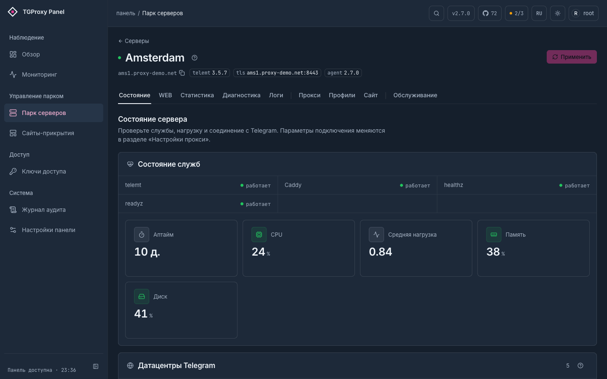

«Проверка с панели» смотрит на сервер снаружи, с адреса панели: DNS-запись, порты 80 и
443, TLS-сертификат, ответ сайта, а на сервере с telemt ещё и маскировку Fake-TLS. Строка
«Постквантовый обмен ключами» информационная: она показывает, договаривается ли Caddy на сервере
о гибридном X25519MLKEM768 с современными клиентами, и на общий результат не влияет. «Полная
проверка сервера» хранит историю, отчёт можно скачать кнопкой «Скачать отчёт». Проверки, которые
выполнить не удалось, считаются отдельно и в пройденные не попадают.

Нагрузку сервера видно в нескольких местах. В списке серверов есть колонки CPU и RAM, на
«Обзоре» колонка CPU; они берутся из последнего ответа агента, у недоступного сервера там
прочерк. На вкладке «Состояние» текущие CPU, память, диск и аптайм. На вкладке «Статистика»
график CPU, RAM и диска за 1 час, 6 часов, 24 часа или 7 дней. Тот же график есть в карточке
сервера в «Мониторинге», в разделе «Серверы».

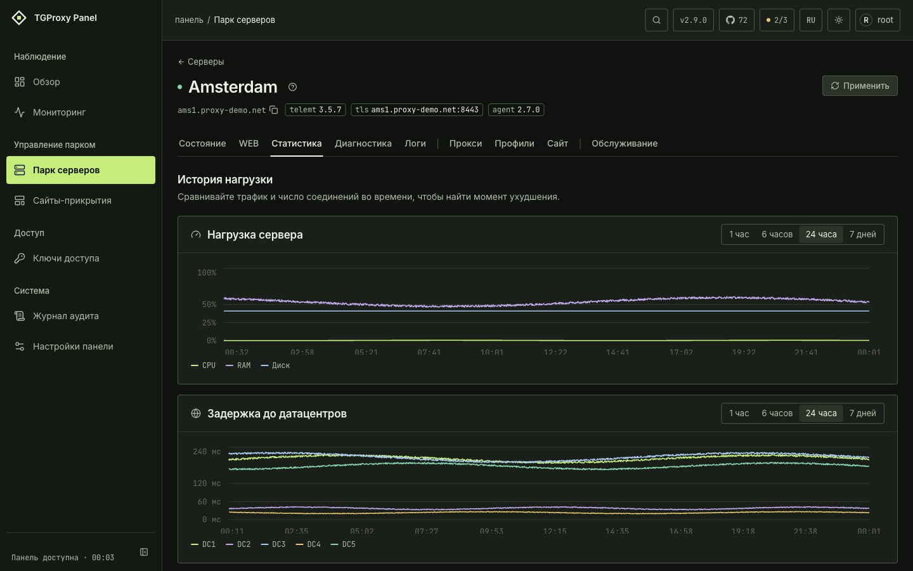

### Когда изменения доходят до сервера

Новые и отозванные ключи и смена сайта уходят на сервер пачкой, раз в 45 секунд по умолчанию.
Интервал меняется в «Настройки» → «Уведомления», поле «Как часто применять изменения, сек»
(от 10 до 3600), или переменной `APPLY_INTERVAL`. Кнопка «Применить сейчас» на странице сервера
отправляет изменения сразу. Сервер с telemt применяет их без перезапуска, и подключённые люди
ничего не замечают. На сервере с tproxy каждое применение перезапускает relay, клиенты
переподключаются сами.

## 7. Движок сервера: telemt или tproxy

Движок выбирается при создании сервера и потом не меняется. Чтобы перевести сервер на другой
движок, его нужно удалить из панели, добавить заново с другим движком и переустановить.

### telemt

Движок по умолчанию: один процесс telemt закреплённой версии плюс Caddy.

- Caddy из подписанного репозитория проекта Caddy держит TLS на 443 и передаёт запросы на
  loopback-листенер telemt (`X-Forwarded-For`). Сайт-прикрытие отдаёт сам telemt, Caddy с диска
  ничего не отдаёт. Поэтому запрос без правильного секрета обрабатывает тот же процесс, что и
  запрос к прокси.
- Бинарник telemt версии `TELEMT_VERSION` берётся из релизов проекта. Его sha256 сверяется с
  `TELEMT_SHA256_X86_64` до установки в `/usr/local/bin/telemt`.
- telemt работает под системной учётной записью `telemt`, без root.
- `tgwp-agent init-node --engine telemt` пишет `/etc/telemt/telemt.toml`, токен control API в
  `/etc/telemt/api.token` (0600), юнит `/etc/systemd/system/telemt.service` и сайт-прикрытие в
  `/var/lib/telemt/public`.
- Таблица nftables `tgwp_telemt` закрывает внутренние порты снаружи.

### tproxy

Старый стек: `tproxy-server` закреплённого коммита, официальный MTProxy, Caddy и агент. Его
ставит апстримный `deploy/install.sh`.

### Порты

| Порт | Что на нём | Доступ |
|---|---|---|
| 80, 443 | Caddy: сертификат, сайт-прикрытие, WEB-прокси | из интернета |
| `classic_port`, по умолчанию 8443 | Fake-TLS | из интернета, только telemt |
| 9090, 9091, 18080 | метрики, control API и WEB-листенер telemt | только loopback |

На сервере с tproxy наружу открыты только 80 и 443.

Если «Домен Fake-TLS» совпадает с хостом сервера (так по умолчанию), сервер должен
дотягиваться до собственного публичного адреса на 443. Подключение к порту Fake-TLS с незнакомым
именем сайта telemt перенаправляет на этот домен, то есть на сам сервер. Если NAT-hairpin или
правила исходящего трафика не пускают сервер к самому себе, маскировка ломается молча: проверка
со стороны вместо сайта-прикрытия получает ошибку соединения, а это как раз тот отпечаток,
которого схема должна избегать. Проверьте с самого сервера: `curl -sSI https://<домен сервера>/`
должен вернуть ответ сайта-прикрытия.

### Что это меняет в панели

- На сервере с telemt у ключа две ссылки: WEB (`https://t.me/webproxy?server=…`) и Fake-TLS
  (`https://t.me/proxy?server=…&port=<classic_port>&secret=ee…`). На сервере с tproxy есть только
  WEB.
- Лимиты ключа (квота трафика, скорость вверх и вниз, число уникальных IP, число соединений)
  работают только на telemt, их соблюдает сам telemt.
- На telemt изменения ключей уходят через control API, и живые сессии не рвутся. На tproxy
  каждое применение перезапускает relay.
- Версия telemt закреплена. Скрипт установки скачивает и проверяет то, что указано в
  `TELEMT_VERSION` и `TELEMT_SHA256_X86_64` в `.env` панели. Меняйте их только парой.

### Адреса и Fake-TLS

На сервере с telemt вкладка «Настройки» начинается с карточки «Адреса и Fake-TLS».

«Публичный IP» можно поправить после установки: на сервере за NAT установщик мог записать
внешний адрес провайдера вместо адреса интерфейса. Следующее применение перепишет адрес в
конфиге telemt и перезапустит его. Ссылки не изменятся: в них записан домен сервера.

**Смена «Домена Fake-TLS» или «Порта Fake-TLS» ломает все выданные Fake-TLS-ссылки этого
сервера**, потому что домен и порт зашиты в секрет ссылки. Следующее применение перепишет
конфиг, перезапустит telemt и разорвёт активные соединения. После этого ссылки нужно выдать
заново. WEB-ссылки не меняются.

«Запасные домены маскировки» дают каждому ключу ещё по одной Fake-TLS-ссылке на каждый домен,
основная ссылка остаётся прежней. Если провайдер начнёт резать основной домен по SNI, человек
просто возьмёт ссылку с другим доменом, переустанавливать сервер не нужно. Подходят только
настоящие сайты, которые отвечают по HTTPS на 443 и доступны с сервера: telemt при запуске
снимает TLS-отпечаток каждого домена, и если какой-то недоступен, применение откатится.
Сохранение перезапускает telemt, но выданные ссылки продолжают работать. Нужен агент 2.9.2 или
новее, доменов можно задать до восьми.

«Тег спонсорского канала» включает показ спонсорского канала людям, подключённым через этот
сервер. Тег выдаёт бот @MTProxybot после регистрации сервера, кнопки рядом с полем копируют
адрес и секрет, которые он спросит.

### Обновление сервера

Когда в панели меняется закреплённая версия telemt (вы обновили панель или сами поменяли
`TELEMT_VERSION` и `TELEMT_SHA256_X86_64` в `.env`), зайдите на сервер по SSH и выполните от
root:

```bash
tgwp-agent upgrade --check   # что изменится; ничего не меняет
tgwp-agent upgrade           # покажет план и спросит подтверждение
tgwp-agent upgrade --yes     # без вопросов; обязателен, если нет терминала
```

Команда берёт токен сервера из `/etc/tgwp-agent/agent.env` и спрашивает у панели, что должно
стоять на сервере. Генерировать новую команду установки и переставлять сервер целиком не нужно.
Обновляется только то, что отличается: бинарник telemt, бинарник агента или оба (`--telemt` и
`--agent` сужают выбор). Каждая загрузка проверяется по sha256 из панели до того, как что-либо
будет заменено. Предыдущий бинарник сохраняется, служба перезапускается, и команда ждёт, пока
она не сообщит о готовности. Если не сообщила, возвращается предыдущий бинарник. Перезапуск
telemt рвёт живые сессии на сервере, поэтому обновляйте серверы по одному.

telemt можно обновить и из панели: на странице сервера откройте вкладку «Обслуживание», карточку
«Обновления Telemt» и нажмите «Обновить Telemt». Для нескольких серверов есть «Обновить telemt на
серверах» на странице «Серверы»: отметьте серверы в нужном порядке, и панель обновит их по
очереди, после каждого проверит сервер и минуту понаблюдает за ним. Ошибка останавливает
очередь. Так обновляются только серверы с telemt, которые сейчас на связи, и только сам telemt;
агента обновляет `tgwp-agent upgrade`.

На сервере панели `sudo /opt/tgproxy-panel/install.sh --update` заодно переносит закреплённую
версию telemt в `.env` на ту, что идёт с новым релизом панели. Обычный порядок такой: сначала
обновить панель, затем серверы.

## 8. Выдача ключей

Ключ даёт доступ к прокси одному человеку или группе. Откройте «Ключи доступа» и нажмите «Новый
ключ». Вверху три вкладки:

- «Личный»: ключ для одного человека, его можно отозвать, не трогая остальных. Заполните
  «Название ключа», «Кому выдан» (имя или e-mail) и отметьте «Серверы».
- «Общий»: один ключ на группу людей. Если его отозвать, доступ потеряют все, кто им пользуется.
- «Несколько ключей»: серия общих ключей. Задайте «Префикс» и «Количество» (от 1 до 100), ключи
  получат названия `префикс-1`, `префикс-2` и так далее. После создания все ссылки можно скачать
  одним файлом кнопкой «Скачать все ссылки (.txt)».

Необязательные поля: «Истекает» (срок действия), «Лимиты» и «Заметка». Лимиты трафика, скорости,
уникальных IP и соединений появляются, когда среди выбранных серверов есть сервер с telemt. Блок
«Что получится» внизу пересказывает, какой ключ выйдет. Нажмите «Создать ключ».


Ключ можно привязать к нескольким серверам, и тогда у него будут ссылки на каждый. На одном
сервере по умолчанию помещается до 128 ключей, заполненность видна в колонке «Ключи» списка
серверов.

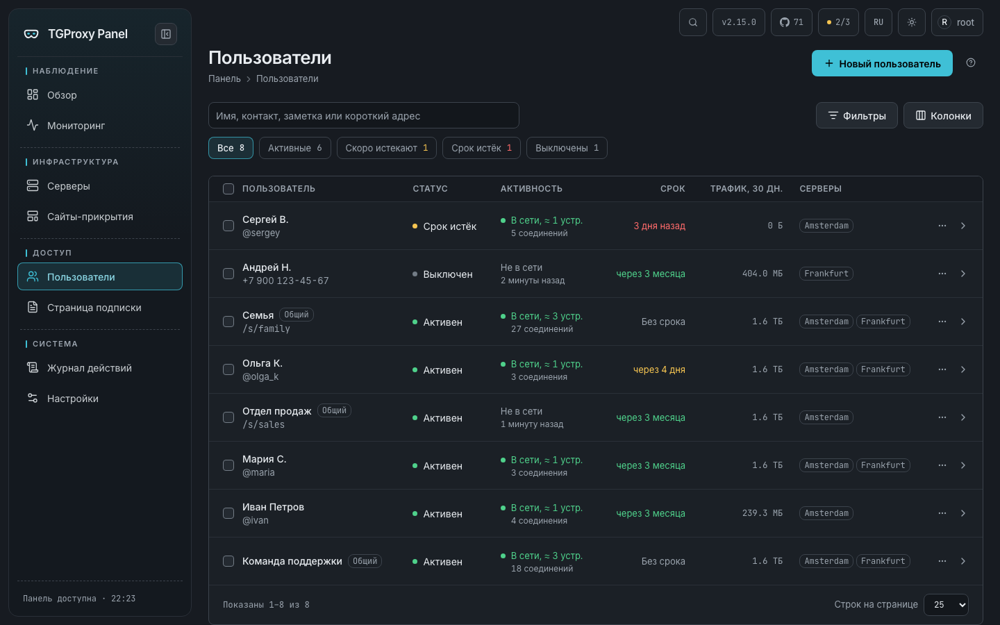

После создания панель сразу покажет ссылки и QR-коды. Каждую ссылку можно скопировать в двух
видах, `t.me` и `tg://`, а QR-код скачать картинкой. Если на сервере заданы запасные домены,
рядом появится выбор «Домен маскировки». Ссылки на отдельные серверы спрятаны под «Ссылки по
серверам».

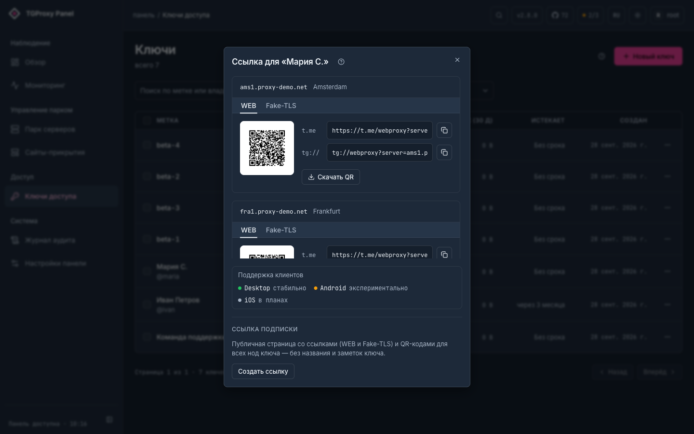

Новый ключ сначала стоит в статусе «Ожидает» и начинает работать после ближайшего применения на
сервере, обычно меньше чем через минуту. Потом статус сменится на «Активен».

Какую ссылку отправлять:

- Fake-TLS работает во всех приложениях Telegram. Если сомневаетесь, отправляйте её.
- WEB-прокси идёт через сайт сервера по обычному HTTPS, его труднее заблокировать. Пока он
  работает только в Telegram Desktop и новых версиях Telegram для Android.

Кнопка «Создать ссылку» в этом же окне делает страницу подписки: одна публичная ссылка, по
которой человек выбирает своё устройство и за три шага подключает прокси, а ниже есть все ссылки
и QR-коды. Название и заметки ключа туда не попадают. Что показывать на странице, настраивается в
«Настройки» → «Страница подписки» (туда ведёт ссылка «Настроить страницу» рядом). Саму ссылку подписки и её QR панель показывает один раз, сохраните их сразу.
«Обновить ссылку» выпускает новую (старая перестаёт работать), «Отозвать ссылку» закрывает
страницу.

В списке ключей у каждого ключа есть меню: «Показать ссылку», «Обновить секрет» и «Отозвать».
После «Обновить секрет» старые ссылки перестают работать, новые нужно разослать заново. Если
отметить ключи галочками, над списком появятся кнопки «Продлить», «Отозвать» и «Удалить». Отзыв
срабатывает при следующем применении. Ключи с истёкшим сроком тоже помечаются как «Отозван».

## 9. Сайт-прикрытие сервера

На домене каждого прокси-сервера открывается обычный сайт. Посторонний, который зайдёт по адресу
сервера, увидит страницу кофейни или блога, а прокси останется незаметным.

В разделе «Сайты-прикрытия» лежат 15 готовых сайтов с фильтром по категориям и поиском. Любой
можно открыть кнопкой «Предпросмотр». Чтобы поставить сайт на сервер, нажмите «Использовать» и
выберите сервер. То же можно сделать со страницы сервера: вкладка «Сайт-прикрытие» → «Сменить
сайт». Сайт уедет на сервер при следующем применении, статус сменится с «Ожидает применения» на
«Развёрнут».

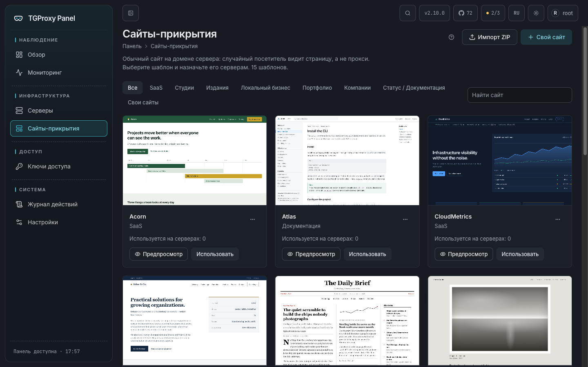

Свой сайт можно сделать тремя способами:

- «Настроить сайт» в меню готового сайта создаёт редактируемую копию с вашим текстом. На
  серверах при этом остаются прежние сайты.
- «Свой сайт» открывает редактор нового шаблона.
- «Импорт ZIP» загружает статический сайт: HTML, CSS, JavaScript и локальные файлы, обязательно
  с `index.html`, не больше 2 МБ в распакованном виде.

Редактор проверяет ограничения сайта-прикрытия: никаких внешних ресурсов, inline-обработчиков и
форм. Встроенные стили и скрипты он выносит в отдельные файлы. При назначении каждый сервер
получает свою копию сайта со своим порядком блоков и своими именами классов и файлов, чтобы
серверы нельзя было связать по одинаковым страницам.

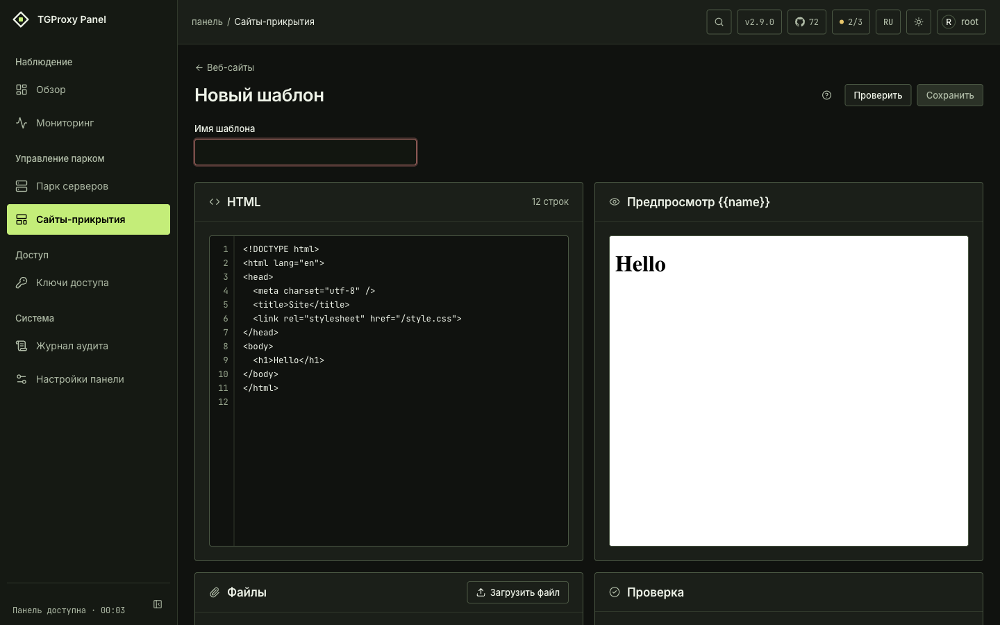

Сервер с telemt может показывать вместо шаблона ответ приложения, которое уже работает рядом.
На вкладке «Сайт-прикрытие» нажмите «HTTP-сайт», укажите «Origin URL» и нажмите «Проверить и
применить». Подходит только адрес `http://` на loopback или приватном IP. Кнопка доступна, если сервер
подтвердил поддержку такой возможности. Перед переключением агент проверит адрес на самом
сервере, и при ошибке останется прежний сайт.

Предпросмотр в редакторе не показывает, что на самом деле развернулось на сервере. После
назначения откройте `https://<домен сервера>/` в браузере и убедитесь, что сайт открывается
целиком, с картинками и стилями.

## 10. Мониторинг, алерты и аудит

«Обзор» показывает общий вердикт по серверам, список «Требует внимания» и все серверы разом.

«Мониторинг» разбит на разделы: «Все серверы», «Серверы» (подключения, трафик и нагрузка каждого
сервера), «WEB-транспорт» и «Экспорт метрик». Период выбирается сверху: 1 час, 6 часов, 24 часа
или 7 дней. Метрики самой панели отдаются на `/metrics` с заголовком
`Authorization: Bearer <METRICS_TOKEN>`. Готовый дашборд Grafana лежит в
`deploy/grafana/tgwp-panel.json`, настройка Prometheus и Grafana описана в
[мониторинге](monitoring.ru.md).

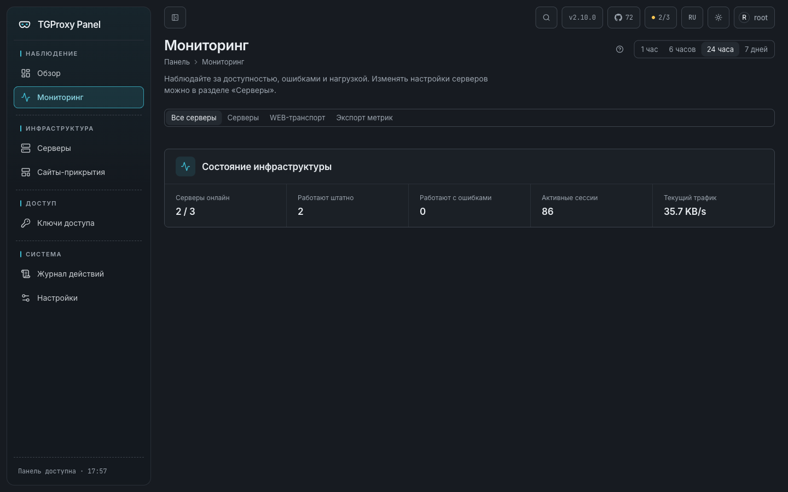

### Оповещения в Telegram

Откройте «Настройки» → «Уведомления» (раздел «Уведомления и опрос серверов»). Включите
переключатель «Включить уведомления», вставьте «Токен бота» и «Chat ID», нажмите «Отправить
тестовое сообщение» и затем «Сохранить». Панель пишет, когда сервер пропадает и возвращается, когда применение не удалось и
когда на сервере что-то не так, например заканчивается место на диске или прокси не готов
принимать подключения. Когда такая проблема уходит, приходит второе сообщение. В каждом сообщении
простыми словами сказано, что случилось, что это значит и где смотреть, и есть ссылка на сервер в
панели. Поле «Язык уведомлений» выбирает русский или английский; тестовое сообщение приходит на
языке, выбранном в форме. На этой же вкладке задаётся, через сколько секунд без ответа сервер
считается недоступным.

Оповещения можно дублировать на свой HTTPS-адрес через `ALERT_WEBHOOK_URL` (раздел 13).

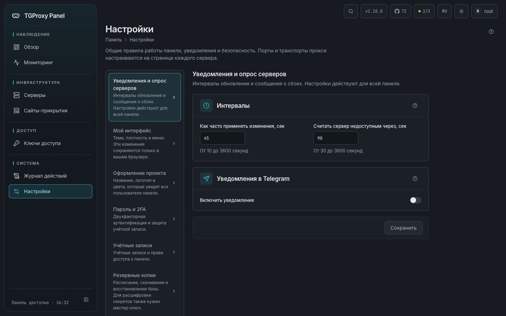

### Журнал действий

«Журнал действий» хранит все действия администраторов с фильтрами по действию, пользователю и
дате.

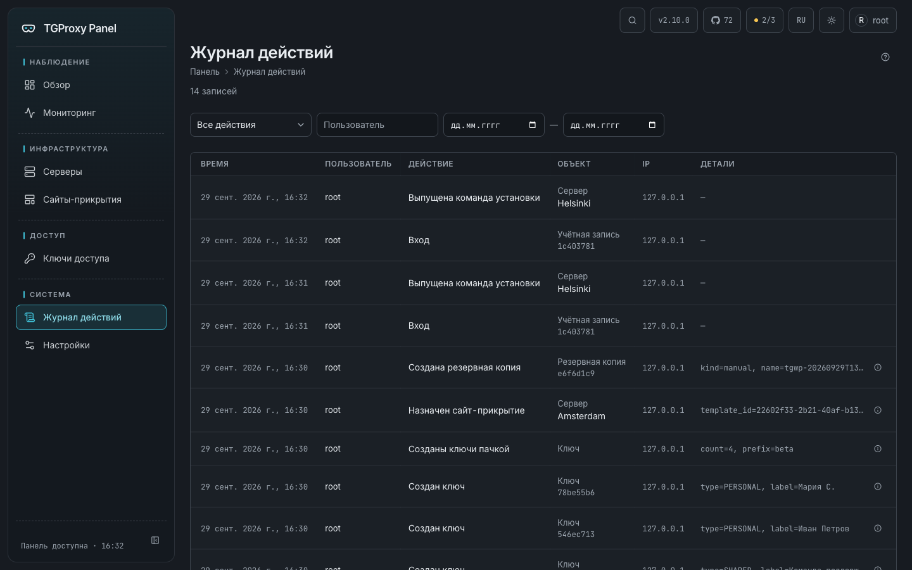

### Верхняя панель, поиск и справка

Кнопка в левом верхнем углу сворачивает боковое меню. Поиск и команды открываются по `⌘K` или
`Ctrl+K`: оттуда можно перейти к разделу, серверу или ключу, выпустить ключ, применить изменения
на всех серверах, сменить тему или язык.

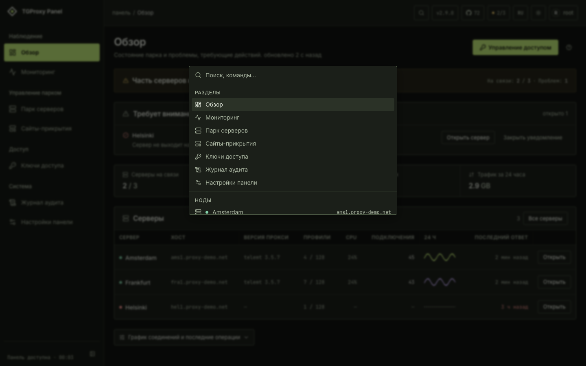

Справа в верхней панели три значка: версия панели, проект на GitHub со счётчиком звёзд и число
серверов онлайн. На узких экранах те же данные переезжают в меню пользователя. Раз в час панель
читает последний релиз репозитория `GITHUB_REPO` (по умолчанию `greenpandorik/tgproxy-panel`).
Если вышла новая версия, значок версии подсвечивается и ведёт на страницу релиза. Ничего о вашей
установке при этом не отправляется, а `UPDATE_CHECK=false` в `.env` отключает обращения к GitHub.

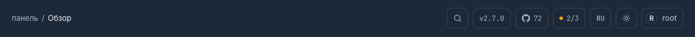

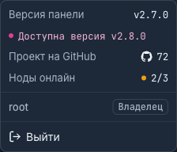

Знак «?» в заголовке страницы или окна открывает справку справа: что значит каждое поле, пример
значения, что будет, если поле оставить пустым, и типичные ошибки. Клавиша `?` открывает справку
по текущей странице. Формы помнят введённое. Если окно закрылось случайно, при следующем открытии
панель предложит продолжить черновик или начать заново. Черновик хранится в браузере сутки,
пароли и токены в него не попадают.

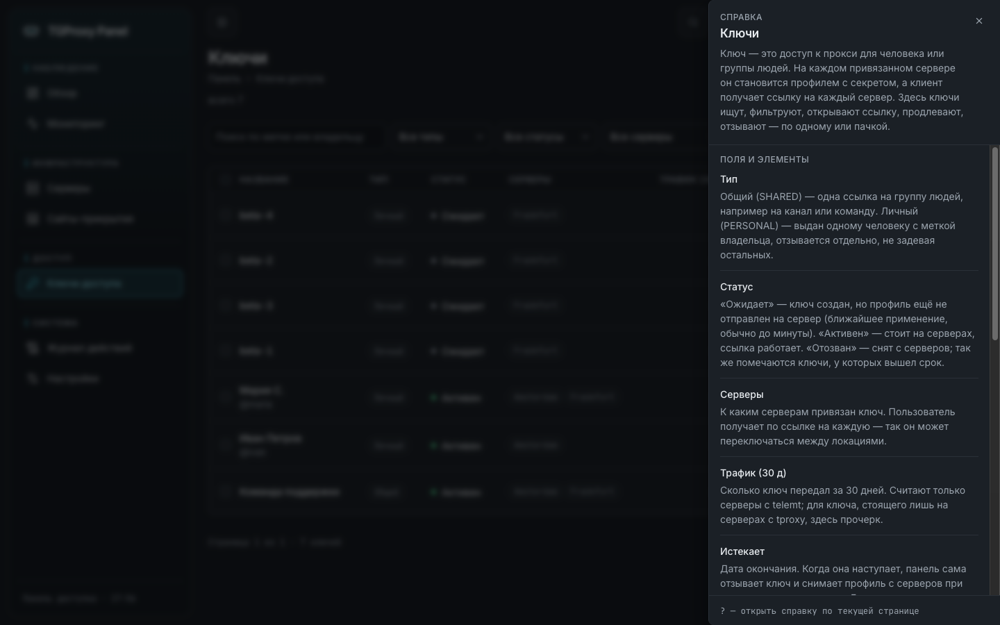

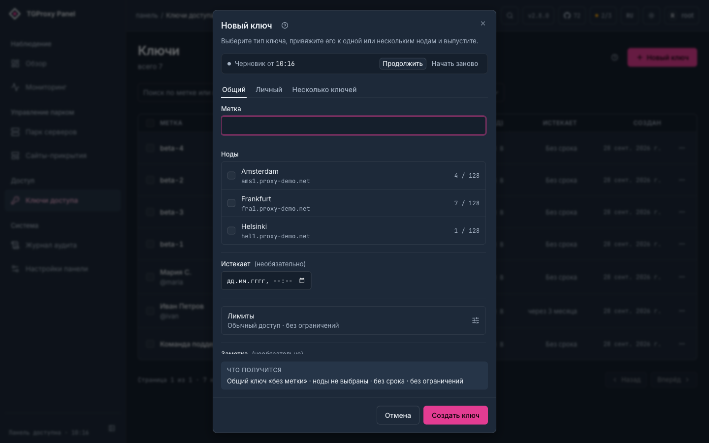

### Датацентры Telegram

На вкладке «Состояние» блок «Датацентры Telegram» показывает, как сервер видит сеть Telegram. По
каждому датацентру там есть задержка, которую telemt измеряет своими регулярными проверками и
усредняет, предпочтение IPv4 или IPv6, состояние прямого маршрута и счётчик соединений. Задержка до 150 мс зелёная, до 400 мс жёлтая, выше красная. Вкладка
«Статистика» рисует те же задержки во времени, в списке серверов есть колонка «Telegram» с общей
задержкой, а плитка «Задержка до Telegram» на «Обзоре» усредняет её по серверам онлайн. На
серверах с tproxy этих данных нет.

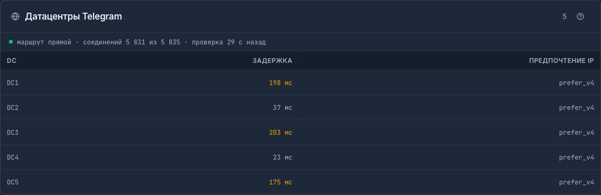

### Проверки из внешних сетей

Панель проверяет серверы со своего адреса. Чтобы видеть, как сервер открывается из других сетей,
например у разных провайдеров, подключите внешние проверки: на сервере панели задайте
`PROBE_TOKEN` и `PROBE_LOCATIONS`, а в каждой такой сети запустите `tgwp-probe`. Результаты
появятся на вкладке «Проверки» в блоке «Проверки из внешних сетей».

## 11. Брендинг

«Настройки» → «Оформление» (раздел «Оформление проекта»): название панели, логотип, favicon, фон
страницы входа, основной и акцентный цвета, тема по умолчанию, текст на странице входа, ссылка
на поддержку, текст в подвале и свой CSS. Изменения применяются для всех пользователей сразу, без
пересборки. Можно держать несколько вариантов оформления и переключать активный кнопкой
«Активировать».

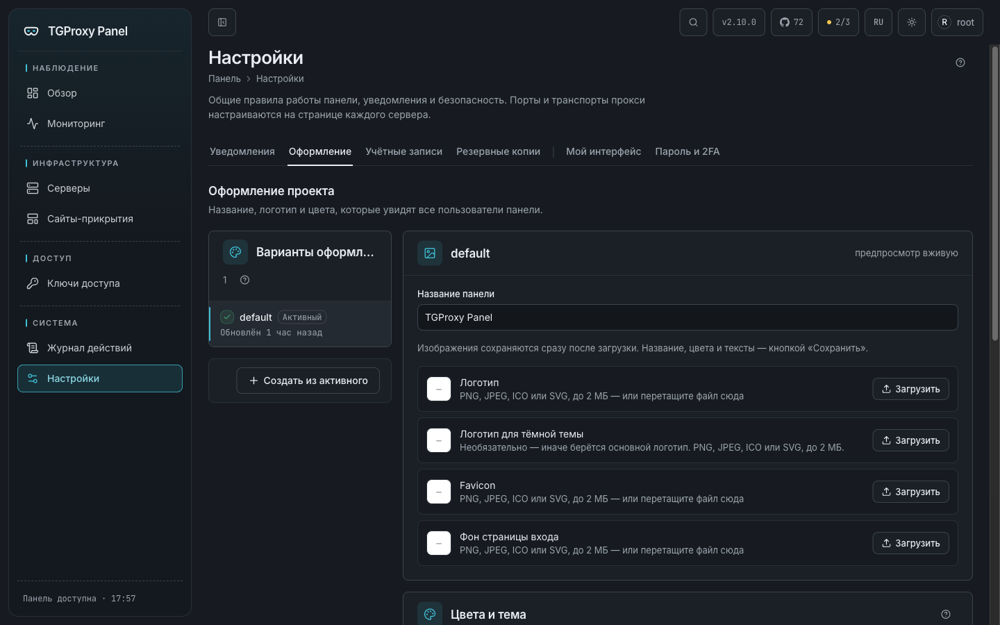

Вкладка «Мой интерфейс» меняет тему, плотность и боковое меню только для вас. Эти настройки
хранятся в вашем браузере.

## 12. Резервные копии, ротация ключа, обновление

### Резервные копии

Вкладка «Настройки» → «Резервные копии» видна только владельцу. Кнопка «Создать копию» делает
копию базы сразу. В блоке «Ежедневная копия» включите «Создавать каждую ночь», выберите время
(час по UTC) и сколько копий хранить, от 1 до 60, и нажмите «Сохранить». Лишние копии по расписанию удаляются, а
созданные вручную остаются. Файлы лежат в томе панели в `/data/backups/`, из таблицы их можно
скачать.

Копия содержит всю базу, но секреты в ней зашифрованы. Храните рядом с копиями `MASTER_KEY` из
`.env`: без него восстановленная база ничего не расшифрует. Шифрование копий, их выгрузку на
другой сервер и проверку восстановления включают переменные `BACKUP_*` (раздел 13).

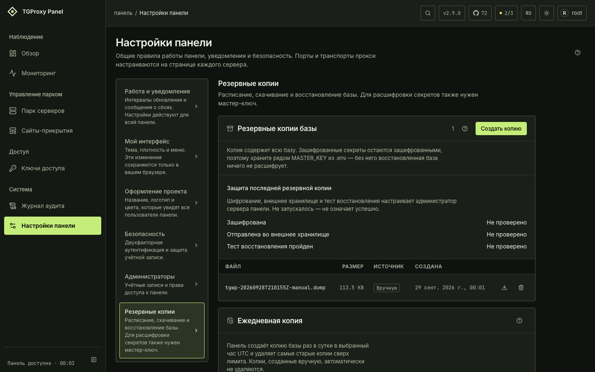

Восстановление из копии. Команды выполняются в каталоге установки. Восстановление работает только
при остановленной панели и полностью заменяет текущую базу.

```bash
docker compose stop panel
docker compose run --rm panel db restore /data/backups/<файл>.dump --yes
docker compose start panel
```

### Ротация мастер-ключа

Новый ключ создаётся командой `openssl rand -base64 32`. Порядок такой:

```bash
docker compose stop panel
# в .env добавьте MASTER_KEY_NEW=<новый ключ base64>
docker compose run --rm panel keys rotate --dry-run
docker compose run --rm panel keys rotate
# затем в .env: MASTER_KEY=<новый>, MASTER_KEY_VERSION=2, MASTER_KEY_V1=<старый>; MASTER_KEY_NEW удалить
docker compose up -d panel
```

`--dry-run` только считает строки, которые будут перешифрованы. Панель запускается через
`up -d`, чтобы контейнер подхватил новый `.env`. Держите старый ключ в `MASTER_KEY_V1`, пока он
нужен для старых резервных копий. Подробности в [эксплуатации](runbook.ru.md).

### Обновление панели

Панель, поставленная установщиком:

```bash
sudo /opt/tgproxy-panel/install.sh --update      # последний релиз; --version 1.2.0 для конкретного
```

Установщик скачает новый образ и перезапустит контейнеры. Данные сохраняются, а в `.env`
меняются только номер версии панели и закреплённая версия telemt. Миграции базы панель выполняет сама при запуске.

Панель, собранная из исходников:

```bash
git pull
cd deploy && docker compose up -d --build panel
```

### Обновление серверов

Агента и telemt на серверах обновляет `tgwp-agent upgrade`, а telemt ещё и кнопки в панели
(раздел 7). `tproxy-server` закреплён на коммите из `TPROXY_COMMIT`. Чтобы сменить коммит,
сервер нужно переустановить новой командой установки.

## 13. Переменные окружения

Переменные лежат в `.env`: `/opt/tgproxy-panel/.env` после установщика или `deploy/.env` при
ручной установке. После правки пересоздайте контейнер панели командой
`docker compose up -d panel`, простой `restart` новых значений не увидит.

| Переменная | Назначение |
|---|---|
| `DATABASE_URL` | Строка подключения к PostgreSQL. В compose её задаёт сам `docker-compose.yml` |
| `MASTER_KEY`, `MASTER_KEY_VERSION` | Ключ шифрования секретов в базе и его версия |
| `MASTER_KEY_V<n>`, `MASTER_KEY_NEW` | Прежние ключи после ротации и новый ключ на время `keys rotate` |
| `SESSION_SECRET` | Подпись cookie сессий |
| `PANEL_PUBLIC_URL` | Публичный адрес панели без `/` в конце, попадает в команду установки серверов |
| `PANEL_HTTP_ADDR` | Адрес, который слушает панель внутри контейнера, обычно `:8080` |
| `DATA_DIR` | Каталог данных панели, в Docker это `/data` (том `paneldata`) |
| `NODE_DRIVER` | `gateway` для реальных серверов, `mock` для демо и тестов |
| `METRICS_TOKEN` | Токен для `/metrics`, обязателен при `gateway` |
| `TELEMT_VERSION`, `TELEMT_SHA256_X86_64` | Версия telemt для серверов и sha256 её архива. Меняются только парой, sha256 обязателен при `gateway` |
| `TPROXY_COMMIT` | Коммит `tproxy-server` для установки серверов |
| `FEATURE_TOTP` | `true` по умолчанию; `false` прячет двухфакторный вход |
| `APPLY_INTERVAL`, `OFFLINE_AFTER` | Интервал применения и порог офлайна в секундах, по умолчанию 45 и 90. Значения, сохранённые в «Настройки» → «Уведомления», важнее |
| `UPDATE_CHECK`, `GITHUB_REPO`, `GITHUB_TOKEN` | Проверка новой версии на GitHub: выключатель, репозиторий и необязательный токен |
| `LOG_LEVEL` | `debug`, `info`, `warn` или `error` |
| `PANEL_DOMAIN`, `ACME_EMAIL` | Только для Caddy в compose |
| `POSTGRES_PASSWORD` | Пароль встроенной PostgreSQL в compose, установщик генерирует его сам |
| `PANEL_VERSION`, `PANEL_IMAGE` | Какой образ панели запускать, их пишет установщик |
| `PROBE_TOKEN`, `PROBE_LOCATIONS` | Проверки из внешних сетей: токен от 32 символов и имена точек через запятую |
| `ALERT_WEBHOOK_URL`, `ALERT_WEBHOOK_SECRET` | Оповещения на свой HTTPS-адрес с подписью, секрет от 32 символов |
| `BACKUP_AGE_RECIPIENT`, `BACKUP_UPLOAD_URL`, `BACKUP_UPLOAD_TOKEN`, `BACKUP_VERIFY` | Шифрование копий открытым ключом age, выгрузка по HTTPS и проверка восстановления |

Полное описание каждой переменной есть в [справочнике](reference.ru.md).

## 14. Если что-то не работает

Прежде чем раздавать ключи, проверьте подключение сами, лучше всего из Telegram Desktop, где
работают обе ссылки.

- Панель не стартует. Выполните `docker compose logs panel` в каталоге установки. В строке
  ошибки будет `config:` и имя переменной. Чаще всего это пустой `METRICS_TOKEN` или
  `TELEMT_SHA256_X86_64`, неверный `DATABASE_URL` или `MASTER_KEY`, который не декодируется в
  32 байта.
- Установщик панели остановился на проверках. Домен не указывает на этот сервер, перед ним
  включён прокси CDN или порт 80 либо 443 занят. Поправьте и нажмите `r`.
- Установка сервера остановилась на ожидании сертификата. A-запись должна указывать на этот
  сервер, а порты 80 и 443 должны быть доступны из интернета. Лог Caddy:
  `journalctl -u caddy -n 30`. Затем запустите ту же команду ещё раз.
- telemt не сообщил о готовности. Ему нужен выход к датацентрам Telegram и к домену Fake-TLS на
  443. Лог: `journalctl -u telemt -n 30`.
- Регистрация вернула 404. Токен уже потрачен или прошло 24 часа. Выпустите новую команду:
  вкладка «Обслуживание» → «Показать команду установки».
- Сервер не выходит на связь. На сервере выполните `systemctl status tgwp-agent` и
  `journalctl -u tgwp-agent -n 100 --no-pager`. Агент должен достучаться до `PANEL_PUBLIC_URL`.
  Службы прокси: `systemctl status telemt caddy` на telemt,
  `systemctl status tproxy-server mtproxy caddy` на tproxy. Если агент не запускается, переустановите его командой с вкладки
  «Обслуживание».
- Ключ висит в статусе «Ожидает». Сервер офлайн или применение не удалось. Откройте вкладку
  «Обслуживание» сервера, блок «История применений»: в подробностях операции есть лог агента.
- WEB-ссылка работает, а Fake-TLS нет. Посмотрите «Проверки» → «Проверка с панели», строку
  «Маскировка Fake-TLS». Обычно порт 8443 закрыт в файрволе хостинга или сервер не может
  подключиться сам к себе на 443 (раздел 7).
- Fake-TLS-ссылки перестали работать после смены домена или порта Fake-TLS. Так и должно быть,
  выдайте ссылки заново.

Подробные сценарии восстановления описаны в [эксплуатации](runbook.ru.md).
